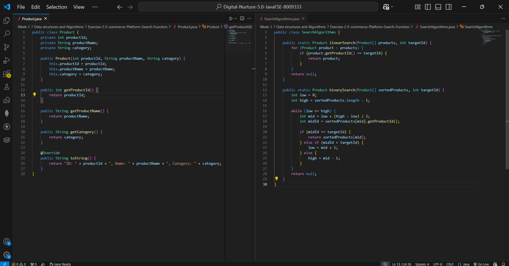
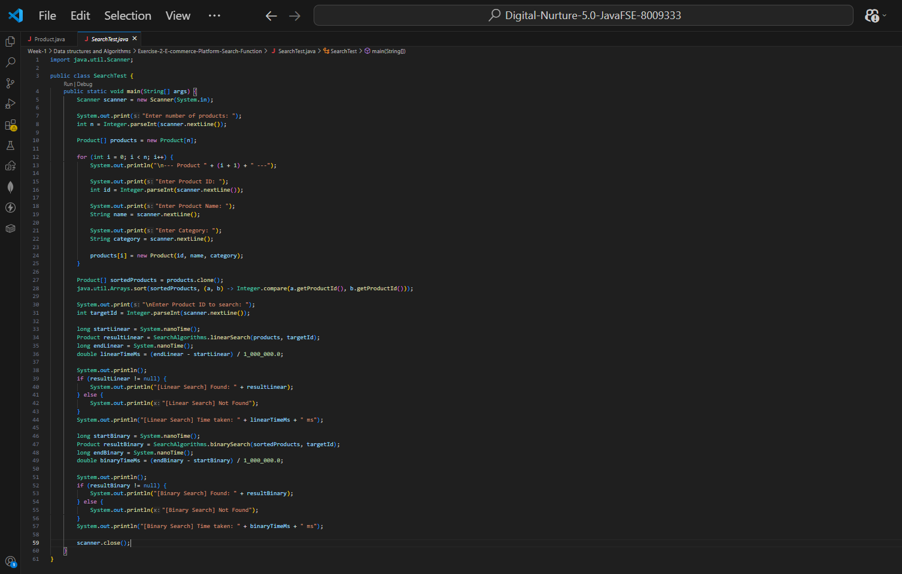
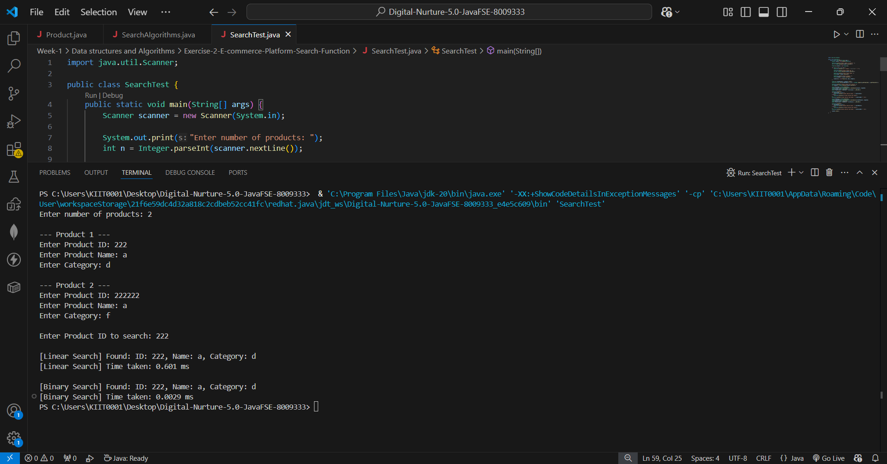

## ✅ Exercise 2: E-commerce Platform Search Function (Java)

### 📘 Scenario
You are working on the search functionality of an e-commerce platform. The
search needs to be optimized for fast performance, so this exercise compares
**Linear Search** and **Binary Search** to determine which is better suited
for a growing product catalog.

---

### 1️⃣ Understand Asymptotic Notation

**Q. Explain Big O notation and how it helps in analyzing algorithms.**

Big O notation describes the upper bound of an algorithm's time or space
complexity in terms of input size `n`. It helps evaluate how efficiently an
algorithm performs as input grows, by focusing on the growth rate rather than
exact execution time — making it essential for comparing algorithms on
performance and scalability, independent of hardware or implementation
details.

**Q. Describe the best, average, and worst-case scenarios for search operations.**

**Linear Search:**
- Best Case: O(1) — element is the first item in the array.
- Average Case: O(n) — element is found somewhere in the middle, requiring
  roughly half the array to be scanned.
- Worst Case: O(n) — element is at the end or not present at all.

**Binary Search (on a sorted array):**
- Best Case: O(1) — element is exactly at the middle index on the first
  comparison.
- Average Case: O(log n) — the search space is halved each iteration.
- Worst Case: O(log n) — element is not found, but the algorithm still
  narrows the range until it's exhausted.

---

### 2️⃣ Setup

#### 📁 Files Included
- `Product.java` — Class with `productId`, `productName`, and `category`.
- `SearchAlgorithms.java` — Contains both `linearSearch()` and `binarySearch()`.
- `SearchTest.java` — Interactive test class that takes product details and a
  search ID as console input, then runs both algorithms and times each one.

---

### 3️⃣ Implementation

#### 🔹 Product.java
A simple data class holding the three searchable attributes required by the
exercise: `productId`, `productName`, and `category`.

#### 🔹 SearchAlgorithms.java
- `linearSearch(Product[] products, int targetId)` — scans the array
  sequentially from the start until a match is found or the array ends. Works
  on an **unsorted** array.
- `binarySearch(Product[] sortedProducts, int targetId)` — repeatedly halves
  the search range based on comparing the middle element's ID to the target.
  Requires the array to be **sorted by `productId`** beforehand.

#### 🔹 SearchTest.java
- Takes the number of products and their details as console input, storing
  them in an **unsorted array** (`products`) used for Linear Search.
- Creates a **sorted copy** (`sortedProducts`) via `Arrays.sort()`, used for
  Binary Search — satisfying the requirement that binary search needs sorted
  data.
- Prompts for a product ID to search, then runs both algorithms on their
  respective arrays and prints the result and time taken (in milliseconds)
  for each.

### 🖼️ Code Screenshot
📌 Code from VS Code showing the search implementation:




### 🖼️ Output Screenshot
📌 Terminal output verifying both search algorithms:



```
Enter number of products: 2

--- Product 1 ---
Enter Product ID: 222
Enter Product Name: a
Enter Category: d

--- Product 2 ---
Enter Product ID: 222222
Enter Product Name: a
Enter Category: f

Enter Product ID to search: 222

[Linear Search] Found: ID: 222, Name: a, Category: d
[Linear Search] Time taken: 0.601 ms

[Binary Search] Found: ID: 222, Name: a, Category: d
[Binary Search] Time taken: 0.0029 ms
```

### How to run
Open `SearchTest.java` in VS Code and click the **Run ▶️** button above the
`main` method, then enter the requested product details and search ID in the
terminal.

Or, from a terminal in this folder:
```bash
javac Product.java SearchAlgorithms.java SearchTest.java
java SearchTest
```

---

### 4️⃣ Analysis

#### Performance Comparison Table

| Search Method | Best Case | Average Case | Worst Case | Sorted Required |
|---|---|---|---|---|
| Linear Search | O(1) | O(n) | O(n) | ❌ No |
| Binary Search | O(1) | O(log n) | O(log n) | ✅ Yes |

#### Which algorithm is more suitable for an e-commerce platform, and why?

**Binary Search is the better choice** for product search at scale. The core
reason is that O(log n) scales dramatically better than O(n) as the catalog
grows — for 1 million products, linear search may need up to 1,000,000
comparisons in the worst case, while binary search needs at most ~20
(log₂ 1,000,000 ≈ 20).

The trade-off is that binary search requires the data to be **sorted first**,
which costs O(n log n) once. For a platform where products are indexed once
and searched constantly (a typical read-heavy e-commerce workload), that
one-time sorting cost is negligible compared to the savings on every
subsequent search. Linear search only remains practical for very small
datasets, or for data that changes so frequently that re-sorting overhead
would outweigh the search-time savings.

The sample run above demonstrates this directly: even with only 2 products,
Binary Search (`0.0029 ms`) was already faster than Linear Search
(`0.601 ms`) — and that gap widens enormously as the dataset grows.