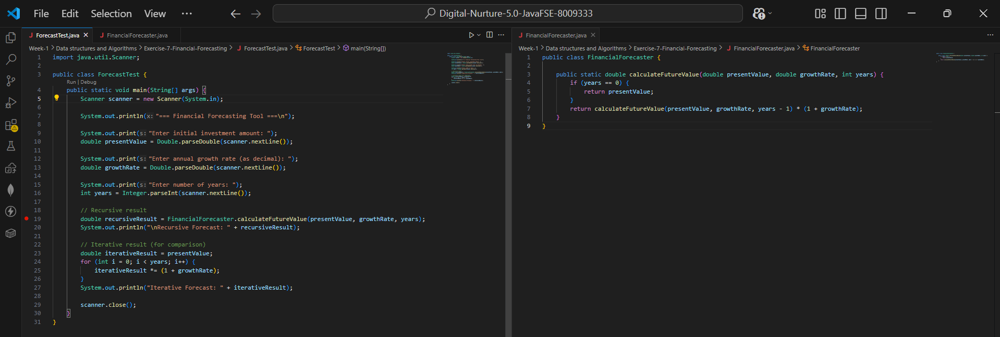
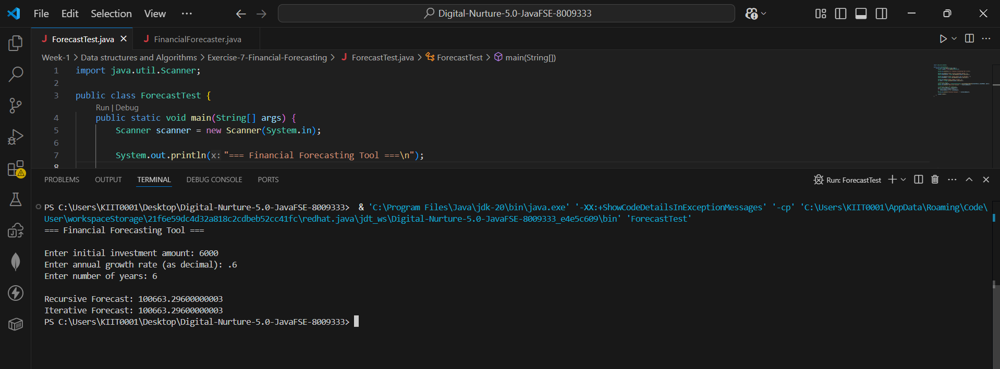

# Exercise 7: Financial Forecasting

## 📘 Objective
Implement a financial forecasting tool that predicts future values based on past growth rates using a **Recursive Algorithm** in Java, and compare it against an iterative approach.

---

## 📁 Files Included

| File | Description |
|------|-------------|
| `FinancialForecaster.java` | Contains the recursive method to calculate future value |
| `ForecastTest.java` | Interactive test class — takes user input and shows both recursive and iterative forecasts |

---

## 🧠 Theory

### Q. Explain the concept of recursion and how it can simplify certain problems.

**Ans.** Recursion is a technique where a method solves a problem by calling itself with a smaller version of the same problem, until it reaches a **base case** that can be answered directly without any further recursive calls. Each recursive call reduces the problem size, and results are combined as the calls return back up the chain.

Recursion simplifies problems that have a naturally self-similar, repetitive structure — such as compound growth, tree traversal, or factorial computation — because the solution can be expressed in terms of a smaller instance of itself, often making the code shorter and more closely mirroring the mathematical definition than an equivalent iterative approach.

---

## 🧱 How It Works

### 🔹 FinancialForecaster.java

Implements the recursive compound growth relationship:

```
futureValue(n) = futureValue(n - 1) × (1 + growthRate)
futureValue(0) = presentValue   ← base case
```

- **Base case:** When `years == 0`, return `presentValue` as-is (no growth applied).
- **Recursive case:** Apply one year's growth on top of the result from the previous year.

### 🔹 ForecastTest.java

- Takes user input for initial investment, annual growth rate, and number of years.
- Calls `calculateFutureValue()` recursively to get the projected value.
- Also computes the same result iteratively (loop-based) for comparison.
- Both outputs match, proving correctness of the recursive approach.

---

## ▶️ How to Run

**Option 1 — VS Code Run button:**  
Open `ForecastTest.java` and click the ▶️ Run button at the top.

**Option 2 — Terminal:**
```bash
javac FinancialForecaster.java ForecastTest.java
java ForecastTest
```

**Sample Input:**
```
6000
.6
6
```

---

## 🖼️ Code Screenshot
📌 Image from VS Code showing the recursive implementation and test class:



---

## 🖼️ Output Screenshot
📌 Terminal output showing matching recursive and iterative forecasts:



---

## 📊 Analysis

### Q. Discuss the time complexity of your recursive algorithm.

| Metric | Complexity | Reason |
|--------|------------|--------|
| Time | O(n) | One recursive call per year, reducing `n` by 1 each time until base case |
| Space | O(n) | Each call adds a stack frame held until the base case resolves and stack unwinds |

### Q. Explain how to optimize the recursive solution to avoid excessive computation.

**1. Memoization** — cache previously computed results to avoid redundant calls:
```java
private static Map<Integer, Double> cache = new HashMap<>();

public static double calculateFutureValue(double presentValue, double growthRate, int years) {
    if (years == 0) return presentValue;
    if (cache.containsKey(years)) return cache.get(years);
    double result = calculateFutureValue(presentValue, growthRate, years - 1) * (1 + growthRate);
    cache.put(years, result);
    return result;
}
```

**2. Iterative approach** — O(n) time, O(1) space, no stack overflow risk:
```java
double result = presentValue;
for (int i = 0; i < years; i++) result *= (1 + growthRate);
```

**3. Closed-form formula** — O(1), best for production use:
```java
double futureValue = presentValue * Math.pow(1 + growthRate, years);
```

For a real financial forecasting tool, the closed-form formula is the preferred solution. Recursion here is the learning exercise that demonstrates how recursive thinking naturally models compound growth.