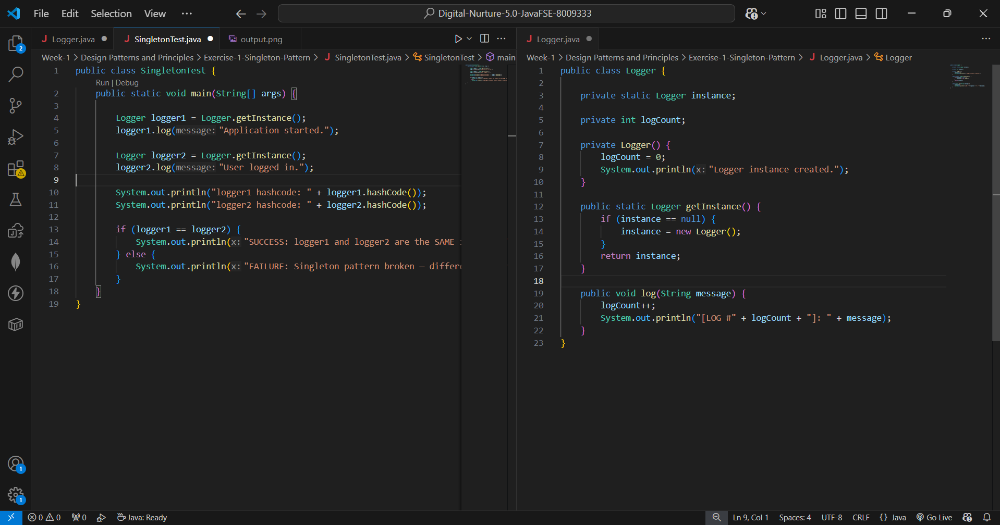
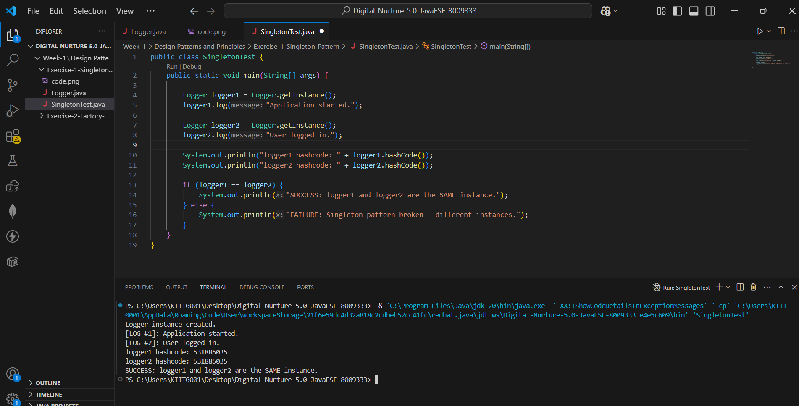

## ✅ Exercise 1: Implementing the Singleton Pattern (Java)

### 📘 Objective
Implement a logging utility using the Singleton Design Pattern in Java, ensuring
that only one instance of the logger class is used across the application to
maintain consistent state.

### 📁 Files Included
- `Logger.java` — Contains the Singleton class responsible for managing logging.
- `SingletonTest.java` — Contains the main entry point and tests the singleton
  behavior using the logger instance.

### 🧱 How It Works

#### 🔹 Logger.java
This class implements the Singleton Pattern by:
- Declaring a private static variable to store the single instance.
- Using a private constructor to prevent external object creation.
- Providing a static method (`getInstance()`) to access the single instance.
- Including a `log()` method to write messages through the shared instance.

#### 🔹 SingletonTest.java
This class tests the Singleton implementation by:
- Creating two references via the static `getInstance()` method.
- Verifying both references point to the same object (via `==` and hashcodes).
- Logging messages through each reference to show that state (the log counter)
  is shared.

### 🖼️ Code Screenshot
📌 Code from VS Code showing the Singleton implementation:



### 🖼️ Output Screenshot
📌 Terminal output verifying the singleton behavior:



### How to run
Open `SingletonTest.java` in VS Code and click the **Run ▶️** button above the
`main` method (Java Extension Pack compiles and runs it automatically).

Or, from a terminal in this folder:
```bash
javac Logger.java SingletonTest.java
java SingletonTest
```

### Key Takeaway
The Singleton pattern restricts instantiation of a class to a single object,
useful for shared resources like loggers, config managers, or connection pools.
This lazy version is not thread-safe; a production version would use
`synchronized` or eager initialization to avoid race conditions.