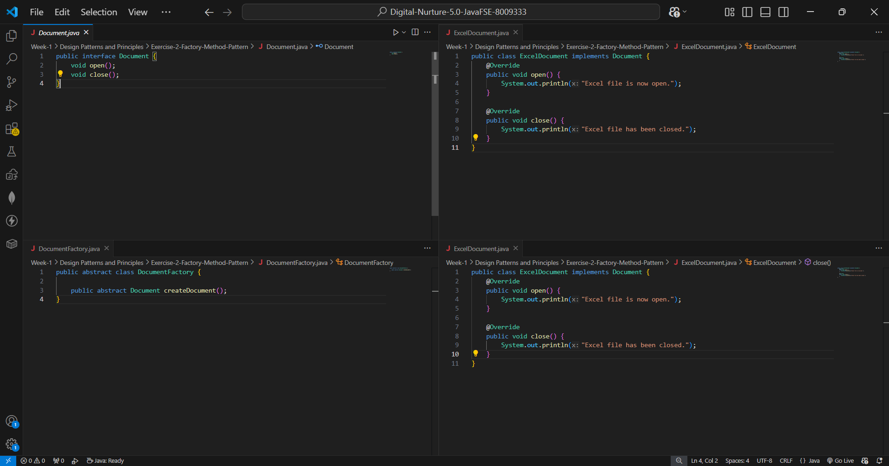
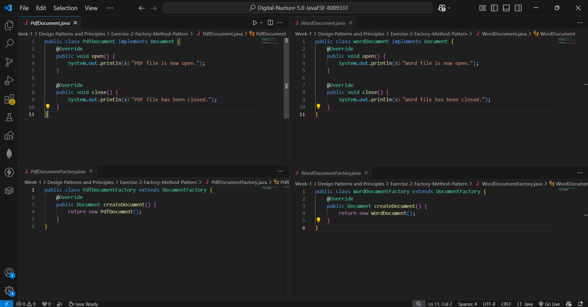
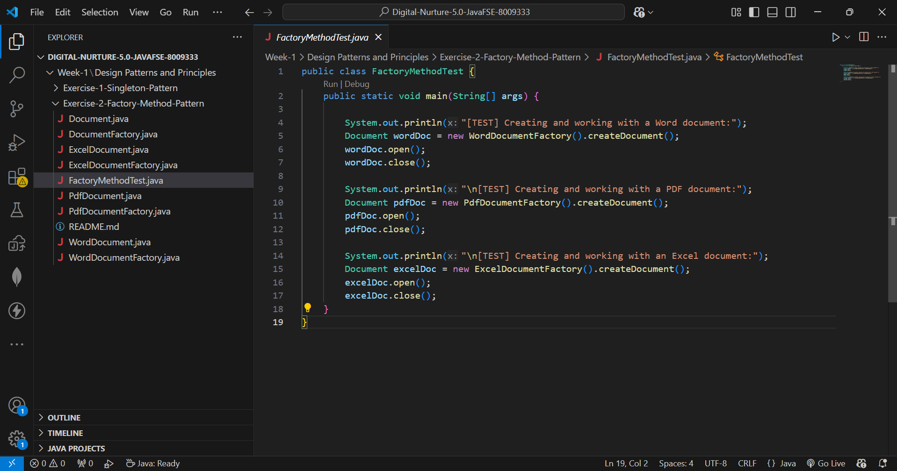
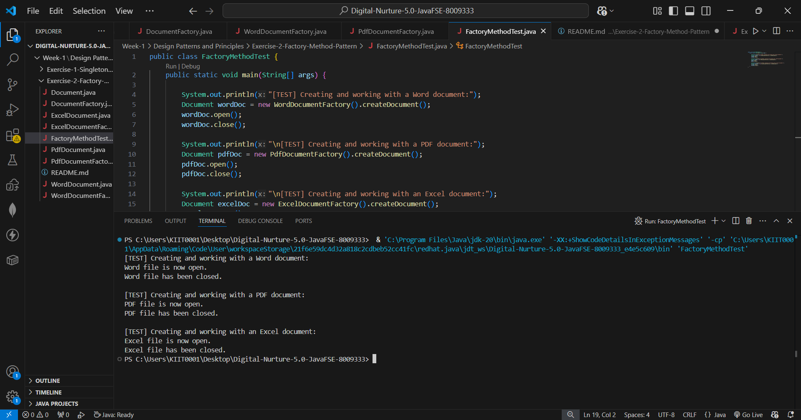

## ✅ Exercise 2: Implementing the Factory Method Pattern (Java)

### 📘 Objective
Build a document management system that can create different types of documents
(Word, PDF, Excel) without the client code needing to know which concrete class
is being instantiated, using the Factory Method Design Pattern.

### 📁 Files Included
- `Document.java` — Common interface implemented by all document types.
- `WordDocument.java`, `PdfDocument.java`, `ExcelDocument.java` — Concrete
  document classes, each implementing `open()` and `close()`.
- `DocumentFactory.java` — Abstract factory declaring the factory method
  `createDocument()`.
- `WordDocumentFactory.java`, `PdfDocumentFactory.java`, `ExcelDocumentFactory.java`
  — Concrete factories, each producing its own document type.
- `FactoryMethodTest.java` — Test/demo class that creates and uses all three
  document types via their factories.

### 🧱 How It Works

#### 🔹 Document.java
Defines a common contract (`open()`, `close()`) that every concrete document
type must implement, so client code can work with any document type
polymorphically.

#### 🔹 WordDocument.java / PdfDocument.java / ExcelDocument.java
Concrete implementations of `Document`, each printing a message specific to
that file type when opened or closed.

#### 🔹 DocumentFactory.java
Declares the abstract `createDocument()` method — the actual "factory method"
that subclasses override to decide which concrete `Document` gets created.

#### 🔹 WordDocumentFactory.java / PdfDocumentFactory.java / ExcelDocumentFactory.java
Each concrete factory overrides `createDocument()` to instantiate and return
its corresponding document type, hiding the `new` call from the client.

#### 🔹 FactoryMethodTest.java
Demonstrates the pattern end-to-end:
- Creates a `WordDocumentFactory`, `PdfDocumentFactory`, and
  `ExcelDocumentFactory` in turn.
- Calls `createDocument()` on each to get a `Document` reference.
- Calls `open()` and `close()` on each, proving the correct concrete class was
  created — without ever writing `new WordDocument()` directly in the test.

### 🖼️ Code Screenshot
📌 Code from VS Code showing the Factory Method implementation:





### 🖼️ Output Screenshot
📌 Terminal output verifying document creation through the factories:



### How to run
Open `FactoryMethodTest.java` in VS Code and click the **Run ▶️** button above
the `main` method (Java Extension Pack compiles and runs it automatically).

Or, from a terminal in this folder:
```bash
javac Document.java WordDocument.java PdfDocument.java ExcelDocument.java DocumentFactory.java WordDocumentFactory.java PdfDocumentFactory.java ExcelDocumentFactory.java FactoryMethodTest.java
java FactoryMethodTest
```

### Key Takeaway
The Factory Method pattern lets a class defer instantiation to subclasses.
The client (`FactoryMethodTest`) only ever depends on the `Document` interface
and `DocumentFactory` abstraction — it never directly instantiates a concrete
document class. This makes it easy to add a new document type (e.g.,
`PowerPointDocument`) later without modifying any existing client code, only
by adding a new `Document` implementation and a matching `DocumentFactory`
subclass.