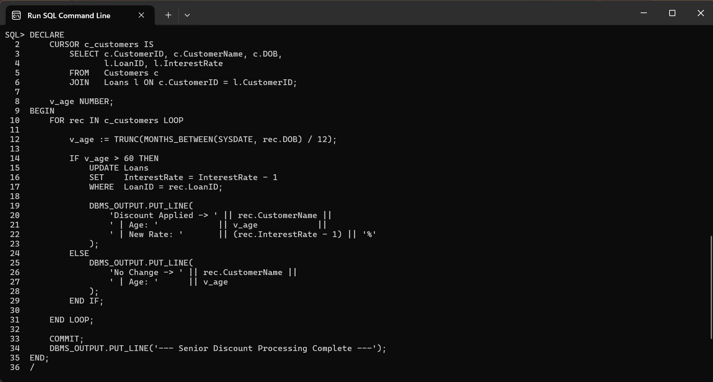
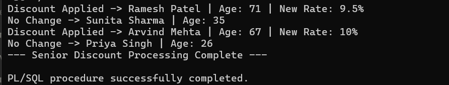
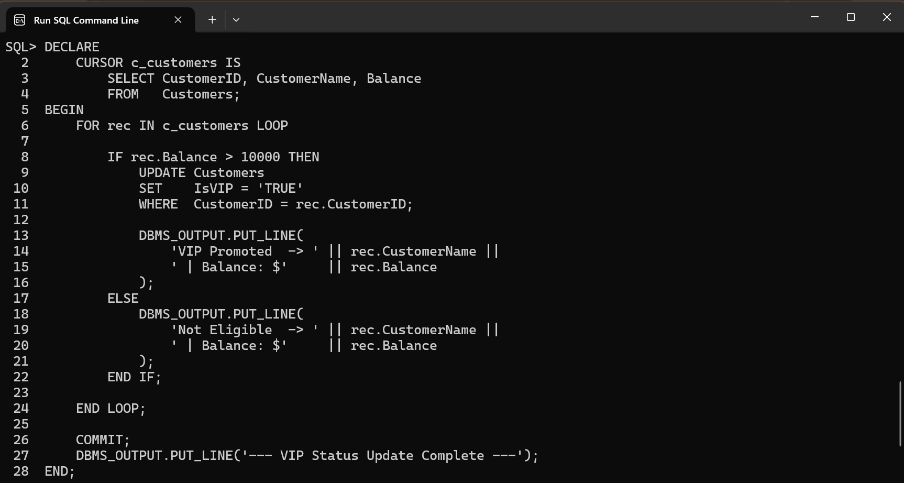
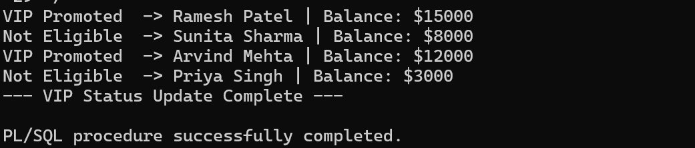
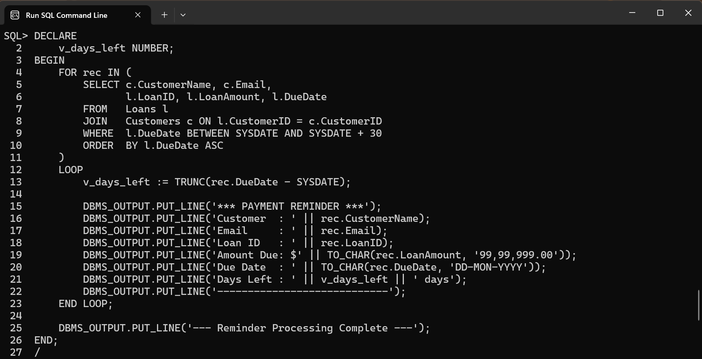
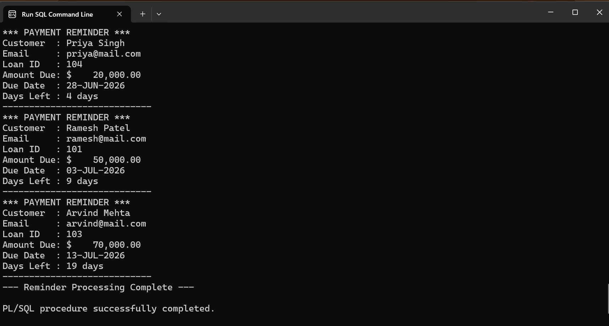

# Exercise 1: Control Structures (PL/SQL)

### 📘 Objective

Implement PL/SQL control structures to automate common banking operations such as
applying loan interest discounts for senior citizens, promoting customers to VIP
status, and generating reminders for upcoming loan due dates.

### 📁 Files Included

* `scenario1.sql` — Applies a 1% discount to loan interest rates for customers
  above 60 years of age.
* `scenario2.sql` — Updates customer VIP status based on account balance.
* `scenario3.sql` — Generates reminders for loans due within the next 30 days.

---

## 🧱 How It Works

### 🔹 Scenario 1: Senior Citizen Loan Discount

This PL/SQL block:

* Uses a **CURSOR** to fetch customer and loan details.
* Calculates customer age using:

```sql
TRUNC(MONTHS_BETWEEN(SYSDATE, rec.DOB) / 12)
```

* Checks if the customer is older than 60.
* If true:

  * reduces loan interest rate by **1%**
  * updates the Loans table.
* Displays status messages using `DBMS_OUTPUT.PUT_LINE`.

This automates age-based loan benefits.

---

### 🔹 Scenario 2: VIP Customer Promotion

This PL/SQL block:

* Iterates through all customer records.
* Checks each customer's balance.
* If balance exceeds **$10,000**:

  * updates the `IsVIP` flag to TRUE.
* Prints confirmation messages.

This automates premium customer classification.

---

### 🔹 Scenario 3: Loan Due Reminder

This PL/SQL block:

* Fetches loans whose due dates fall within the next **30 days**.
* Calculates remaining days.
* Prints reminder messages for each customer.

This helps the bank proactively notify customers.

---

## 🖼️ Scenario 1 Screenshots

📌 SQL code for senior citizen loan discount:



📌 Output showing applied discounts:



---

## 🖼️ Scenario 2 Screenshots

📌 SQL code for VIP promotion:



📌 Output showing VIP status updates:



---

## 🖼️ Scenario 3 Screenshots

📌 SQL code for loan due reminders:



📌 Output showing generated reminders:



---

### ▶️ How to Run

Execute the SQL files in Oracle SQL Command Line:

```bash
@scenario1.sql
@scenario2.sql
@scenario3.sql
```

Or copy and execute each PL/SQL block manually.

---

### 📌 Key Takeaway

PL/SQL control structures such as loops, cursors, and conditional statements
allow complex business logic to be executed directly inside the database.
This improves automation, reduces repetitive manual work, and ensures
consistency in financial operations such as discounts, promotions, and
reminder generation.
