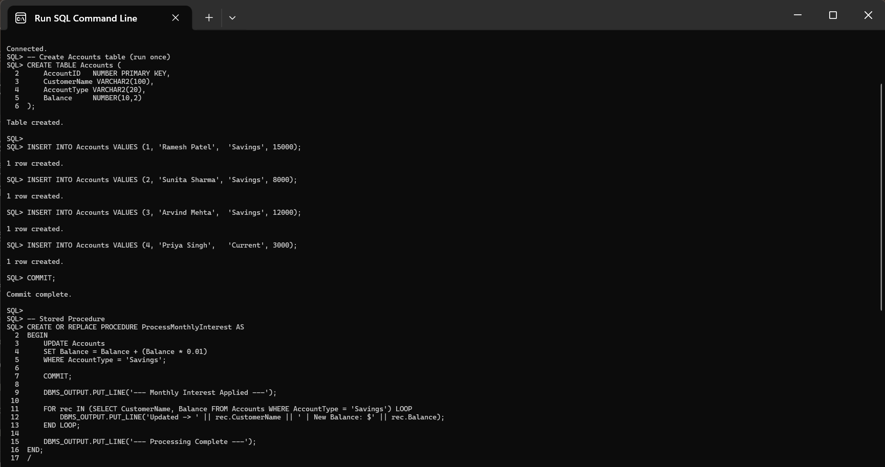
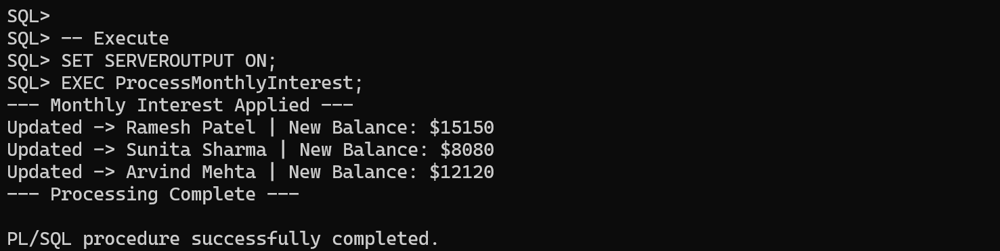
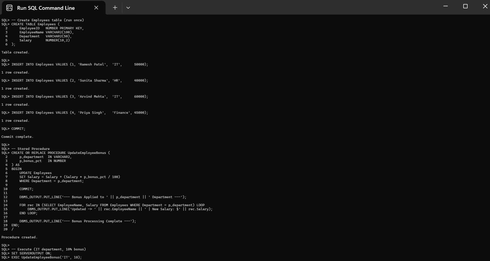
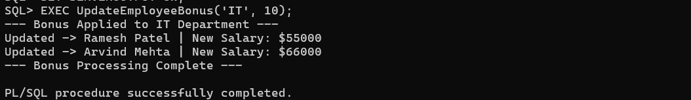
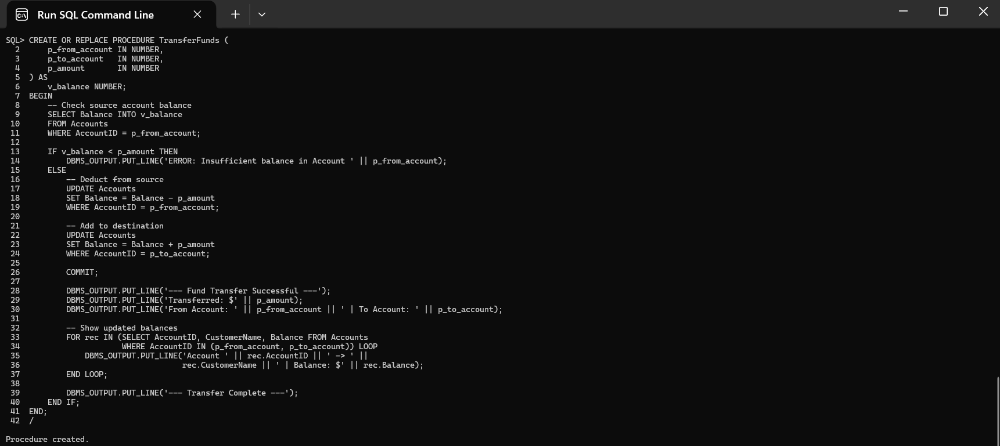
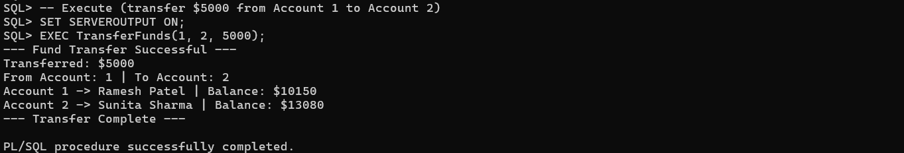

# Exercise 3: Stored Procedures

## 📘 Objective
Implement stored procedures in Oracle PL/SQL to handle real-world banking operations — monthly interest processing, employee bonus updates, and fund transfers between accounts.

---

## 📁 Files Included

| File | Description |
|------|-------------|
| `scenario1.sql` | Stored procedure to apply 1% monthly interest to all savings accounts |
| `scenario2.sql` | Stored procedure to update employee salaries with a bonus percentage |
| `scenario3.sql` | Stored procedure to transfer funds between accounts with balance validation |

---

## 🧱 Scenario 1: Process Monthly Interest

### 📌 Problem
The bank needs to process monthly interest for all savings accounts.

### 🔹 Procedure: `ProcessMonthlyInterest`
- Iterates over all accounts where `AccountType = 'Savings'`
- Applies a **1% interest rate** to the current balance using `UPDATE`
- Commits the transaction and prints updated balances for each savings account

### ▶️ Execute
```sql
SET SERVEROUTPUT ON;
EXEC ProcessMonthlyInterest;
```

### 🖼️ Code Screenshot


### 🖼️ Output Screenshot


---

## 🧱 Scenario 2: Update Employee Bonus

### 📌 Problem
The bank wants to implement a bonus scheme for employees based on department performance.

### 🔹 Procedure: `UpdateEmployeeBonus(p_department, p_bonus_pct)`
- Accepts **department name** and **bonus percentage** as input parameters
- Updates salary of all employees in that department: `Salary = Salary + (Salary × bonus% / 100)`
- Commits and prints each employee's updated salary

### ▶️ Execute
```sql
SET SERVEROUTPUT ON;
EXEC UpdateEmployeeBonus('IT', 10);
```

### 🖼️ Code Screenshot


### 🖼️ Output Screenshot


---

## 🧱 Scenario 3: Transfer Funds

### 📌 Problem
Customers should be able to transfer funds between their accounts safely.

### 🔹 Procedure: `TransferFunds(p_from_account, p_to_account, p_amount)`
- Accepts source account ID, destination account ID, and transfer amount as parameters
- **Checks source balance** before making any changes — prints error if insufficient
- If sufficient: deducts from source, adds to destination, commits, and prints updated balances
- Prevents partial transfers — both UPDATE statements run together or not at all

### ▶️ Execute
```sql
SET SERVEROUTPUT ON;
EXEC TransferFunds(1, 2, 5000);
```

### 🖼️ Code Screenshot


### 🖼️ Output Screenshot


---

## 🛠️ How to Run

1. Open **Oracle SQL*Plus** or **SQL Developer**
2. Run each `.sql` file in order (scenario1 → scenario2 → scenario3)
3. Make sure `SET SERVEROUTPUT ON` is set before executing any procedure
4. Tables (`Accounts`, `Employees`) are created inside each script — run the `CREATE TABLE` and `INSERT` sections once before calling `EXEC`

---

## 📊 Key Concepts Used

| Concept | Used In |
|--------|---------|
| `CREATE OR REPLACE PROCEDURE` | All 3 scenarios |
| `IN` parameters | Scenario 2, Scenario 3 |
| `UPDATE` with `WHERE` clause | All 3 scenarios |
| `SELECT INTO` for balance check | Scenario 3 |
| `IF / ELSE / END IF` | Scenario 3 |
| `FOR rec IN (...) LOOP` | All 3 scenarios |
| `COMMIT` | All 3 scenarios |
| `DBMS_OUTPUT.PUT_LINE` | All 3 scenarios |
| `EXEC` to call procedure | All 3 scenarios |