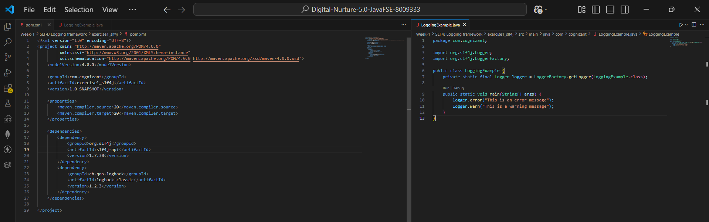
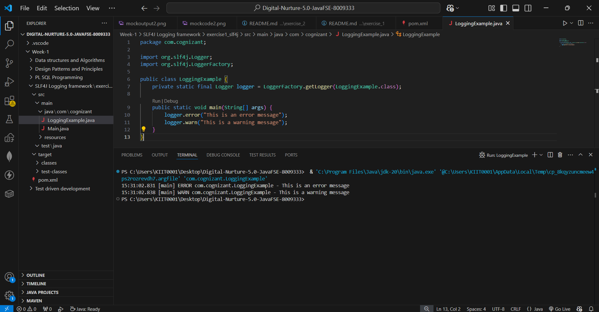

## ✅ Exercise 1: Logging Error Messages and Warning Levels (SLF4J + Logback)

### 📘 Objective
Write a Java application that demonstrates logging error messages and
warning levels using SLF4J, backed by the Logback implementation.

### 📁 Files Included
- `pom.xml` — Maven configuration with SLF4J API and Logback Classic
  dependencies.
- `LoggingExample.java` — Demonstrates logging at the `error` and `warn`
  levels.

### 🧱 How It Works

#### 🔹 pom.xml
Adds two dependencies:
- `slf4j-api` — the logging facade/interface that application code talks to.
- `logback-classic` — the actual logging implementation that does the work
  (formatting, writing to console, etc.) behind that facade.

#### 🔹 LoggingExample.java
- `LoggerFactory.getLogger(LoggingExample.class)` creates a `Logger` instance
  scoped to this class, so every log line automatically shows which class
  produced it.
- `logger.error(...)` logs a message at the **ERROR** level — used for
  serious problems that need attention.
- `logger.warn(...)` logs a message at the **WARN** level — used for
  potentially harmful situations that aren't necessarily errors yet.

### 🖼️ Code Screenshot
📌 `LoggingExample.java` in VS Code:



### 🖼️ Output Screenshot
📌 Terminal output showing both log levels:



```
15:26:31.641 [main] ERROR com.cognizant.LoggingExample - This is an error message
15:26:31.645 [main] WARN  com.cognizant.LoggingExample - This is a warning message
```

### How to run
From a terminal at the project root (where `pom.xml` lives):
```bash
mvn compile exec:java -Dexec.mainClass="com.cognizant.LoggingExample"
```
Or click the **Run ▶️** button above `main()` in VS Code.

### Key Takeaway
SLF4J (Simple Logging Facade for Java) decouples application code from a
specific logging implementation. The app only depends on `slf4j-api`, while
`logback-classic` plugs in underneath as the actual engine — meaning the
logging backend could later be swapped (e.g., to Log4j2) without changing any
application code, since all calls go through the same SLF4J `Logger`
interface.