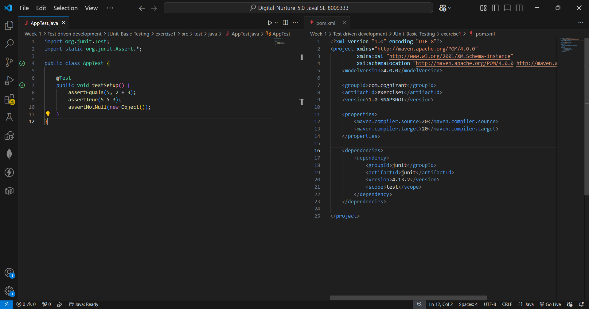
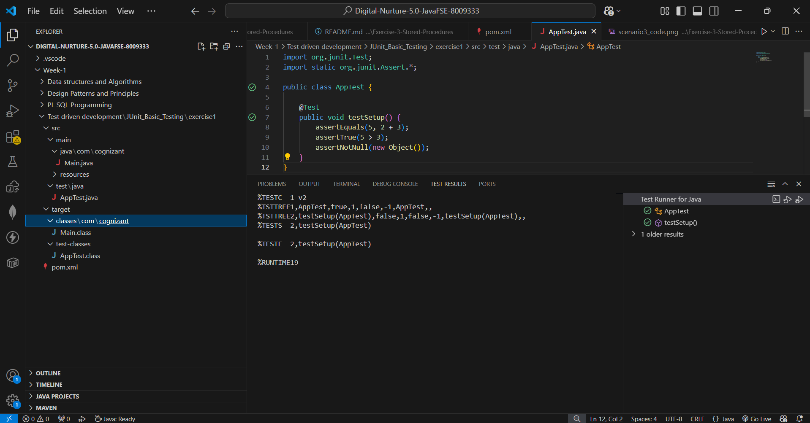

# Exercise 1: Setting Up JUnit

## 📘 Objective
Set up JUnit 4 in a Maven-based Java project to start writing unit tests.

---

## 📁 Files Included

| File | Description |
|------|-------------|
| `pom.xml` | Maven configuration with JUnit 4.13.2 dependency |
| `src/test/java/AppTest.java` | Basic test class verifying JUnit is set up correctly |

---

## 🧱 How It Works

### 🔹 pom.xml
JUnit 4.13.2 is added as a test-scoped dependency exactly as specified in the handbook:

```xml
<dependency>
    <groupId>junit</groupId>
    <artifactId>junit</artifactId>
    <version>4.13.2</version>
    <scope>test</scope>
</dependency>
```

`<scope>test</scope>` means JUnit is only included during testing — not in the production build.

### 🔹 AppTest.java
A basic test class with one `@Test` method that verifies JUnit is correctly installed and working by running three assertions:
- `assertEquals` — checks 2 + 3 equals 5
- `assertTrue` — checks 5 > 3 is true
- `assertNotNull` — checks a new Object is not null

---

## ▶️ How to Run

**Option 1 — VS Code Test Runner:**
Click the ▶️ Run button above the `@Test` method or open the **Testing panel** (beaker icon on left sidebar).

**Option 2 — Maven terminal:**
```bash
mvn test
```

---

## 🖼️ Code Screenshot
📌 pom.xml and AppTest.java showing JUnit setup:



---

## 🖼️ Output Screenshot
📌 TEST RESULTS panel showing test passed:



---

## ✅ Exercise Requirements Met

| Requirement | Status |
|-------------|--------|
| Create a new Java project | ✅ Maven project created in VS Code |
| Add JUnit dependency to pom.xml | ✅ JUnit 4.13.2 added |
| Create a new test class | ✅ AppTest.java created in src/test/java |
| Test executes successfully | ✅ Green tick in Test Runner |