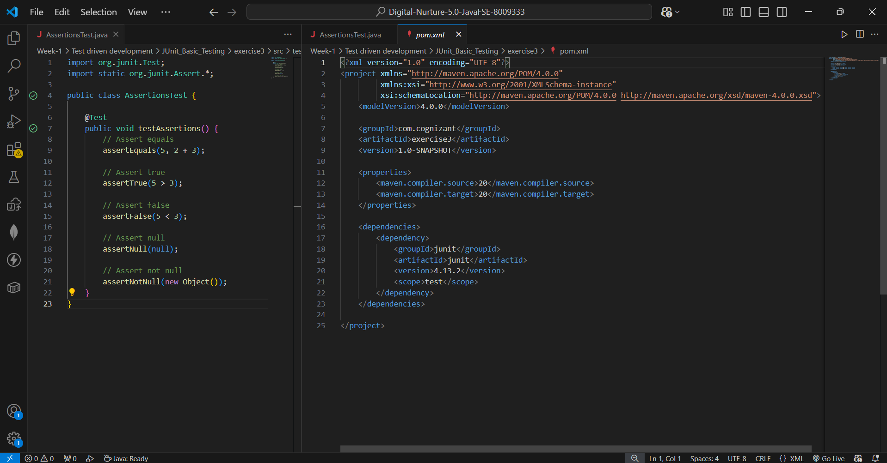
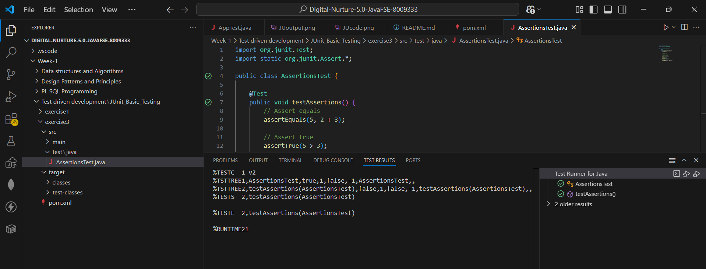

# Exercise 3: Assertions in JUnit

## 📘 Objective
Use different JUnit assertions to validate test results and understand how each assertion type works.

---

## 📁 Files Included

| File | Description |
|------|-------------|
| `pom.xml` | Maven configuration with JUnit 4.13.2 dependency |
| `src/test/java/AssertionsTest.java` | Test class demonstrating all major JUnit assertion types |

---

## 🧱 How It Works

### 🔹 AssertionsTest.java
A single test method `testAssertions()` that covers all five core JUnit assertion types:

| Assertion | What It Checks | Example |
|-----------|---------------|---------|
| `assertEquals` | Two values are equal | `assertEquals(5, 2 + 3)` |
| `assertTrue` | Condition is true | `assertTrue(5 > 3)` |
| `assertFalse` | Condition is false | `assertFalse(5 < 3)` |
| `assertNull` | Value is null | `assertNull(null)` |
| `assertNotNull` | Value is not null | `assertNotNull(new Object())` |

If any assertion fails, JUnit immediately stops that test and reports a failure — proving that all assertions must pass for the test to be green.

---

## ▶️ How to Run

**Option 1 — VS Code Test Runner:**
Click the ▶️ Run button above the `@Test` method or open the **Testing panel** (beaker icon on left sidebar).

**Option 2 — Maven terminal:**
```bash
mvn test
```

---

## 🖼️ Code Screenshot
📌 AssertionsTest.java showing all assertion types:



---

## 🖼️ Output Screenshot
📌 TEST RESULTS panel showing test passed:



---

## ✅ Exercise Requirements Met

| Requirement | Status |
|-------------|--------|
| Write tests using various JUnit assertions | ✅ All 5 assertion types covered |
| `assertEquals` | ✅ `assertEquals(5, 2 + 3)` |
| `assertTrue` | ✅ `assertTrue(5 > 3)` |
| `assertFalse` | ✅ `assertFalse(5 < 3)` |
| `assertNull` | ✅ `assertNull(null)` |
| `assertNotNull` | ✅ `assertNotNull(new Object())` |
| Test executes successfully | ✅ Green tick in Test Runner |