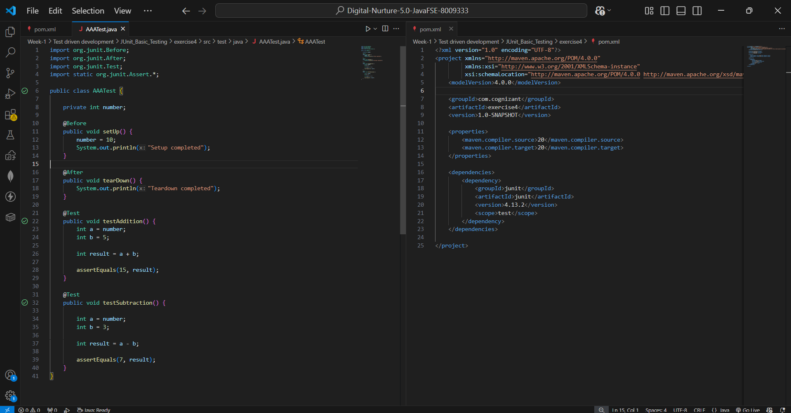
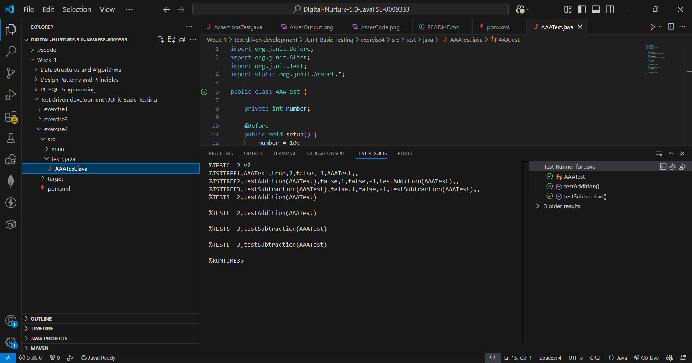

# Exercise 4: Arrange-Act-Assert (AAA) Pattern, Test Fixtures, Setup and Teardown Methods in JUnit

## 📘 Objective
Organize JUnit tests using the **Arrange-Act-Assert (AAA)** pattern and manage test state using `@Before` and `@After` setup and teardown methods.

---

## 📁 Files Included

| File | Description |
|------|-------------|
| `pom.xml` | Maven configuration with JUnit 4.13.2 dependency |
| `src/test/java/AAATest.java` | Test class demonstrating AAA pattern with setup and teardown |

---

## 🧱 How It Works

### 🔹 AAA Pattern
Each test method follows the **Arrange-Act-Assert** structure:

| Phase | What It Does | Example |
|-------|-------------|---------|
| **Arrange** | Set up test data/variables | `int a = number; int b = 5;` |
| **Act** | Perform the operation | `int result = a + b;` |
| **Assert** | Verify the result | `assertEquals(15, result);` |

### 🔹 @Before — setUp()
Runs **before every test method** — initializes `number = 10` as a shared test fixture so each test starts with a clean, consistent state.

### 🔹 @After — tearDown()
Runs **after every test method** — used for cleanup tasks after each test completes.

### 🔹 Test Methods

**testAddition()**
- Arrange: `a = 10` (from setUp), `b = 5`
- Act: `result = a + b`
- Assert: `assertEquals(15, result)` ✅

**testSubtraction()**
- Arrange: `a = 10` (from setUp), `b = 3`
- Act: `result = a - b`
- Assert: `assertEquals(7, result)` ✅

---

## ▶️ How to Run

**Option 1 — VS Code Test Runner:**
Click the ▶️ Run button above any `@Test` method or open the **Testing panel** (beaker icon on left sidebar).

**Option 2 — Maven terminal:**
```bash
mvn test
```

**Execution order per test:**
```
setUp()       ← @Before
testAddition() ← @Test
tearDown()    ← @After

setUp()          ← @Before
testSubtraction() ← @Test
tearDown()       ← @After
```

---

## 🖼️ Code Screenshot
📌 AAATest.java showing AAA pattern with @Before and @After:



---

## 🖼️ Output Screenshot
📌 TEST RESULTS panel showing both tests passed:



---

## ✅ Exercise Requirements Met

| Requirement | Status |
|-------------|--------|
| Write tests using the AAA pattern | ✅ Arrange-Act-Assert in every test |
| Use `@Before` for setup | ✅ `setUp()` initializes `number = 10` |
| Use `@After` for teardown | ✅ `tearDown()` prints cleanup message |
| Test fixture shared across tests | ✅ `number` field reinitialized before each test |
| Both tests pass | ✅ Green ticks in Test Runner |