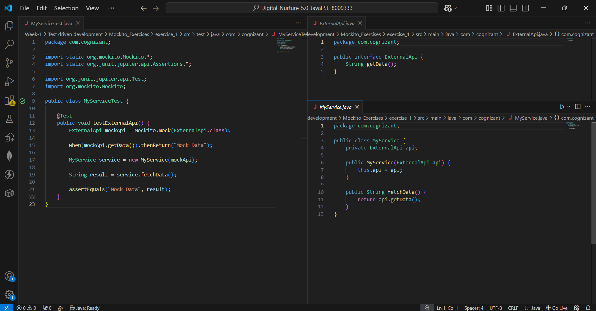
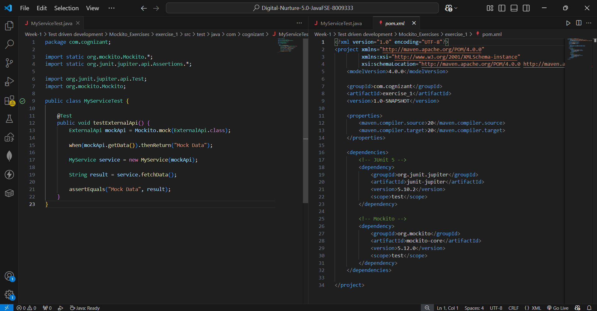
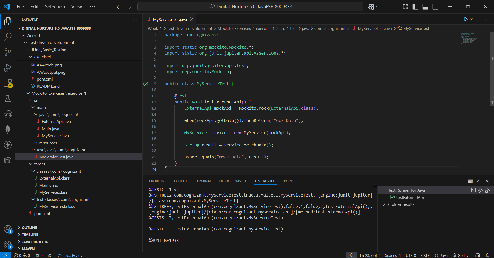

## ✅ Exercise 1: Mocking and Stubbing (Mockito + JUnit 5)

### 📘 Objective
Test a service that depends on an external API, without actually calling that
external API, by using Mockito to create a mock object and stub its method to
return a predefined value.

### 📁 Files Included
- `pom.xml` — Maven configuration with JUnit 5 and Mockito dependencies.
- `ExternalApi.java` — Interface representing the external dependency.
- `MyService.java` — The class under test; depends on `ExternalApi`.
- `MyServiceTest.java` (inside `src/test/java/com/cognizant`) — Test class
  that mocks `ExternalApi` and verifies `MyService` behaves correctly.

### 🧱 How It Works

#### 🔹 ExternalApi.java
A simple interface with one method, `getData()`. In a real application this
would be backed by an actual HTTP call to a third-party service — but for
testing, we never want our unit tests to depend on a real network call.

#### 🔹 MyService.java
Takes an `ExternalApi` instance via constructor injection and exposes
`fetchData()`, which simply delegates to `externalApi.getData()`. Because the
dependency is injected rather than created internally, it can be swapped out
for a mock during testing.

#### 🔹 MyServiceTest.java
This test demonstrates the three steps from the exercise:
1. **Create a mock object** — `Mockito.mock(ExternalApi.class)` creates a fake
   implementation of `ExternalApi` with no real behavior.
2. **Stub the method** — `when(mockApi.getData()).thenReturn("Mock Data")`
   tells the mock exactly what to return when `getData()` is called, without
   needing a real implementation.
3. **Use the mock in a test** — a `MyService` is built using the mock, and
   `fetchData()` is called. Since `MyService` just delegates to
   `externalApi.getData()`, calling it returns `"Mock Data"`, which is then
   verified with `assertEquals`.

### 🖼️ Code Screenshot
📌 `All code in .java` in VS Code:




### 🖼️ Output Screenshot
📌 Test Runner for Java showing the test passing:



### How to run
From a terminal at the project root (where `pom.xml` lives):
```bash
mvn test
```
Or use the **Testing** panel in VS Code (flask icon in the sidebar) and run
`testExternalApi` directly.

### Key Takeaway
Mocking lets you isolate the class under test (`MyService`) from its real
dependencies (`ExternalApi`). This means tests run fast, don't depend on
external systems being available, and can simulate specific scenarios (like a
particular API response, an error, or a timeout) on demand — something that
would be difficult or unreliable to set up with a real external API.