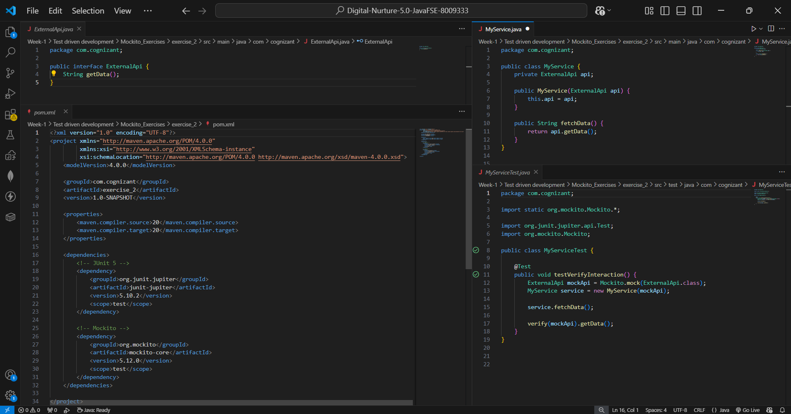
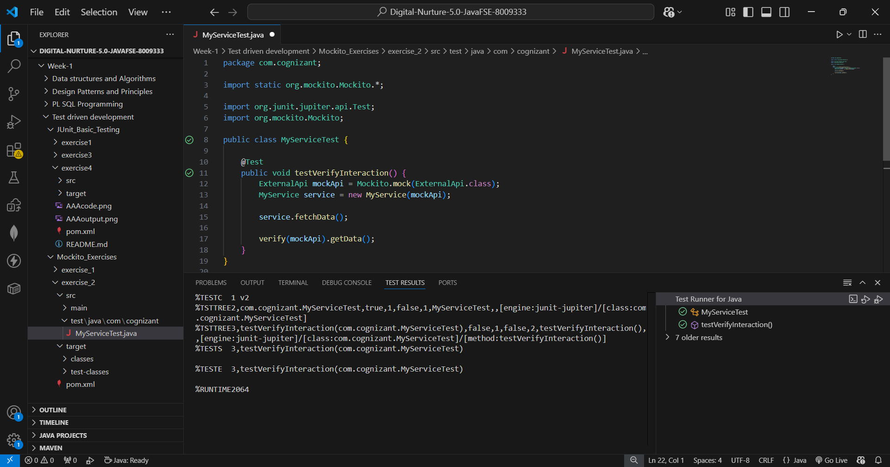

## ✅ Exercise 2: Verifying Interactions (Mockito + JUnit 5)

### 📘 Objective
Ensure that a specific method on a mock object is actually called during
execution, using Mockito's `verify()` — distinct from checking a return value,
this checks that an interaction happened.

### 📁 Files Included
- `pom.xml` — Maven configuration with JUnit 5 and Mockito dependencies.
- `ExternalApi.java` — Interface representing the external dependency.
- `MyService.java` — The class under test; depends on `ExternalApi`.
- `MyServiceTest.java` (inside `src/test/java/com/cognizant`) — Test class
  that verifies `MyService` actually calls `ExternalApi.getData()`.

### 🧱 How It Works

#### 🔹 ExternalApi.java / MyService.java
Same as Exercise 1 — `MyService` depends on `ExternalApi` via constructor
injection, and `fetchData()` delegates to `externalApi.getData()`.

#### 🔹 MyServiceTest.java
This test demonstrates the three steps from the exercise:
1. **Create a mock object** — `Mockito.mock(ExternalApi.class)`.
2. **Call the method** — `service.fetchData()` is invoked, which internally
   calls `mockApi.getData()`.
3. **Verify the interaction** — `verify(mockApi).getData()` asserts that
   `getData()` was called on the mock exactly once during the test. If
   `MyService` had a bug and never actually called the dependency, this line
   alone would fail the test, even without checking any return value.

### 🖼️ Code Screenshot
📌 `All code in .java` in VS Code:



### 🖼️ Output Screenshot
📌 Test Runner for Java showing the test passing:



### How to run
From a terminal at the project root (where `pom.xml` lives):
```bash
mvn test
```
Or use the **Testing** panel in VS Code (flask icon in the sidebar) and run
`testVerifyInteraction` directly.

### Key Takeaway
`verify()` is used when the behavior you care about is *that something
happened*, not *what it returned* — for example, confirming a logging call,
an email send, or a database write occurred. This complements stubbing
(Exercise 1), which controls *what a mock returns*; verification instead
checks *how the mock was used*.