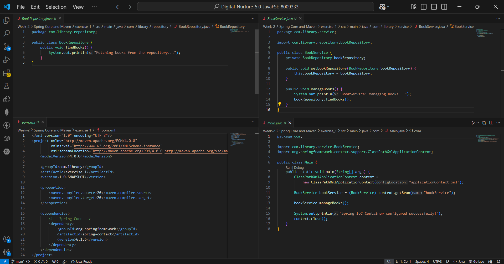
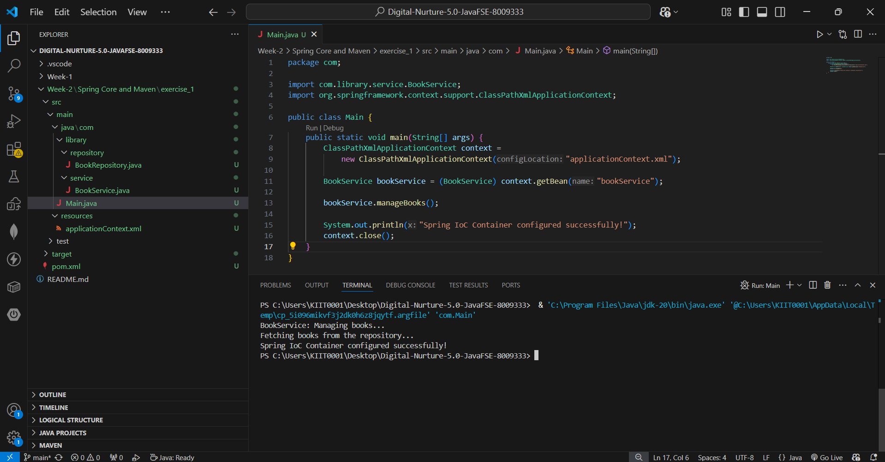

# Exercise 1: Configuring a Basic Spring Application

## 📘 Objective

The objective of this exercise is to understand the basic configuration of a Spring application using the Spring Framework. This includes setting up a Maven project, adding Spring Core dependencies, creating XML-based bean configurations, and testing the Spring IoC container.

---

## 📂 Project Structure

```text
LibraryManagement
│── src/main/java
│   ├── com.library.service
│   │   └── BookService.java
│   ├── com.library.repository
│   │   └── BookRepository.java
│   └── com.Main.java
│
│── src/main/resources
│   └── applicationContext.xml
│
│── pom.xml
│── README.md
│── code.png
│── output.png
```

---

## 📁 Files Description

### 1. `pom.xml`

Contains Maven configuration and Spring Core dependency required for running the application.

Dependency used:

* Spring Context

Purpose:

* To provide Spring IoC container functionality.

---

### 2. `applicationContext.xml`

XML configuration file located inside `src/main/resources`.

Purpose:

* Defines the Spring beans:

  * `BookService`
  * `BookRepository`

This file is responsible for managing object creation and dependency configuration.

---

### 3. `BookService.java`

Located in:
`com.library.service`

Purpose:

* Represents the service layer of the application.
* Handles book-related business logic.

Current functionality:

* Displays the message:
  `BookService: Managing books...`

---

### 4. `BookRepository.java`

Located in:
`com.library.repository`

Purpose:

* Represents the repository/data layer.
* Handles book data operations.

Current functionality:

* Displays the message:
  `Fetching books from the repository...`

---

### 5. `Main.java`

Purpose:

* Entry point of the application.
* Loads the Spring Application Context.
* Retrieves beans from the IoC container.
* Executes methods to test configuration.

Main operations:

* Loads `applicationContext.xml`
* Fetches `BookService` bean
* Fetches `BookRepository` bean
* Calls their methods
* Closes the context

---

## ⚙️ Implementation Steps

### Step 1: Create Maven Project

Created a Maven project named:
`LibraryManagement`

---

### Step 2: Add Spring Dependency

Added Spring Core dependency inside `pom.xml`.

This enables:

* Bean creation
* Dependency Injection
* IoC Container support

---

### Step 3: Configure Application Context

Created `applicationContext.xml` and registered beans:

* `bookService`
* `bookRepository`

This allows Spring to manage object lifecycle.

---

### Step 4: Create Service and Repository Classes

Implemented:

* `BookService`
* `BookRepository`

These classes simulate backend operations of a library management system.

---

### Step 5: Create Main Class

Implemented `Main.java` to:

* Load Spring context
* Access beans
* Execute methods

---

## ▶️ Execution

Run the application using:

### VS Code:

Click the **Run ▶️** button.

OR

### Terminal:

```bash
mvn compile
mvn exec:java
```

---

## 🖼️ Code Screenshot

Code implementation screenshots:



---

## 🖼️ Output Screenshot

Successful execution output:



---

## 📌 Output

```text
BookService: Managing books...
Fetching books from the repository...
Spring IoC Container configured successfully!
```

---

## 🧠 Concepts Learned

* Spring Framework Basics
* Spring IoC Container
* XML Bean Configuration
* Bean Management
* ApplicationContext Loading
* Maven Dependency Management

---

## ✅ Conclusion

This exercise successfully demonstrates how to configure a basic Spring application using XML configuration and the Spring IoC container. It provides a strong foundation for understanding Dependency Injection and bean lifecycle management in Spring.
