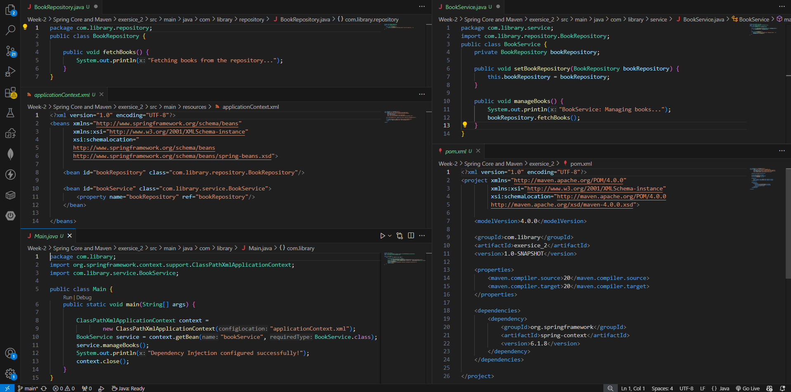
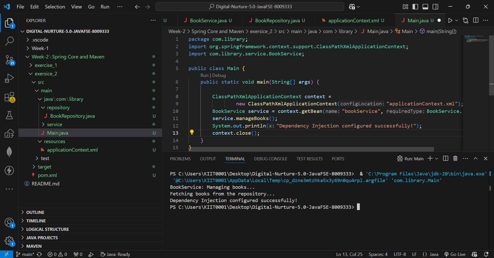

# Exercise 2: Implementing Dependency Injection

## 📘 Objective

The objective of this exercise is to understand how Dependency Injection (DI) works in the Spring Framework using the Inversion of Control (IoC) container. This exercise demonstrates how Spring manages dependencies between classes through XML-based configuration.

---

## 📂 Project Structure

```text
LibraryManagement
│── src/main/java
│   ├── com.library.service
│   │   └── BookService.java
│   ├── com.library.repository
│   │   └── BookRepository.java
│   └── com.library.Main.java
│
│── src/main/resources
│   └── applicationContext.xml
│
│── pom.xml
│── README.md
│── code.png
│── output.png
```

---

## 📁 Files Description

### 1. `BookRepository.java`

Located in:
`com.library.repository`

Purpose:

* Represents the repository layer.
* Handles book data operations.

Functionality:

* Contains the method `fetchBooks()` which prints repository data access message.

---

### 2. `BookService.java`

Located in:
`com.library.service`

Purpose:

* Represents the service layer.
* Depends on `BookRepository`.

Functionality:

* Uses setter injection to receive `BookRepository`.
* Calls repository methods to fetch data.

Important Method:

* `setBookRepository()` → used for Dependency Injection.

---

### 3. `applicationContext.xml`

Located in:
`src/main/resources`

Purpose:

* Configures Spring beans.
* Wires `BookRepository` into `BookService`.

Important Configuration:

```xml
<property name="bookRepository" ref="bookRepository"/>
```

This line performs setter-based Dependency Injection.

---

### 4. `Main.java`

Purpose:

* Loads Spring Application Context.
* Retrieves `BookService` bean.
* Tests dependency injection.

Main operations:

* Load XML configuration
* Get service bean
* Execute methods
* Close context

---

## ⚙️ Implementation Steps

### Step 1: Modify XML Configuration

Updated `applicationContext.xml` to inject `BookRepository` into `BookService`.

---

### Step 2: Update Service Class

Added setter method:

```java
setBookRepository(BookRepository bookRepository)
```

This allows Spring to inject the dependency.

---

### Step 3: Test Configuration

Ran `Main.java` to verify:

* Bean creation
* Dependency injection
* Method execution

---

## ▶️ Execution

Run the application using:

### VS Code:

Click **Run ▶️**

OR

### Terminal:

```bash
mvn compile
mvn exec:java
```

---

## 🖼️ Code Screenshot

Code implementation screenshots:



---

## 🖼️ Output Screenshot

Execution output:



---

## 📌 Output

```text
BookService: Managing books...
Fetching books from the repository...
Dependency Injection configured successfully!
```

---

## 🧠 Concepts Learned

* Spring IoC Container
* Dependency Injection (DI)
* Setter Injection
* Bean Wiring
* XML Configuration
* Object Lifecycle Management

---

## ✅ Conclusion

This exercise successfully demonstrates how Spring Dependency Injection works using XML configuration and setter injection. It shows how Spring manages dependencies between service and repository layers efficiently.
