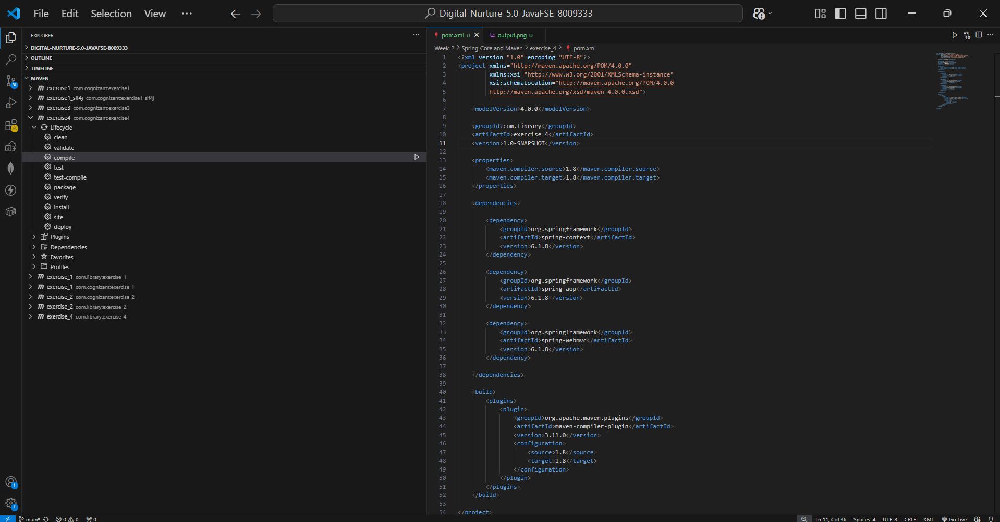
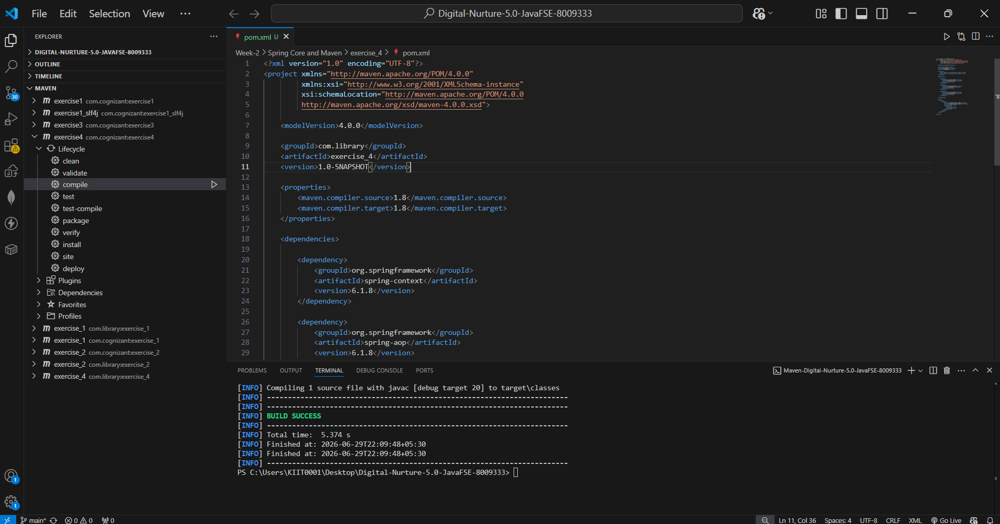

# Exercise 4: Creating and Configuring a Maven Project

## 📘 Objective

The objective of this exercise is to create and configure a Maven project for the Library Management application and integrate essential Spring Framework dependencies.

---

## 📂 Project Structure

```text id="8qf9l1"
LibraryManagement
│── src
│   ├── main
│   │   ├── java
│   │   └── resources
│   ├── test
│
│── target
│── pom.xml
│── README.md
```

---

## 📌 Scenario

A new Maven project needs to be set up for the Library Management application. The project must include Spring Framework dependencies and configure Maven Compiler Plugin for Java 1.8 compatibility.

---

## ⚙️ Steps Performed

### Step 1: Created a New Maven Project

Created a Maven-based project named:

```text id="xv60ry"
exercise_4
```

with:

* **Group ID:** `com.library`
* **Artifact ID:** `exercise_4`

---

### Step 2: Added Spring Dependencies in `pom.xml`

Included the following dependencies:

#### Spring Context

Used for configuring Spring IoC container.

```xml id="knr6i8"
<artifactId>spring-context</artifactId>
```

---

#### Spring AOP

Used for aspect-oriented programming support.

```xml id="6isyr4"
<artifactId>spring-aop</artifactId>
```

---

#### Spring WebMVC

Used for web application development.

```xml id="9v24ir"
<artifactId>spring-webmvc</artifactId>
```

---

### Step 3: Configured Maven Compiler Plugin

Configured Java version compatibility:

```xml id="8cm4hy"
<source>1.8</source>
<target>1.8</target>
```

This ensures the project compiles using Java 8 standards.

---

## 🛠 Build Verification

The Maven lifecycle **compile** phase was executed successfully.

Command used:

```bash id="pn4jkp"
mvn compile
```

---

## 📌 Output

```text id="tkv1rj"
[INFO] BUILD SUCCESS
```

This confirms:

* Dependencies were resolved correctly
* Project compiled successfully
* Maven configuration is valid

---

## 🖼️ Screenshots

### pom.xml Configuration



---

### Maven Build Output



---

## 🧠 Concepts Learned

* Maven Project Structure
* Dependency Management in Maven
* Spring Dependency Integration
* Maven Lifecycle
* Maven Compiler Plugin Configuration

---

## ✅ Conclusion

This exercise successfully demonstrates how to create and configure a Maven project, manage Spring dependencies, and compile the project using Maven. This forms the foundation for building scalable Spring-based applications.
