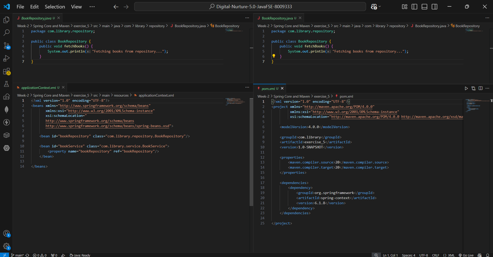
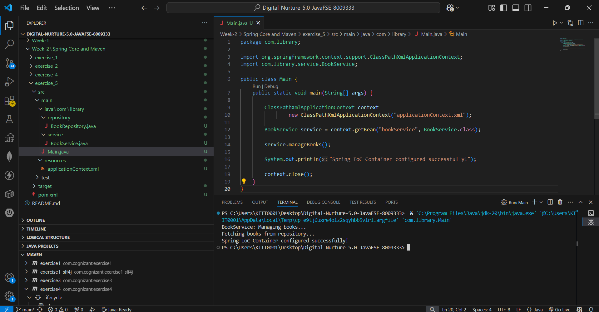

# Exercise 5: Configuring the Spring IoC Container

## 📘 Objective

The objective of this exercise is to understand how the Spring IoC (Inversion of Control) Container manages beans and dependencies using XML configuration.

This exercise demonstrates how to configure beans centrally and inject dependencies between classes using Spring Framework.

---

## 📂 Project Structure

```text
exercise_5
│── src
│   ├── main
│   │   ├── java
│   │   │   ├── com.library.service
│   │   │   │   └── BookService.java
│   │   │   ├── com.library.repository
│   │   │   │   └── BookRepository.java
│   │   │   └── com.library.Main.java
│   │   └── resources
│   │       └── applicationContext.xml
│── pom.xml
│── README.md
│── code.png
│── output.png
```

---

## 📌 Scenario

The library management application requires a centralized configuration for managing beans and dependencies.

Spring IoC container helps by:

* Creating objects
* Managing their lifecycle
* Injecting dependencies automatically

---

## ⚙️ Steps Performed

### Step 1: Created Spring Configuration File

Created:

```text
applicationContext.xml
```

inside:

```text
src/main/resources
```

Defined beans for:

* `BookService`
* `BookRepository`

This file acts as the central Spring configuration.

---

### Step 2: Updated BookService Class

Added setter method:

```java
setBookRepository(BookRepository bookRepository)
```

This allows Spring to inject the repository dependency.

---

### Step 3: Created Repository Class

Implemented `BookRepository` with:

```java
fetchBooks()
```

This simulates fetching books from the database.

---

### Step 4: Tested Application

Created `Main.java` to:

* Load Spring Application Context
* Retrieve `BookService` bean
* Execute methods
* Verify dependency injection

---

## 🔧 Spring IoC Configuration

Important bean configuration:

```xml
<bean id="bookRepository" class="com.library.repository.BookRepository"/>

<bean id="bookService" class="com.library.service.BookService">
    <property name="bookRepository" ref="bookRepository"/>
</bean>
```

This configures Spring to inject `BookRepository` into `BookService`.

---

## ▶️ Execution

Run:

```text
Main.java
```

using VS Code Run button.

---

## 🖼️ Code Screenshot

Implementation screenshots:



---

## 🖼️ Output Screenshot

Execution output:



---

## 📌 Output

```text
BookService: Managing books...
Fetching books from repository...
Spring IoC Container configured successfully!
```

---

## 🧠 Concepts Learned

* Spring IoC Container
* Bean Configuration
* XML-based Configuration
* Setter Injection
* Dependency Management
* Object Lifecycle Handling

---

## ✅ Conclusion

This exercise successfully demonstrates how the Spring IoC Container works by centrally configuring beans and managing dependencies between classes. It provides a strong understanding of bean lifecycle and dependency injection in Spring Framework.
