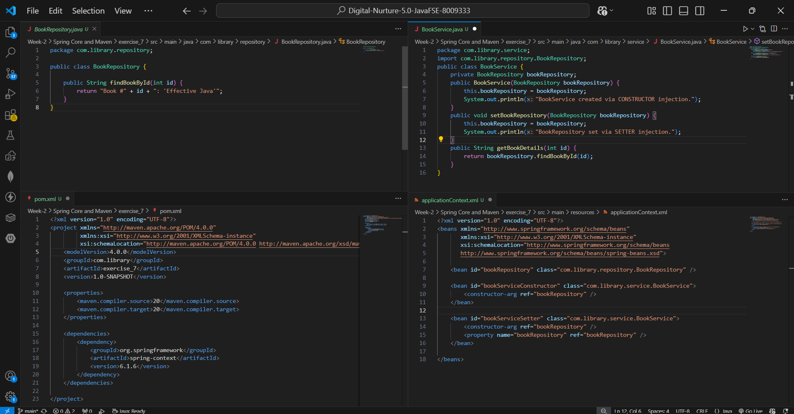
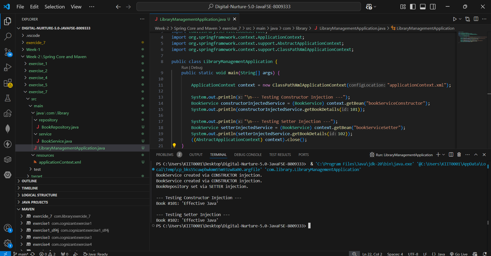

# Exercise 7: Implementing Constructor and Setter Injection

## 📘 Objective

The objective of this exercise is to understand and implement both **Constructor Injection** and **Setter Injection** in the Spring Framework for better control over bean initialization.

This exercise demonstrates how Spring IoC container can manage dependencies using multiple injection techniques.

---

## 📂 Project Structure

```text
exercise_7
│── src
│   ├── main
│   │   ├── java
│   │   │   ├── com.library.service
│   │   │   │   └── BookService.java
│   │   │   ├── com.library.repository
│   │   │   │   └── BookRepository.java
│   │   │   └── com.library.LibraryManagementApplication.java
│   │   └── resources
│   │       └── applicationContext.xml
│── pom.xml
│── README.md
│── code.png
│── output.png
```

---

## 📌 Scenario

The library management application requires both constructor injection and setter injection to initialize and manage dependencies effectively.

This helps in:

* Better object creation control
* Flexible dependency management
* Improved Spring bean lifecycle understanding

---

## ⚙️ Steps Performed

### Step 1: Configure Constructor Injection

Updated `applicationContext.xml` using:

```xml
<constructor-arg ref="bookRepository"/>
```

This injects the dependency during object creation.

---

### Step 2: Configure Setter Injection

Updated `applicationContext.xml` using:

```xml
<property name="bookRepository" ref="bookRepository"/>
```

This injects the dependency after object creation.

---

### Step 3: Implemented Service Class

Created `BookService.java` with:

* Constructor for constructor injection
* Setter method for setter injection
* Method to manage books

---

### Step 4: Implemented Repository Class

Created `BookRepository.java` to simulate fetching books from repository.

---

### Step 5: Tested Both Injections

Created `LibraryManagementApplication.java` to:

* Load Spring Application Context
* Retrieve beans
* Verify constructor injection
* Verify setter injection

---

## 🔧 Spring Configuration

Bean wiring:

```xml
<bean id="bookRepository" class="com.library.repository.BookRepository"/>

<bean id="bookService" class="com.library.service.BookService">
    <constructor-arg ref="bookRepository"/>
    <property name="bookRepository" ref="bookRepository"/>
</bean>
```

This enables both injection types.

---

## ▶️ Execution

Run:

```text
LibraryManagementApplication.java
```

using VS Code.

---

## 🖼️ Code Screenshot

Implementation screenshots:



---

## 🖼️ Output Screenshot

Execution output:



---

## 📌 Output

```text
BookService created via CONSTRUCTOR injection.
BookService created via CONSTRUCTOR injection.
BookRepository set via SETTER injection.

--- Testing Constructor Injection ---
Book #101: 'Effective Java'

--- Testing Setter Injection ---
Book #102: 'Effective Java'
```

---

## 🧠 Concepts Learned

* Spring IoC Container
* Constructor Injection
* Setter Injection
* Bean Lifecycle
* Dependency Management
* XML-based Configuration

---

## ✅ Conclusion

This exercise successfully demonstrates how Spring supports both constructor and setter injection for managing dependencies. It provides a clear understanding of bean initialization and dependency handling in Spring applications.
