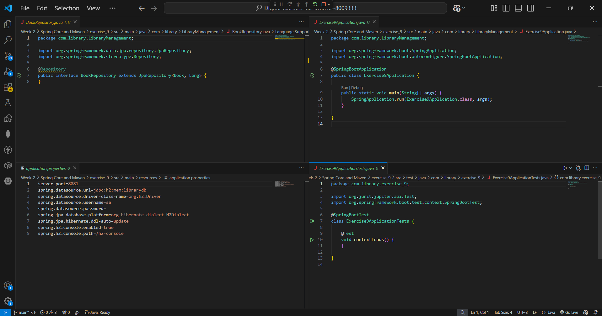
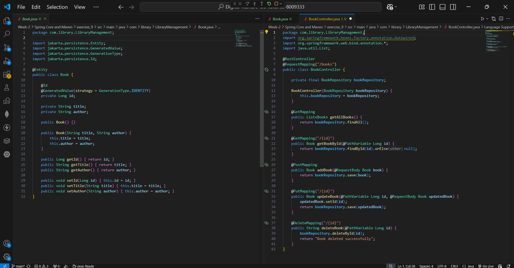
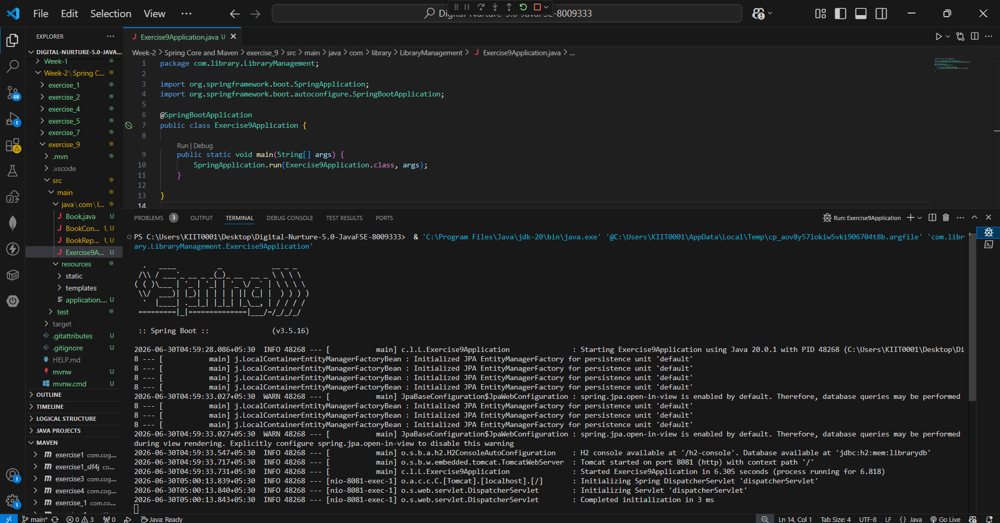
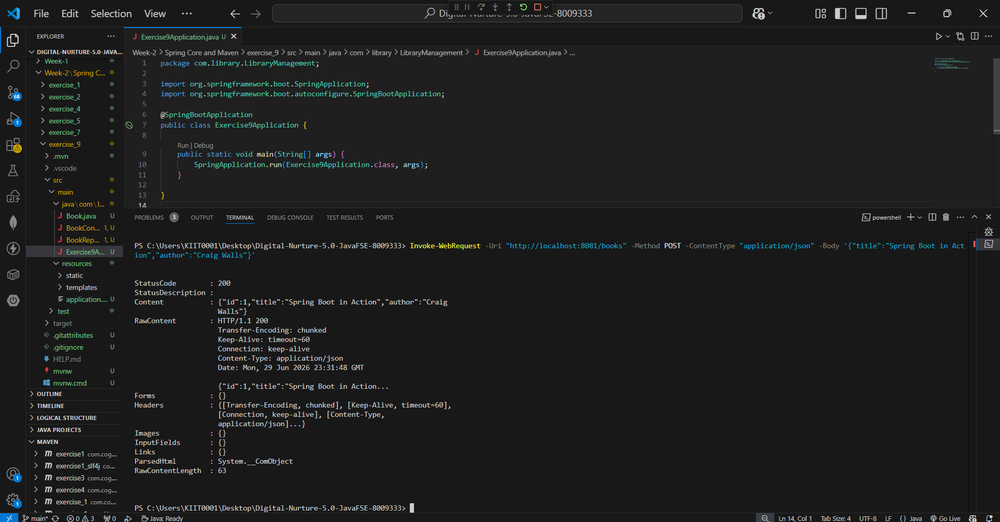
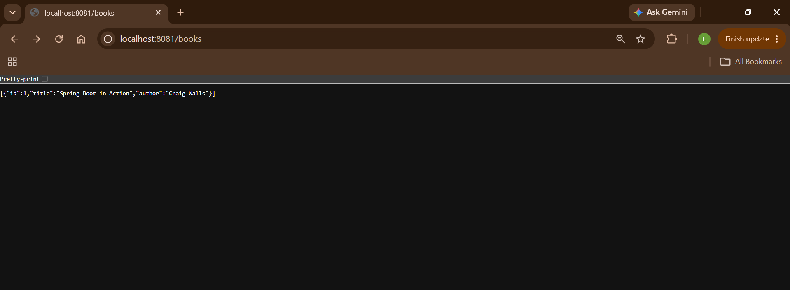

# Exercise 9: Creating a Spring Boot Application

## 📘 Objective
Create a Spring Boot application for the Library Management System with REST API endpoints for CRUD operations, using Spring Web, Spring Data JPA, and H2 in-memory database.

---

## 📁 Files Included

| File | Description |
|------|-------------|
| `pom.xml` | Maven configuration with Spring Boot, JPA, Web, and H2 dependencies |
| `src/main/resources/application.properties` | Database and server configuration |
| `src/main/java/.../Exercise9Application.java` | Spring Boot main class with `@SpringBootApplication` |
| `src/main/java/.../Book.java` | JPA Entity representing a book |
| `src/main/java/.../BookRepository.java` | Spring Data JPA repository interface |
| `src/main/java/.../BookController.java` | REST Controller with CRUD endpoints |

---

## 🧱 How It Works

### 🔹 Book.java (Entity)
- Annotated with `@Entity` — maps to H2 database table automatically
- Fields: `id` (auto-generated), `title`, `author`
- Includes constructors, getters, and setters

### 🔹 BookRepository.java
- Extends `JpaRepository<Book, Long>`
- Provides all CRUD operations out of the box — no implementation needed
- Annotated with `@Repository`

### 🔹 BookController.java
- `@RestController` with `@RequestMapping("/books")`
- Uses constructor injection for `BookRepository`
- Handles all HTTP methods:

| Method | Endpoint | Operation |
|--------|----------|-----------|
| GET | `/books` | Get all books |
| GET | `/books/{id}` | Get book by ID |
| POST | `/books` | Add new book |
| PUT | `/books/{id}` | Update book |
| DELETE | `/books/{id}` | Delete book |

### 🔹 application.properties
```properties
server.port=8081
spring.datasource.url=jdbc:h2:mem:librarydb
spring.datasource.driver-class-name=org.h2.Driver
spring.datasource.username=sa
spring.datasource.password=
spring.jpa.database-platform=org.hibernate.dialect.H2Dialect
spring.jpa.hibernate.ddl-auto=update
spring.h2.console.enabled=true
spring.h2.console.path=/h2-console
```

---

## ▶️ How to Run

```bash
mvn spring-boot:run
```

Or via VS Code — click ▶️ Run on `Exercise9Application.java`

---

## 🧪 Testing the API

**Add a book (PowerShell):**
```powershell
Invoke-WebRequest -Uri "http://localhost:8081/books" -Method POST -ContentType "application/json" -Body '{"title":"Spring Boot in Action","author":"Craig Walls"}'
```

**Get all books (Browser):**
```
http://localhost:8081/books
```

**H2 Database Console:**
```
http://localhost:8081/h2-console
```
JDBC URL: `jdbc:h2:mem:librarydb` | Username: `sa` | Password: (empty)

---

## 🖼️ Code Screenshots

### BookRepository + Application + Properties
📌 BookRepository.java, Exercise9Application.java and application.properties:



### Book Entity + REST Controller
📌 Book.java and BookController.java showing full CRUD implementation:



---

## 🖼️ Output Screenshots

### Spring Boot Startup
📌 Application started successfully on port 8081:



### POST Request — Add Book
📌 Book added via REST API, StatusCode 200 with JSON response:



### GET Request — Browser
📌 `localhost:8081/books` returning book as JSON array:



---

## ✅ Exercise Requirements Met

| Requirement | Status |
|-------------|--------|
| Create Spring Boot project via Spring Initializr | ✅ |
| Add Spring Web, Spring Data JPA, H2 dependencies | ✅ |
| Configure `application.properties` | ✅ |
| Create `Book` entity with `@Entity` | ✅ |
| Create `BookRepository` extending `JpaRepository` | ✅ |
| Create `BookController` with CRUD endpoints | ✅ |
| Run application and test REST endpoints | ✅ |