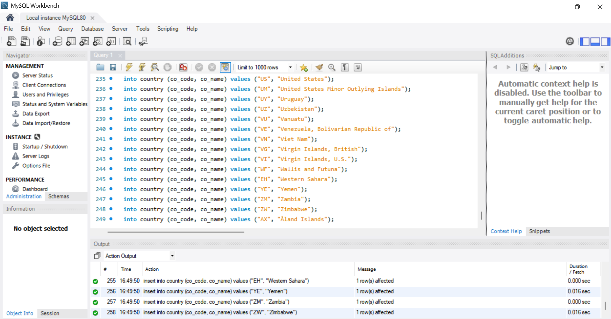
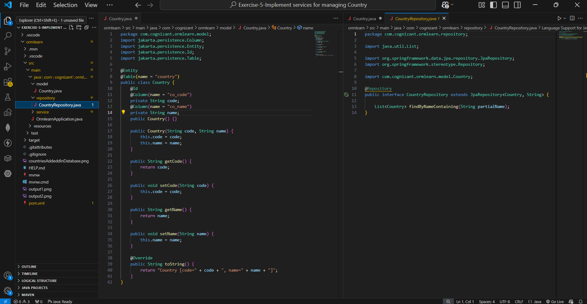
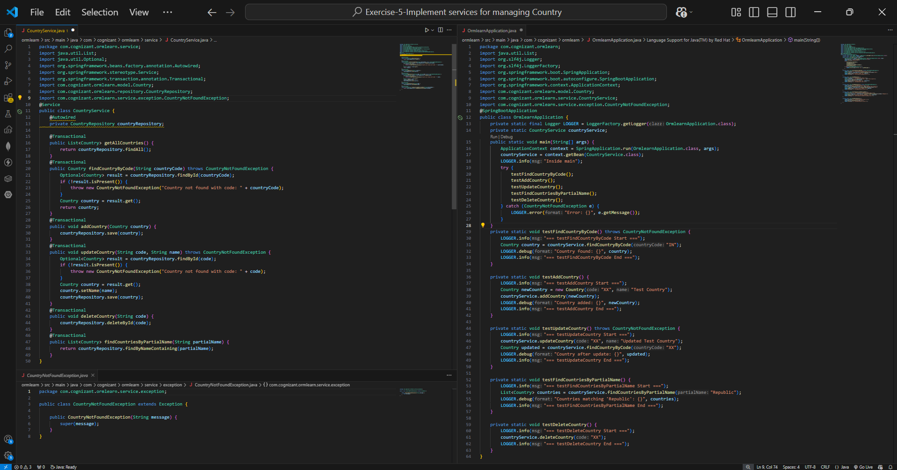
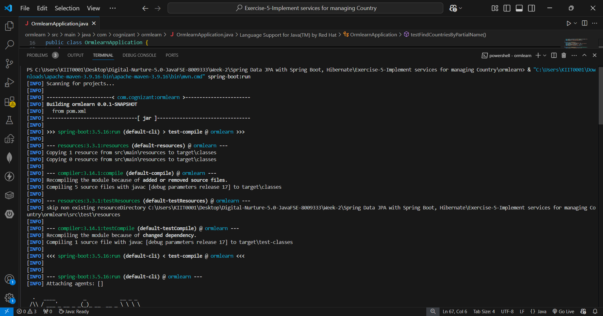
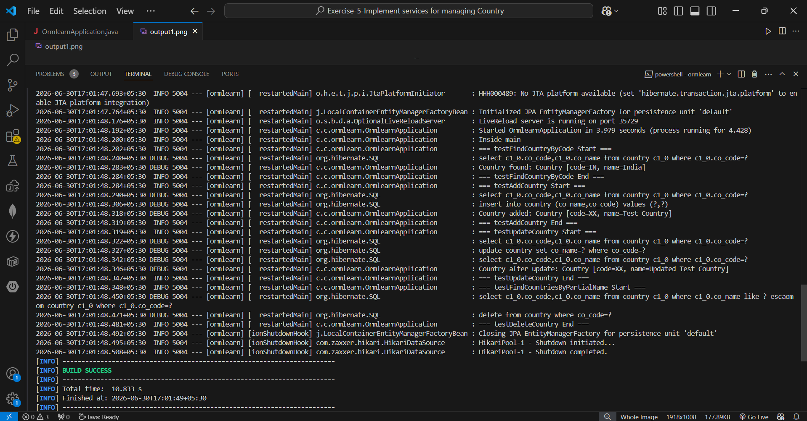

# Hands-on 5: Implement Services for Managing Country

## Scenario
An application requires features to be implemented with regards to country. These features needed to be supported by implementing them as services using Spring Data JPA:
- Find a country based on country code
- Add a new country
- Update a country
- Delete a country
- Find list of countries matching a partial country name

## Project Structure
```
ormlearn/
├── pom.xml
├── src/main/
│   ├── java/com/cognizant/ormlearn/
│   │   ├── OrmlearnApplication.java
│   │   ├── model/
│   │   │   └── Country.java
│   │   ├── repository/
│   │   │   └── CountryRepository.java
│   │   └── service/
│   │       ├── CountryService.java
│   │       └── exception/
│   │           └── CountryNotFoundException.java
│   └── resources/
│       └── application.properties
├── README.md
├── countriesAddedInDatabase.png
├── code1.png
├── code2.png
├── output1.png
└── output2.png
```

## Implementation Details

### 1. Country Entity (`model/Country.java`)
Maps to the `country` table in MySQL with `co_code` as the primary key and `co_name` as the country name, using JPA annotations `@Entity`, `@Table`, `@Id`, and `@Column`.

### 2. CountryRepository (`repository/CountryRepository.java`)
Extends `JpaRepository<Country, String>` to inherit standard CRUD operations (save, findById, findAll, deleteById) without writing any implementation.

A custom **Query Method** was added:
```java
List<Country> findByNameContaining(String partialName);
```
Spring Data JPA automatically generates the underlying SQL `LIKE` query just from the method name — no implementation code required.

### 3. CountryNotFoundException (`service/exception/CountryNotFoundException.java`)
A custom checked exception thrown when a country code lookup doesn't match any record in the database.

### 4. CountryService (`service/CountryService.java`)
Implements all six required operations, each wrapped in `@Transactional`:

| Method | Purpose |
|---|---|
| `getAllCountries()` | Returns all countries |
| `findCountryByCode(code)` | Finds a country by code; throws `CountryNotFoundException` if not found |
| `addCountry(country)` | Saves a new country |
| `updateCountry(code, name)` | Finds the country, updates its name, and saves it |
| `deleteCountry(code)` | Deletes a country by code |
| `findCountriesByPartialName(partialName)` | Uses the query method to find countries matching a partial name |

### 5. OrmlearnApplication (`OrmlearnApplication.java`)
The main class runs each service method in sequence on startup and logs the results using SLF4J:
1. `testFindCountryByCode()` — looks up India (`IN`)
2. `testAddCountry()` — adds a test country (`XX`)
3. `testUpdateCountry()` — updates the test country's name
4. `testFindCountriesByPartialName()` — searches for countries containing "Republic"
5. `testDeleteCountry()` — deletes the test country

## Database Setup
The `country` table in the `ormlearn` MySQL schema was populated with the full list of ~250 countries (ISO country codes and names) prior to running the tests.



## Code





## Test Output Summary
```
=== testFindCountryByCode Start ===
Country found: Country [code=IN, name=India]
=== testFindCountryByCode End ===

=== testAddCountry Start ===
Country added: Country [code=XX, name=Test Country]
=== testAddCountry End ===

=== testUpdateCountry Start ===
Country after update: Country [code=XX, name=Updated Test Country]
=== testUpdateCountry End ===

=== testFindCountriesByPartialName Start ===
Countries matching 'Republic': [13 countries found, e.g. Democratic People's
Republic of Korea, Republic of Korea, Lao People's Democratic Republic, ...]
=== testFindCountriesByPartialName End ===

=== testDeleteCountry Start ===
=== testDeleteCountry End ===

BUILD SUCCESS
```

Each operation's generated SQL was also logged by Hibernate (`select`, `insert`, `update`, `delete`, `like`), confirming the full Spring Data JPA → Hibernate → MySQL pipeline works end to end.





## How to Run
```bash
cd ormlearn
mvn spring-boot:run
```

## Key Concepts Demonstrated
- **Spring Data JPA Repositories** — CRUD via `JpaRepository` with zero boilerplate
- **Query Methods** — deriving SQL from method naming conventions (`findByNameContaining`)
- **Service Layer** — business logic separated from data access, using `@Transactional`
- **Custom Exceptions** — domain-specific error handling (`CountryNotFoundException`)
- **Dependency Injection** — `@Autowired` wiring of repository into service