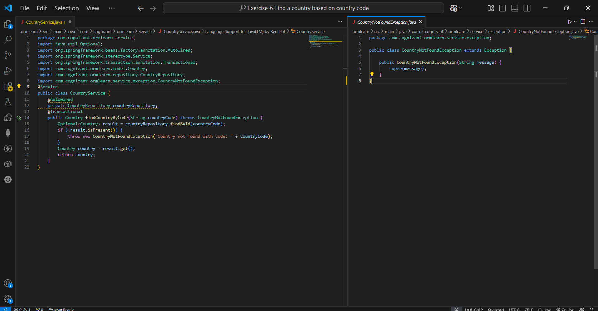
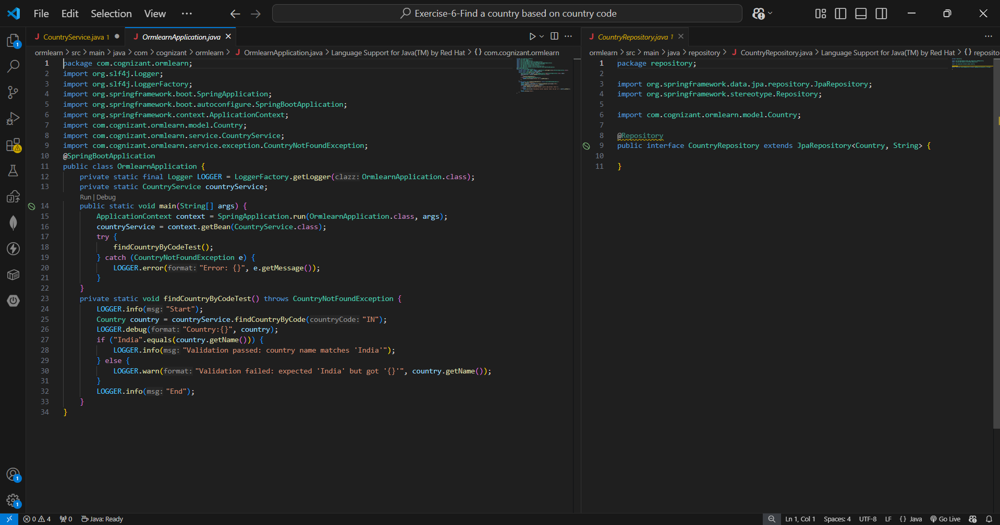
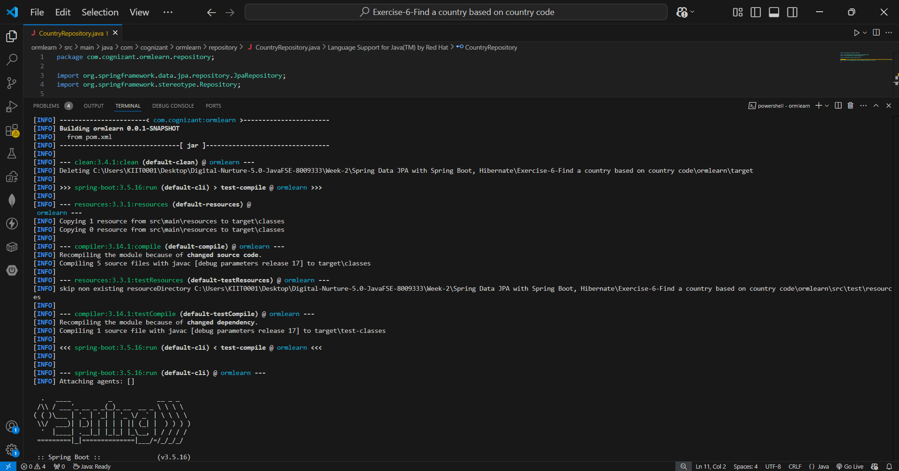
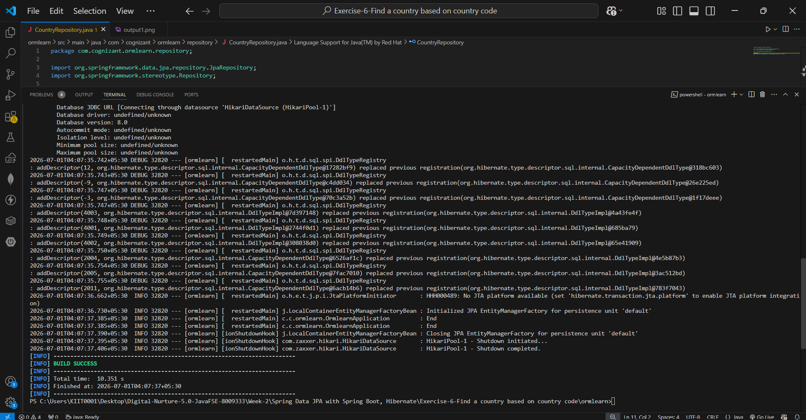

# Hands-on 6: Find a Country Based on Country Code

## Scenario
The application needs a service method to look up a country by its ISO country code, with proper exception handling when the code doesn't exist in the database.

## Project Structure
```
ormlearn/
├── pom.xml
├── src/main/
│   ├── java/com/cognizant/ormlearn/
│   │   ├── OrmlearnApplication.java
│   │   ├── model/
│   │   │   └── Country.java
│   │   ├── repository/
│   │   │   └── CountryRepository.java
│   │   └── service/
│   │       ├── CountryService.java
│   │       └── exception/
│   │           └── CountryNotFoundException.java
│   └── resources/
│       └── application.properties
├── README.md
├── code1.png
├── code2.png
└── output.png
```

## Implementation

### Step 1 — CountryNotFoundException
Created in `com.cognizant.ormlearn.service.exception`:

```java
package com.cognizant.ormlearn.service.exception;

public class CountryNotFoundException extends Exception {

    public CountryNotFoundException(String message) {
        super(message);
    }
}
```

### Step 2 — findCountryByCode() in CountryService
Added with `@Transactional` annotation as specified:

```java
@Transactional
public Country findCountryByCode(String countryCode) throws CountryNotFoundException {

    // Get the country based on findById() built-in method
    Optional<Country> result = countryRepository.findById(countryCode);

    // Check if a country is found. If not found, throw CountryNotFoundException
    if (!result.isPresent()) {
        throw new CountryNotFoundException("Country not found with code: " + countryCode);
    }

    // Use get() method to return the country fetched
    Country country = result.get();
    return country;
}
```

Steps followed exactly as specified:
- Used the built-in `findById()` from `JpaRepository` which returns `Optional<Country>`
- Checked `result.isPresent()` — throws `CountryNotFoundException` if no match found
- Used `result.get()` to extract and return the `Country` object

### Step 3 — Test method in OrmlearnApplication

```java
private static void findCountryByCodeTest() throws CountryNotFoundException {
    LOGGER.info("Start");
    Country country = countryService.findCountryByCode("IN");
    LOGGER.debug("Country:{}", country);

    // Validate the country name to check if it is valid
    if ("India".equals(country.getName())) {
        LOGGER.info("Validation passed: country name matches 'India'");
    } else {
        LOGGER.warn("Validation failed: expected 'India' but got '{}'", country.getName());
    }

    LOGGER.info("End");
}
```

Invoked from `main()` wrapped in try/catch for `CountryNotFoundException`:

```java
public static void main(String[] args) {
    ApplicationContext context = SpringApplication.run(OrmlearnApplication.class, args);
    countryService = context.getBean(CountryService.class);

    try {
        findCountryByCodeTest();
    } catch (CountryNotFoundException e) {
        LOGGER.error("Error: {}", e.getMessage());
    }
}
```

## Code Screenshots





## Test Output

```
Start
select c1_0.co_code,c1_0.co_name from country c1_0 where c1_0.co_code=?
Country:Country [code=IN, name=India]
Validation passed: country name matches 'India'
End

BUILD SUCCESS
```




The Hibernate-generated SQL confirms `findById("IN")` produced a correct parameterized lookup query, and the returned country name `India` matched the validation check.

## Importance of @Transactional
As noted by the SME: `@Transactional` tells Spring to automatically manage the Hibernate session and transaction lifecycle for the annotated method. Spring opens a Hibernate session before the method executes, wraps the database operation in a transaction, and commits (or rolls back on exception) when the method completes — without requiring manual `session.beginTransaction()` / `session.commit()` / `session.close()` calls. This keeps the service layer clean and ensures data consistency.

## Verification Against Requirements

| Requirement | Status |
|---|---|
| `CountryNotFoundException` created in `service.exception` package | ✅ |
| `findCountryByCode()` with `@Transactional` annotation | ✅ |
| Method signature matches exactly as specified | ✅ |
| Uses `findById()` returning `Optional<Country>` | ✅ |
| Checks `isPresent()` and throws `CountryNotFoundException` if not found | ✅ |
| Uses `result.get()` to return the fetched country | ✅ |
| Test method in `OrmlearnApplication` with country name validation | ✅ |
| Test method invoked from `main()` | ✅ |