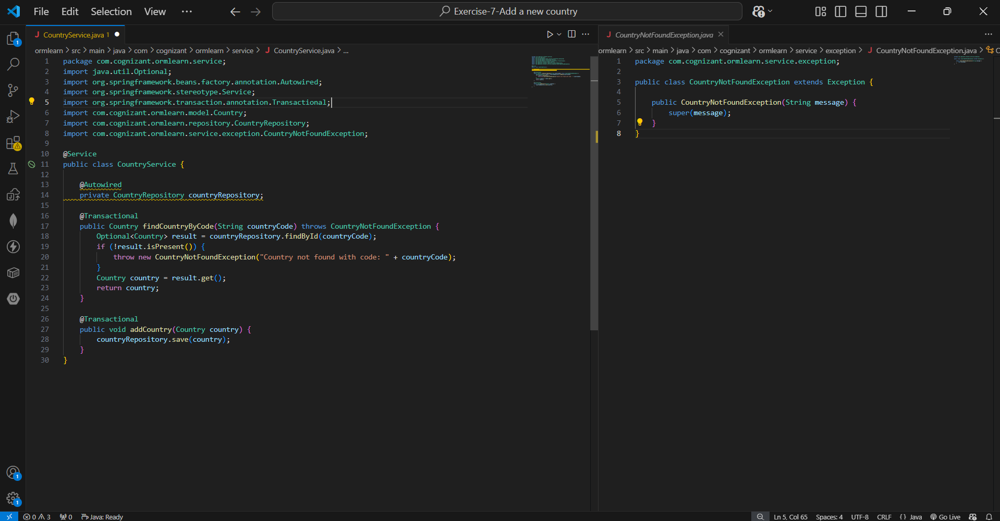
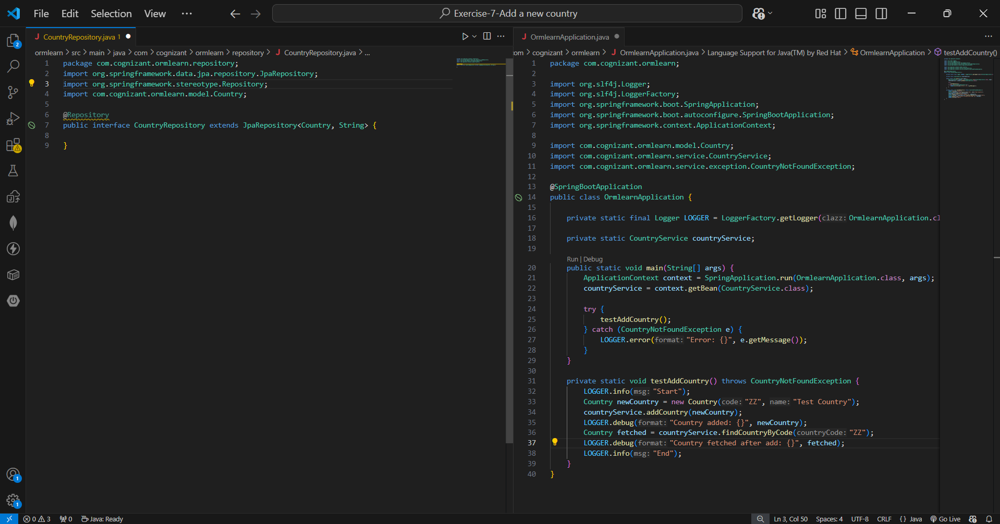
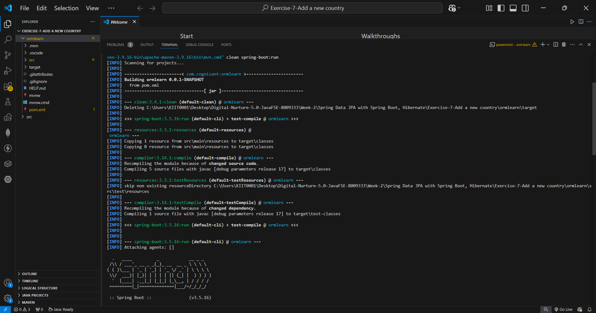
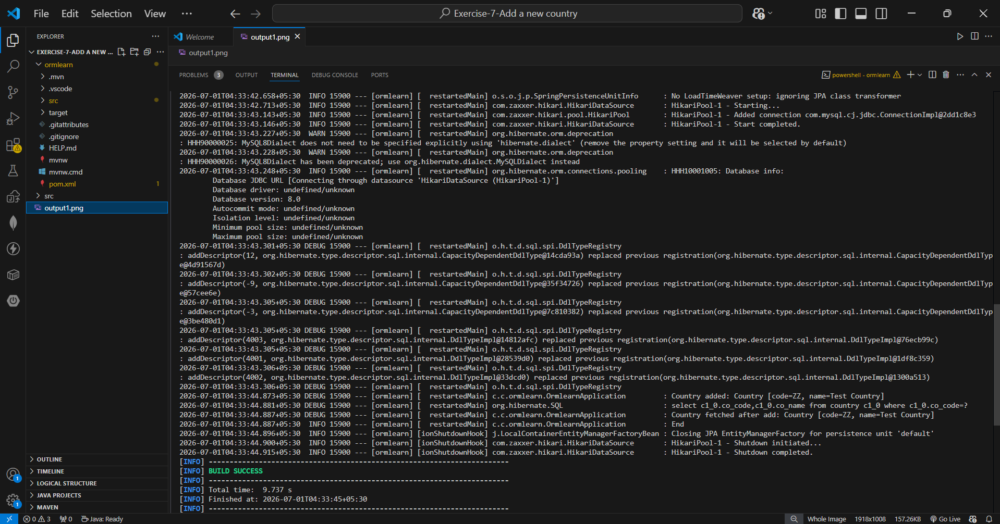
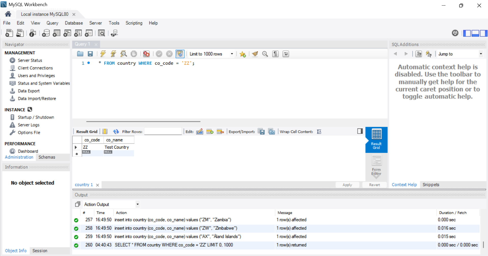

# Hands-on 7: Add a New Country

## Scenario
The application needs a service method to add a new country to the database, followed by verification that the country was successfully persisted.

## Project Structure
```
ormlearn/
├── pom.xml
├── src/main/
│   ├── java/com/cognizant/ormlearn/
│   │   ├── OrmlearnApplication.java
│   │   ├── model/
│   │   │   └── Country.java
│   │   ├── repository/
│   │   │   └── CountryRepository.java
│   │   └── service/
│   │       ├── CountryService.java
│   │       └── exception/
│   │           └── CountryNotFoundException.java
│   └── resources/
│       └── application.properties
├── README.md
├── code1.png
├── code2.png
├── output.png
└── db.png
```

## Implementation

### Step 1 — addCountry() in CountryService
Added with `@Transactional` annotation as specified:

```java
@Transactional
public void addCountry(Country country) {
    countryRepository.save(country);
}
```

Uses the built-in `save()` method from `JpaRepository` which triggers a Hibernate `INSERT` into the `country` table.

### Step 2 — testAddCountry() in OrmlearnApplication

```java
private static void testAddCountry() throws CountryNotFoundException {
    LOGGER.info("Start");

    // Create new instance of country with a new code and name
    Country newCountry = new Country("ZZ", "Test Country");

    // Call addCountry() passing the new country
    countryService.addCountry(newCountry);
    LOGGER.debug("Country added: {}", newCountry);

    // Invoke findCountryByCode() with the same code to verify it was saved
    Country fetched = countryService.findCountryByCode("ZZ");
    LOGGER.debug("Country fetched after add: {}", fetched);

    LOGGER.info("End");
}
```

Steps followed exactly as specified:
- Created a new `Country` instance with code `ZZ` and name `Test Country`
- Called `countryService.addCountry()` passing the new country
- Called `countryService.findCountryByCode("ZZ")` to verify the country was persisted
- Verified in MySQL Workbench that `ZZ | Test Country` exists in the database

## Code Screenshots





## Test Output

```
Start
select c1_0.co_code,c1_0.co_name from country c1_0 where c1_0.co_code=?
insert into country (co_name,co_code) values (?,?)
Country added: Country [code=ZZ, name=Test Country]
select c1_0.co_code,c1_0.co_name from country c1_0 where c1_0.co_code=?
Country fetched after add: Country [code=ZZ, name=Test Country]
End

BUILD SUCCESS
```




## Database Verification

MySQL Workbench confirms `ZZ | Test Country` was successfully inserted into the `country` table.



## Verification Against Requirements

| Requirement | Status |
|---|---|
| `addCountry()` method with `@Transactional` annotation | ✅ |
| Uses `countryRepository.save(country)` | ✅ |
| `testAddCountry()` creates new `Country` instance with new code and name | ✅ |
| Calls `countryService.addCountry()` | ✅ |
| Calls `countryService.findCountryByCode()` with same code to verify | ✅ |
| Verified in database that country was added | ✅ |