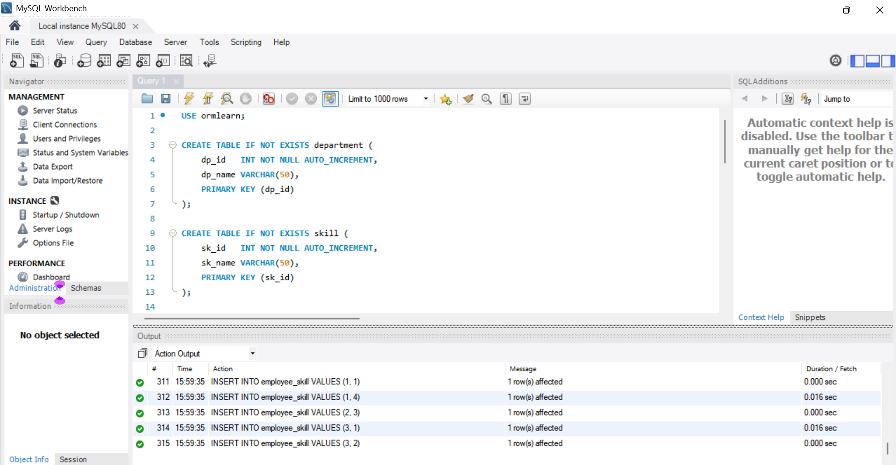
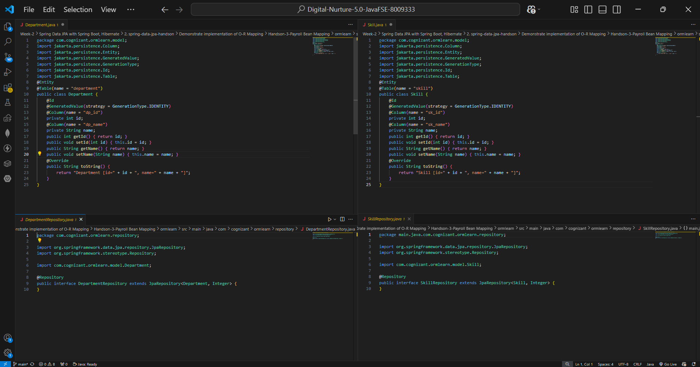
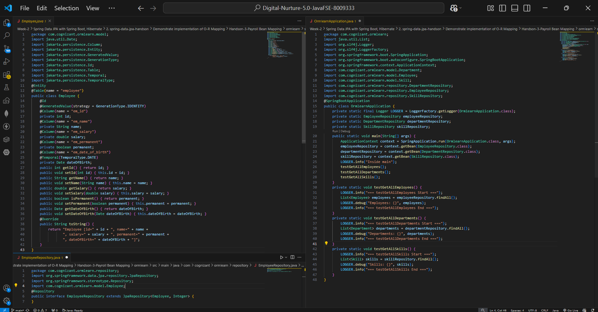
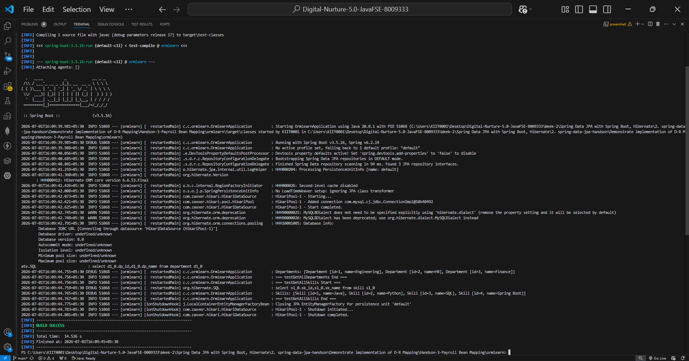

# Hands-on 3: Payroll Bean Mapping

## 📘 Objective
Demonstrate Object-Relational Mapping (ORM) using Spring Data JPA by mapping Employee, Department, and Skill entities to database tables.

---

## 📁 Project Structure

```text
ormlearn/
├── model/
│   ├── Employee.java
│   ├── Department.java
│   └── Skill.java
├── repository/
│   ├── EmployeeRepository.java
│   ├── DepartmentRepository.java
│   └── SkillRepository.java
├── OrmlearnApplication.java
├── application.properties
└── pom.xml
```

---

## 🧱 Entity Mapping

### Department
Maps to `department` table.

### Skill
Maps to `skill` table.

### Employee
Maps to `employee` table.

---

## 🗂 Repository Layer

- `DepartmentRepository`
- `EmployeeRepository`
- `SkillRepository`

All extend `JpaRepository`.

---

## ▶️ Application Flow

1. Start Spring Boot application
2. Connect to MySQL database
3. Fetch department records
4. Fetch skill records
5. Print results

---

## 🖼️ Database Screenshot

Database tables created in MySQL:



---

## 🖼️ Code Screenshots

### Entity Classes, Repository Classes & Application Class
Department, Employee, Skill classes:


 



---

## 🖼️ Output Screenshot

Application execution output:



---

## ✅ Output Verified

```text
Departments: [Department [id=1, name=Engineering], Department [id=2, name=HR], Department [id=3, name=Finance]]

Skills: [Skill [id=1, name=Java], Skill [id=2, name=Python], Skill [id=3, name=SQL], Skill [id=4, name=Spring Boot]]

BUILD SUCCESS
```

---

## ✅ Requirements Completed

✔ Employee bean mapped  
✔ Department bean mapped  
✔ Skill bean mapped  
✔ Repository interfaces created  
✔ Spring Data JPA connected to MySQL  
✔ Data fetched successfully  