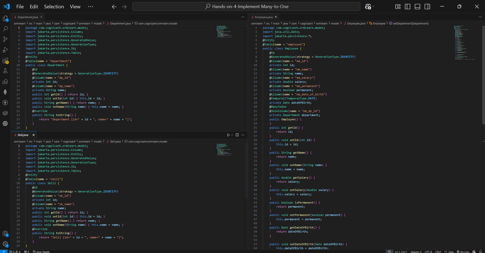
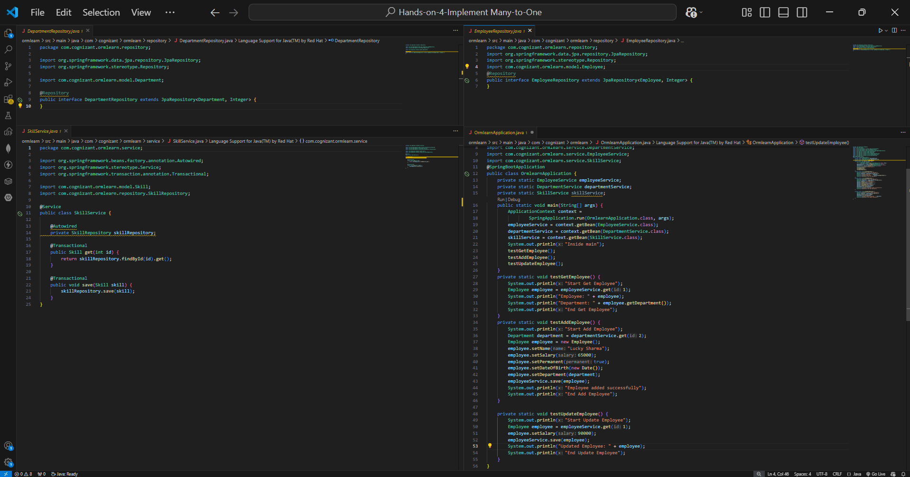
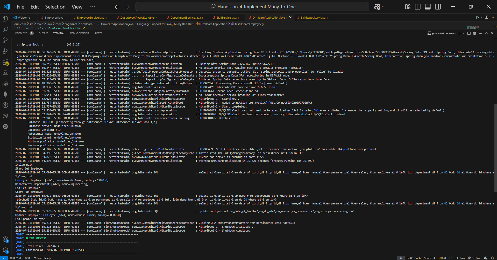

# Hands-on 4: Implement Many-to-One Mapping

## 📘 Objective
Demonstrate Many-to-One mapping between Employee and Department using Spring Data JPA.

---

## 📁 Project Structure

```text
ormlearn/
├── model/
│   ├── Employee.java
│   ├── Department.java
│   └── Skill.java
├── repository/
│   ├── EmployeeRepository.java
│   ├── DepartmentRepository.java
│   └── SkillRepository.java
├── service/
│   ├── EmployeeService.java
│   ├── DepartmentService.java
│   └── SkillService.java
├── OrmlearnApplication.java
├── application.properties
└── pom.xml
```

---

## 🧱 Many-to-One Mapping

In `Employee.java`:

```java
@ManyToOne
@JoinColumn(name = "em_dp_id")
private Department department;
```

This means:
- Many employees can belong to one department.
- `em_dp_id` acts as foreign key.

---

## Service Layer

Created:
- EmployeeService
- DepartmentService
- SkillService

All use:
- `@Service`
- `@Transactional`

---

## Test Cases

### 1. Get Employee
Fetch employee by ID and display associated department.

### 2. Add Employee
Insert new employee into database.

### 3. Update Employee
Update employee salary.

---

## 🖼️ Code Screenshots




---

## 🖼️ Output Screenshot



---

## ✅ Output Verified

```text
Inside main

Start Get Employee
Employee: Employee [id=1, name=Ramesh Kumar, salary=75000.0]
Department: Department [id=1, name=Engineering]

Start Add Employee
Employee added successfully

Start Update Employee
Updated Employee: Employee [id=1, name=Ramesh Kumar, salary=90000.0]

BUILD SUCCESS
```

---

## ✅ Requirements Completed

✔ Many-to-One mapping created  
✔ Employee linked with Department  
✔ Employee fetch tested  
✔ Employee insert tested  
✔ Employee update tested  
✔ Hibernate join query verified