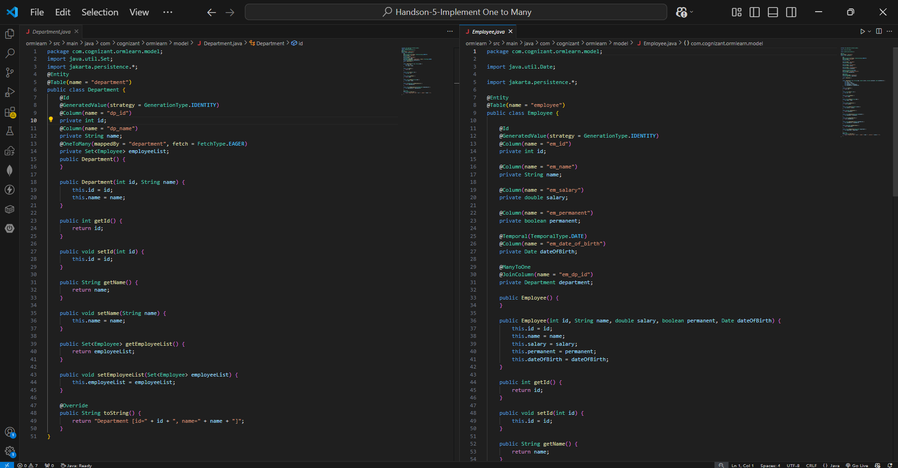
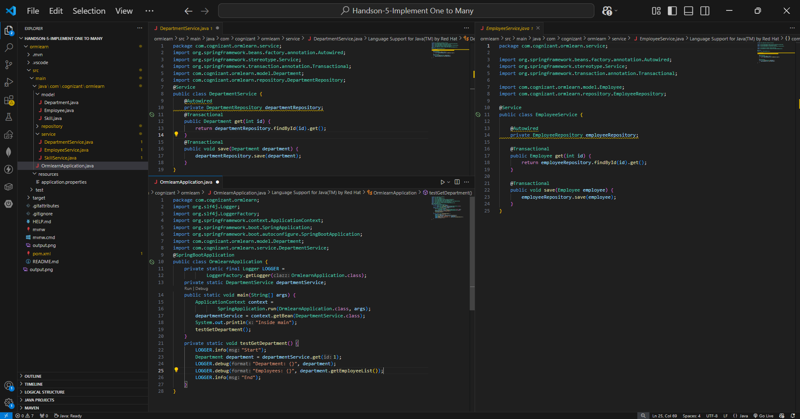
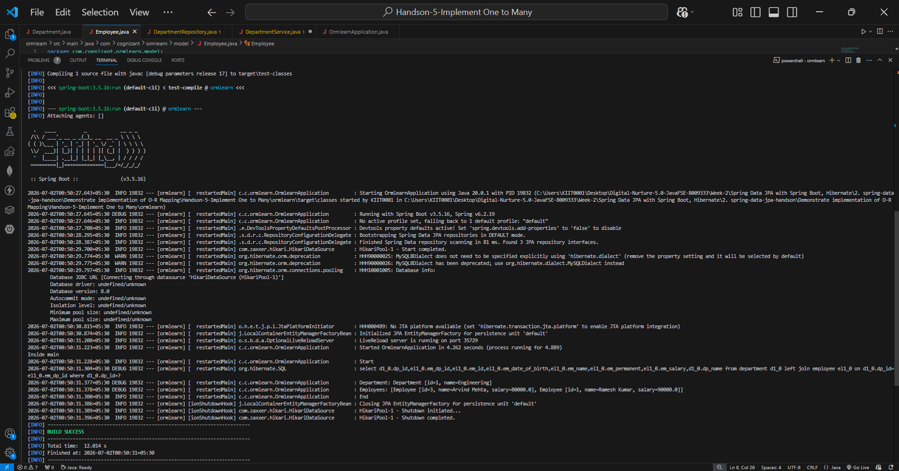

# Hands-on 5: Implement One-to-Many Mapping

## 📘 Objective
Demonstrate One-to-Many mapping between Department and Employee using Spring Data JPA.

---

## 📁 Project Structure

```text
ormlearn/
├── model/
│   ├── Employee.java
│   ├── Department.java
│   └── Skill.java
├── repository/
│   ├── EmployeeRepository.java
│   ├── DepartmentRepository.java
│   └── SkillRepository.java
├── service/
│   ├── EmployeeService.java
│   ├── DepartmentService.java
│   └── SkillService.java
├── OrmlearnApplication.java
├── application.properties
└── pom.xml
```

---

## 🧱 One-to-Many Mapping

In `Department.java`:

```java
@OneToMany(mappedBy = "department", fetch = FetchType.EAGER)
private Set<Employee> employeeList;
```

### Explanation:
- One department can have multiple employees.
- `mappedBy = "department"` tells Hibernate that the relationship is controlled by the `department` field in `Employee.java`.
- `FetchType.EAGER` ensures employees are fetched immediately along with department.

---

## Relationship

```text
Department (1) ------> (Many) Employees
```

Example:

```text
Engineering Department
 ├── Employee 1 (Ramesh Kumar)
 └── Employee 3 (Arvind Mehta)
```

---

## Service Layer

Created `DepartmentService.java`:

```java
@Transactional
public Department get(int id) {
    return departmentRepository.findById(id).get();
}
```

Used for fetching department data.

---

## Test Case

In `OrmlearnApplication.java`:

```java
private static void testGetDepartment() {
    LOGGER.info("Start");

    Department department = departmentService.get(1);

    LOGGER.debug("Department: {}", department);
    LOGGER.debug("Employees: {}", department.getEmployeeList());

    LOGGER.info("End");
}
```

This:
- Fetches department with ID `1`
- Prints department details
- Prints all employees under it

---

## 🖼️ Code Screenshots





---

## 🖼️ Output Screenshot

### Successful Execution


---

## ✅ Output Verified

```text
Inside main
Start
Department: Department [id=1, name=Engineering]
Employees:
[
 Employee [id=3, name=Arvind Mehta, salary=80000.0],
 Employee [id=1, name=Ramesh Kumar, salary=90000.0]
]
End

BUILD SUCCESS
```

---

## Hibernate Query Observed

```sql
select d1_0.dp_id,
       el1_0.em_dp_id,
       el1_0.em_id,
       el1_0.em_date_of_birth,
       el1_0.em_name,
       el1_0.em_permanent,
       el1_0.em_salary,
       d1_0.dp_name
from department d1_0
left join employee el1_0
on d1_0.dp_id = el1_0.em_dp_id
where d1_0.dp_id = ?
```

This confirms:
- Hibernate correctly joins `department` and `employee`
- Employee list is mapped properly

---

## ✅ Requirements Completed

✔ Implemented `@OneToMany` mapping  
✔ Linked Department with multiple Employees  
✔ Added `FetchType.EAGER`  
✔ Created DepartmentService  
✔ Tested fetching Department and Employee list  
✔ Verified Hibernate JOIN query  
✔ Build successful