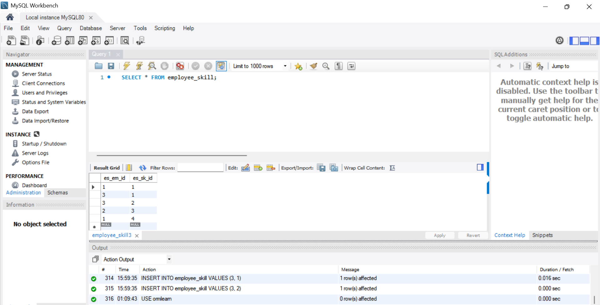
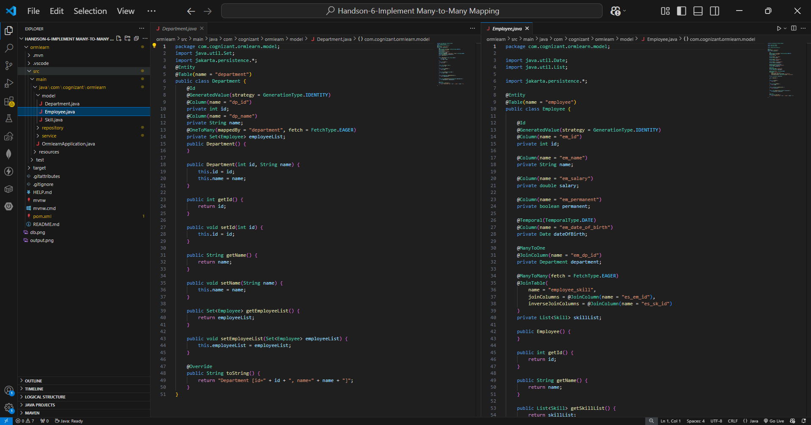
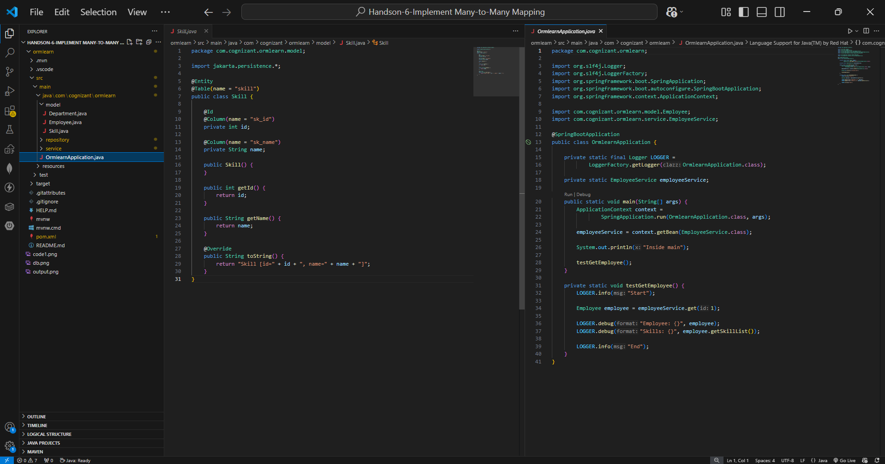
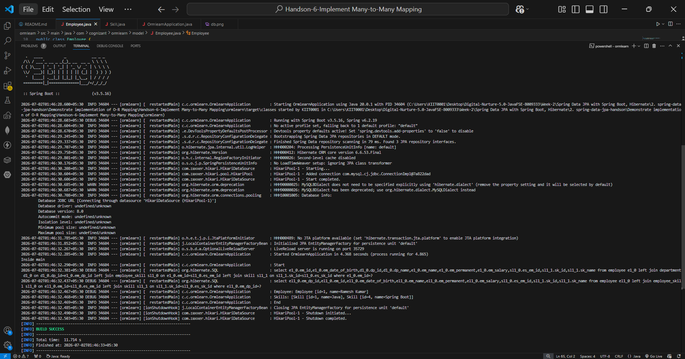

# Hands-on 6: Implement Many-to-Many Mapping

## 📘 Objective
Demonstrate the implementation of **Many-to-Many mapping** between `Employee` and `Skill` using Spring Data JPA and Hibernate.

---

## 📂 Project Structure

```text
ormlearn/
├── pom.xml
├── src/
│   ├── main/
│   │   ├── java/com/cognizant/ormlearn/
│   │   │   ├── model/
│   │   │   │   ├── Employee.java
│   │   │   │   ├── Department.java
│   │   │   │   └── Skill.java
│   │   │   ├── repository/
│   │   │   │   ├── EmployeeRepository.java
│   │   │   │   ├── DepartmentRepository.java
│   │   │   │   └── SkillRepository.java
│   │   │   ├── service/
│   │   │   │   └── EmployeeService.java
│   │   │   └── OrmlearnApplication.java
│   │   └── resources/
│   │       └── application.properties
└── README.md
```

---

# Database Setup

Created and used the mapping table:

```sql
USE ormlearn;

CREATE TABLE employee_skill (
    es_em_id INT,
    es_sk_id INT
);

INSERT INTO employee_skill VALUES (1,1);
INSERT INTO employee_skill VALUES (1,4);
INSERT INTO employee_skill VALUES (2,3);
INSERT INTO employee_skill VALUES (3,1);
INSERT INTO employee_skill VALUES (3,2);
```

This table connects employees with skills.

---

## 🖼 Database Screenshot



---

# Entity Mapping

## Employee.java

Added Many-to-Many relationship:

```java
@ManyToMany(fetch = FetchType.EAGER)
@JoinTable(
    name = "employee_skill",
    joinColumns = @JoinColumn(name = "es_em_id"),
    inverseJoinColumns = @JoinColumn(name = "es_sk_id")
)
private List<Skill> skillList;
```

### Explanation:
- `@ManyToMany` defines many-to-many relationship
- `FetchType.EAGER` loads skills immediately
- `@JoinTable` maps employee and skill tables

---

## 🖼 Employee Mapping Screenshot



---

## Skill.java

Basic entity:

```java
@Entity
@Table(name = "skill")
public class Skill {
    @Id
    @Column(name = "sk_id")
    private int id;

    @Column(name = "sk_name")
    private String name;
}
```

---

## 🖼 Skill + Main Application Screenshot



---

# Relationship Structure

```text
Employee  <------->  Skill
   Many              Many
```

Example:

```text
Ramesh Kumar
 ├── Java
 └── Spring Boot
```

---

# Repository Layer

EmployeeRepository:

```java
@Repository
public interface EmployeeRepository extends JpaRepository<Employee, Integer> {
}
```

Used built-in `findById()`.

---

# Service Layer

EmployeeService:

```java
@Transactional
public Employee get(int id) {
    return employeeRepository.findById(id).get();
}
```

Used for fetching employee details.

---

# Main Application Test

In `OrmlearnApplication.java`:

```java
private static void testGetEmployee() {
    LOGGER.info("Start");

    Employee employee = employeeService.get(1);

    LOGGER.debug("Employee: {}", employee);
    LOGGER.debug("Skills: {}", employee.getSkillList());

    LOGGER.info("End");
}
```

This:
- Fetches employee with ID `1`
- Fetches all skills linked with that employee

---

# Hibernate Query Observed

Hibernate automatically generated:

```sql
select e1_0.em_id,
       e1_0.em_name,
       sl1_1.sk_id,
       sl1_1.sk_name
from employee e1_0
left join employee_skill sl1_0
on e1_0.em_id = sl1_0.es_em_id
left join skill sl1_1
on sl1_1.sk_id = sl1_0.es_sk_id
where e1_0.em_id = ?
```

This confirms:
- Employee table joined correctly with employee_skill
- employee_skill joined correctly with skill table

---

# Output

```text
Inside main
Start
Employee: Employee [id=1, name=Ramesh Kumar]
Skills: [Skill [id=1, name=Java], Skill [id=4, name=Spring Boot]]
End
BUILD SUCCESS
```

---

## 🖼 Output Screenshot



---

# Verification

| Requirement | Status |
|---|---|
| Created employee_skill mapping table | ✅ |
| Implemented Many-to-Many mapping | ✅ |
| Used JoinTable annotation | ✅ |
| Used FetchType.EAGER to fix LazyInitializationException | ✅ |
| Fetched employee by ID | ✅ |
| Retrieved skill list successfully | ✅ |
| Verified SQL joins generated by Hibernate | ✅ |
| Build successful | ✅ |

---

# Conclusion

Successfully implemented **Many-to-Many mapping** between `Employee` and `Skill` using Spring Data JPA and Hibernate. The relationship was verified by fetching employee data and displaying all associated skills.