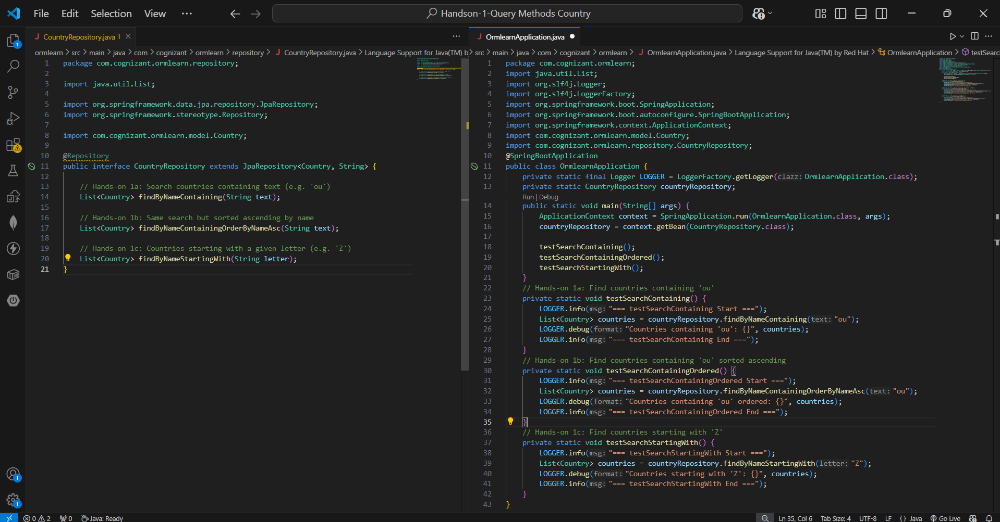
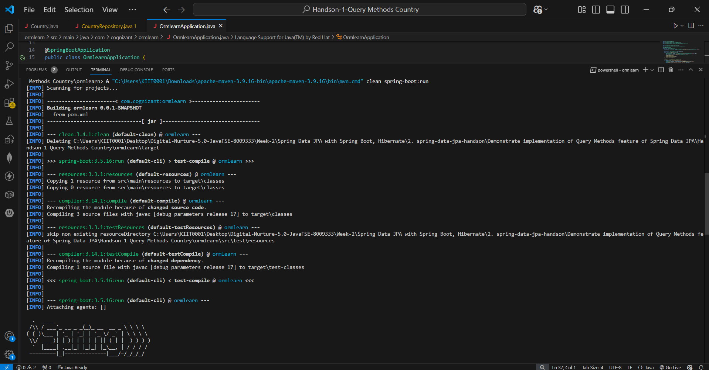
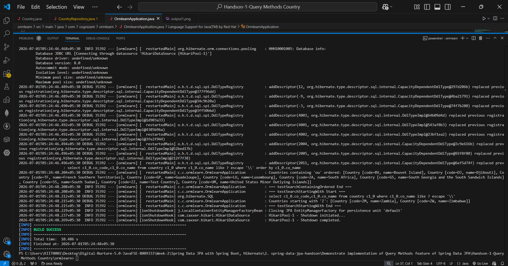
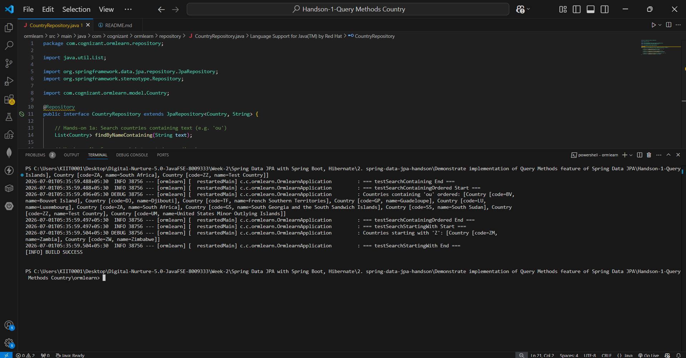

# Handson-1: Query Methods Feature of Spring Data JPA — Country

## 📘 Objective
Demonstrate the implementation of **Query Methods** feature of Spring Data JPA using the `country` table. Spring Data JPA automatically generates SQL queries based on method names in the repository interface — no manual SQL writing needed.

---

## 📁 Files Included

| File | Description |
|------|-------------|
| `pom.xml` | Maven configuration with Spring Boot, Spring Data JPA, MySQL Driver |
| `src/main/resources/application.properties` | Database and Hibernate logging configuration |
| `src/main/java/.../model/Country.java` | JPA Entity mapped to `country` table |
| `src/main/java/.../repository/CountryRepository.java` | Repository with 3 Spring Data JPA query methods |
| `src/main/java/.../OrmlearnApplication.java` | Main class with test methods for all 3 queries |

---

## 🧱 How It Works

### 🔹 Query Methods — No SQL Required
Spring Data JPA reads the **method name** in the repository interface and automatically generates the correct SQL query at runtime. No `@Query` annotation or manual SQL needed.

### 🔹 CountryRepository.java — 3 Query Methods

| Method | Generated SQL | Use Case |
|--------|--------------|----------|
| `findByNameContaining(String text)` | `WHERE co_name LIKE '%text%'` | Search countries containing a keyword |
| `findByNameContainingOrderByNameAsc(String text)` | `WHERE co_name LIKE '%text%' ORDER BY co_name` | Same search but sorted A-Z |
| `findByNameStartingWith(String letter)` | `WHERE co_name LIKE 'letter%'` | Countries starting with a specific letter |

---

## ⚙️ application.properties

```properties
spring.datasource.driver-class-name=com.mysql.cj.jdbc.Driver
spring.datasource.url=jdbc:mysql://localhost:3306/ormlearn
spring.datasource.username=root
spring.datasource.password=********

spring.jpa.hibernate.ddl-auto=validate
spring.jpa.properties.hibernate.dialect=org.hibernate.dialect.MySQL8Dialect
```

---

## ▶️ How to Run

```bash
cd ormlearn
mvn clean spring-boot:run
```

---

## 🖼️ Code Screenshot
📌 CountryRepository.java showing query methods + OrmlearnApplication.java:



---

## 🖼️ Output Screenshot
📌 Terminal showing all 3 query method results with actual Hibernate SQL:

Full Terminal Output




Clean Filtered Output Showing Only Query Results

---

## 📊 Test Results

**testSearchContaining('ou'):**
```
Countries containing 'ou': [Bouvet Island, Djibouti, Guadeloupe,
South Georgia..., Luxembourg, South Sudan, French Southern Territories,
United States Minor Outlying Islands, South Africa, Test Country]
```

**testSearchContainingOrdered('ou'):**
```
Countries containing 'ou' ordered: [Bouvet Island, Djibouti,
French Southern Territories, Guadeloupe, Luxembourg, South Africa,
South Georgia..., South Sudan, Test Country, United States Minor...]
```

**testSearchStartingWith('Z'):**
```
Countries starting with 'Z': [Zambia, Zimbabwe]
```

---

## ✅ Requirements Met

| Requirement | Status |
|-------------|--------|
| Demonstrate Query Methods feature | ✅ |
| Search by containing text | ✅ `findByNameContaining("ou")` |
| Sorting — order ascending | ✅ `findByNameContainingOrderByNameAsc("ou")` |
| Filter with starting text | ✅ `findByNameStartingWith("Z")` |
| No manual SQL — Spring generates automatically | ✅ Hibernate SQL visible in logs |
| BUILD SUCCESS | ✅ |