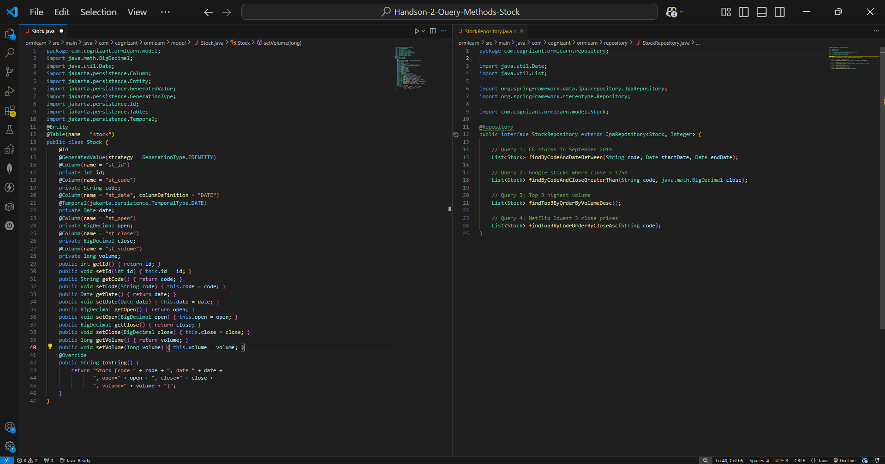
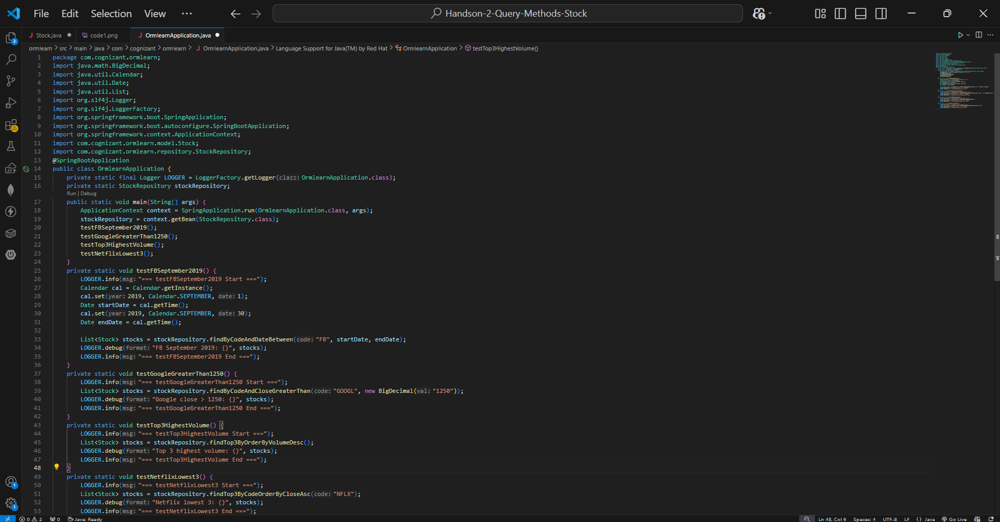
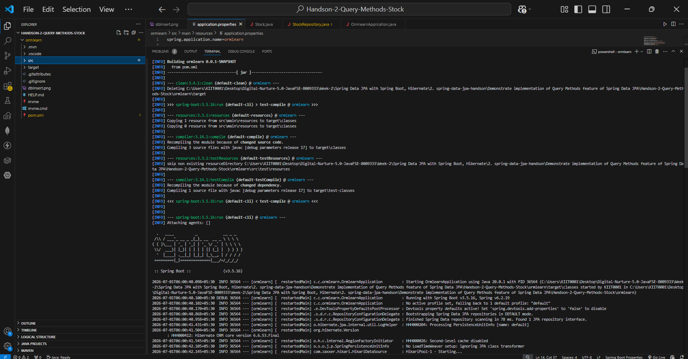
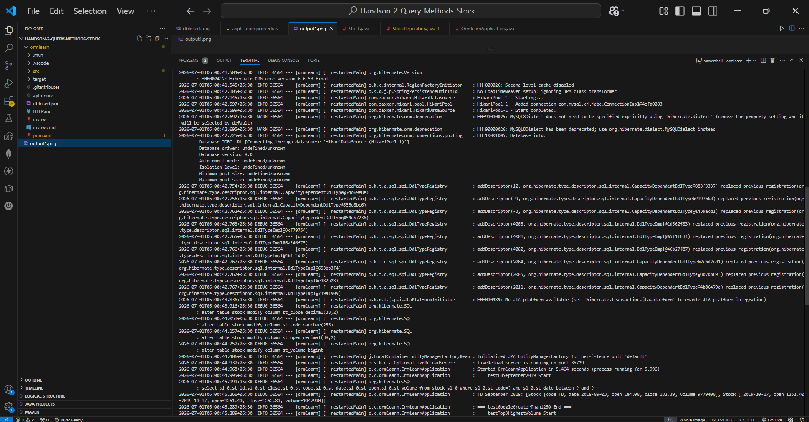
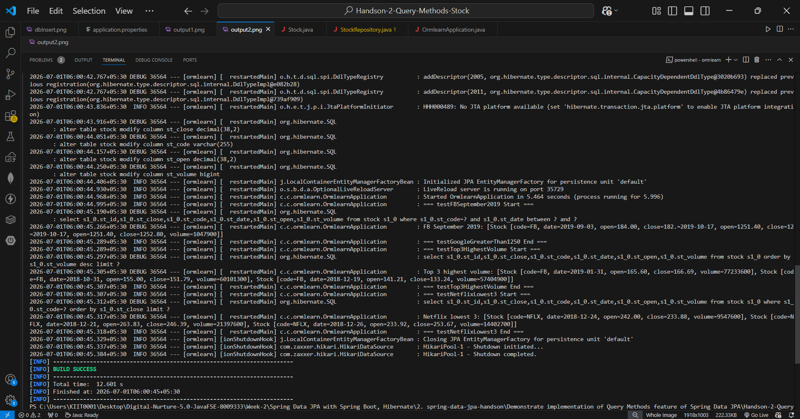

# Handson-2: Query Methods Feature of Spring Data JPA — Stock

## 📘 Objective
Demonstrate the implementation of **Query Methods** feature of Spring Data JPA using one year of stock data for Facebook (FB), Google (GOOGL), and Netflix (NFLX). Spring Data JPA automatically generates SQL queries based on method names — no manual SQL needed.

---

## 📁 Files Included

| File | Description |
|------|-------------|
| `pom.xml` | Maven configuration with Spring Boot, Spring Data JPA, MySQL Driver |
| `src/main/resources/application.properties` | Database and Hibernate logging configuration |
| `src/main/java/.../model/Stock.java` | JPA Entity mapped to `stock` table |
| `src/main/java/.../repository/StockRepository.java` | Repository with 4 Spring Data JPA query methods |
| `src/main/java/.../OrmlearnApplication.java` | Main class with test methods for all 4 queries |

---

## 🗄️ Database Setup

### Stock Table (MySQL)
```sql
CREATE TABLE IF NOT EXISTS `ormlearn`.`stock` (
  `st_id`     INT NOT NULL AUTO_INCREMENT,
  `st_code`   VARCHAR(10),
  `st_date`   DATE,
  `st_open`   NUMERIC(10,2),
  `st_close`  NUMERIC(10,2),
  `st_volume` NUMERIC,
  PRIMARY KEY (`st_id`)
);
```

Data inserted for:
- **FB** — September 2019 + high volume dates
- **GOOGL** — dates where close price > 1250
- **NFLX** — dates with lowest close prices

---

## 🧱 How It Works

### 🔹 Stock.java (Entity)
Maps Java class to `stock` table using JPA annotations:
- `@Entity`, `@Table(name = "stock")`
- `@Id`, `@GeneratedValue(strategy = GenerationType.IDENTITY)`
- `@Column` on each field mapping to `st_id`, `st_code`, `st_date`, `st_open`, `st_close`, `st_volume`

### 🔹 StockRepository.java — 4 Query Methods

| Method | Generated SQL | Query Scenario |
|--------|--------------|----------------|
| `findByCodeAndDateBetween(code, start, end)` | `WHERE st_code=? AND st_date BETWEEN ? AND ?` | FB stocks in September 2019 |
| `findByCodeAndCloseGreaterThan(code, price)` | `WHERE st_code=? AND st_close > ?` | Google stocks where close > 1250 |
| `findTop3ByOrderByVolumeDesc()` | `ORDER BY st_volume DESC LIMIT 3` | Top 3 highest volume transactions |
| `findTop3ByCodeOrderByCloseAsc(code)` | `WHERE st_code=? ORDER BY st_close ASC LIMIT 3` | Netflix 3 lowest close prices |

---

## ⚙️ application.properties

```properties
spring.datasource.driver-class-name=com.mysql.cj.jdbc.Driver
spring.datasource.url=jdbc:mysql://localhost:3306/ormlearn
spring.datasource.username=root
spring.datasource.password=********

spring.jpa.hibernate.ddl-auto=update
spring.jpa.properties.hibernate.dialect=org.hibernate.dialect.MySQL8Dialect
```

---

## ▶️ How to Run

```bash
cd ormlearn
mvn clean spring-boot:run
```

---

## 🖼️ Code Screenshots

📌 Stock.java and StockRepository.java:



📌 OrmlearnApplication.java:



---

## 🖼️ Output Screenshot

📌 Terminal showing all 4 query results with Hibernate SQL and BUILD SUCCESS:





---

## 📊 Test Results

**testFBSeptember2019:**
```
FB September 2019: 19 records from 2019-09-03 to 2019-09-27
```

**testGoogleGreaterThan1250:**
```
GOOGL close > 1250: [2019-04-22 to 2019-04-29, 2019-10-17]
7 records total
```

**testTop3HighestVolume:**
```
Top 3 highest volume:
- FB 2019-01-31 volume=77233600
- FB 2018-10-31 volume=60101300
- FB 2018-12-19 volume=57404900
```

**testNetflixLowest3:**
```
Netflix lowest 3 close prices:
- NFLX 2018-12-24 close=233.88
- NFLX 2018-12-21 close=246.39
- NFLX 2018-12-26 close=253.67
```

---

## ✅ Requirements Met

| Requirement | Status |
|-------------|--------|
| Create Stock entity with JPA annotations | ✅ |
| Create StockRepository with query methods | ✅ |
| FB stocks in September 2019 (`findByCodeAndDateBetween`) | ✅ |
| Google stocks where close > 1250 (`findByCodeAndCloseGreaterThan`) | ✅ |
| Top 3 highest volume (`findTop3ByOrderByVolumeDesc`) | ✅ |
| Netflix 3 lowest close (`findTop3ByCodeOrderByCloseAsc`) | ✅ |
| No manual SQL — Spring generates automatically | ✅ |
| BUILD SUCCESS | ✅ |