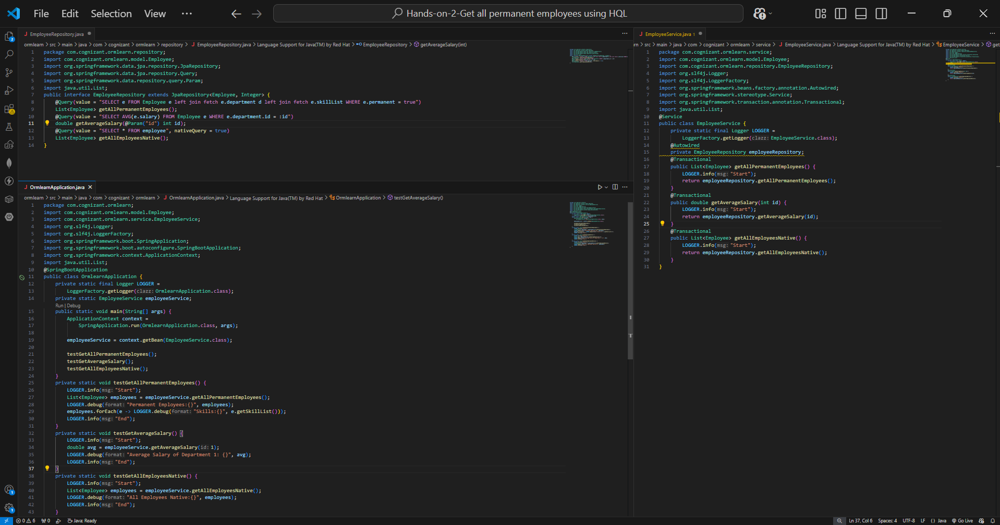
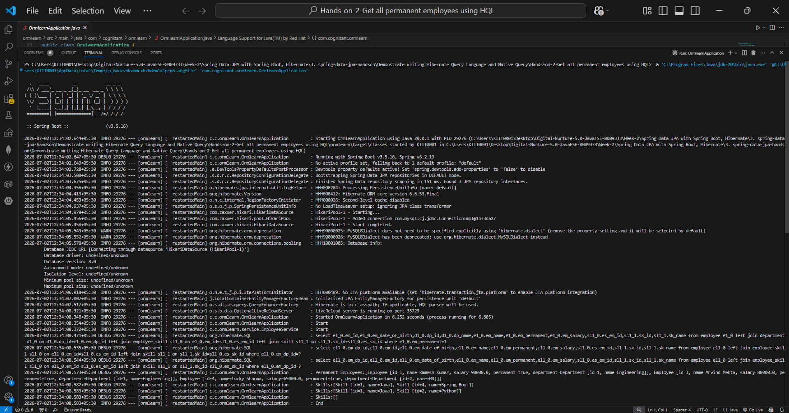
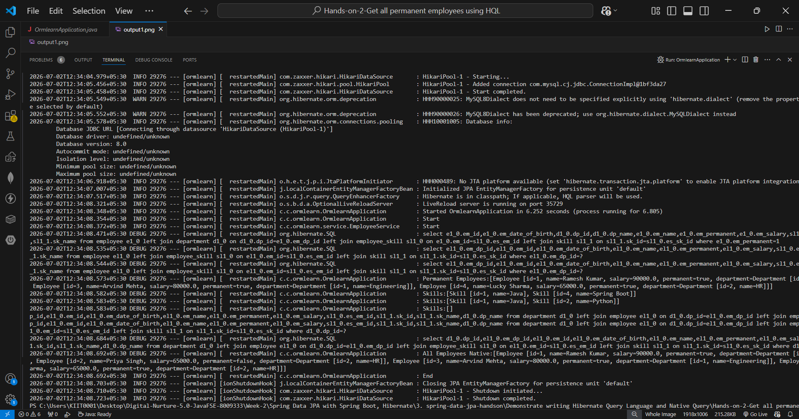

# Hands-on 2 – Get All Permanent Employees using HQL

## 📘 Objective
Fetch all permanent employees using **Hibernate Query Language (HQL)** with department and skill details using `fetch` joins.

---

## 📁 Project Structure

```text
ormlearn/
├── pom.xml
├── src/main/java/com/cognizant/ormlearn/
│   ├── OrmlearnApplication.java
│   ├── model/
│   │   ├── Employee.java
│   │   ├── Department.java
│   │   └── Skill.java
│   ├── repository/
│   │   └── EmployeeRepository.java
│   └── service/
│       └── EmployeeService.java
└── src/main/resources/
    └── application.properties
```

---

## 🔹 HQL Query Used

```java
@Query(value = "SELECT e FROM Employee e left join fetch e.department d left join fetch e.skillList WHERE e.permanent = true")
List<Employee> getAllPermanentEmployees();
```

### Why `fetch`?
- `join` only links the table but does NOT populate the beans
- `fetch` ensures the related data (department, skills) is also loaded
- Without `fetch`, accessing `e.getSkillList()` outside transaction throws `LazyInitializationException`

---

## 🔹 Service Method

```java
@Transactional
public List<Employee> getAllPermanentEmployees() {
    LOGGER.info("Start");
    return employeeRepository.getAllPermanentEmployees();
}
```

---

## 🔹 Test Method

```java
private static void testGetAllPermanentEmployees() {
    LOGGER.info("Start");
    List<Employee> employees = employeeService.getAllPermanentEmployees();
    LOGGER.debug("Permanent Employees:{}", employees);
    employees.forEach(e -> LOGGER.debug("Skills:{}", e.getSkillList()));
    LOGGER.info("End");
}
```

---

## ▶️ How to Run

```bash
.\mvnw.cmd clean spring-boot:run
```

---

## ✅ Output

```text
Permanent Employees:[
  Employee [id=1, name=Ramesh Kumar, salary=90000.0, permanent=true, department=Engineering],
  Employee [id=3, name=Arvind Mehta, salary=80000.0, permanent=true, department=Engineering],
  Employee [id=4, name=Lucky Sharma, salary=65000.0, permanent=true, department=HR]
]
Skills:[Java, Spring Boot]
Skills:[Java, Python]
Skills:[]
```

---

## 🎯 Key Concepts

| Concept | Description |
|---|---|
| HQL | Object-oriented query using Java class names |
| `@Query` | Annotation to define custom HQL in repository |
| `left join fetch` | Loads related entity data in single query |
| `@Transactional` | Keeps session open for lazy loading |

---

## 🖼️ Screenshots




