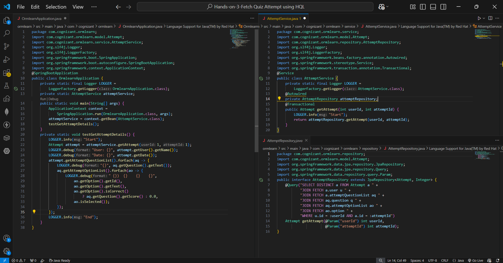
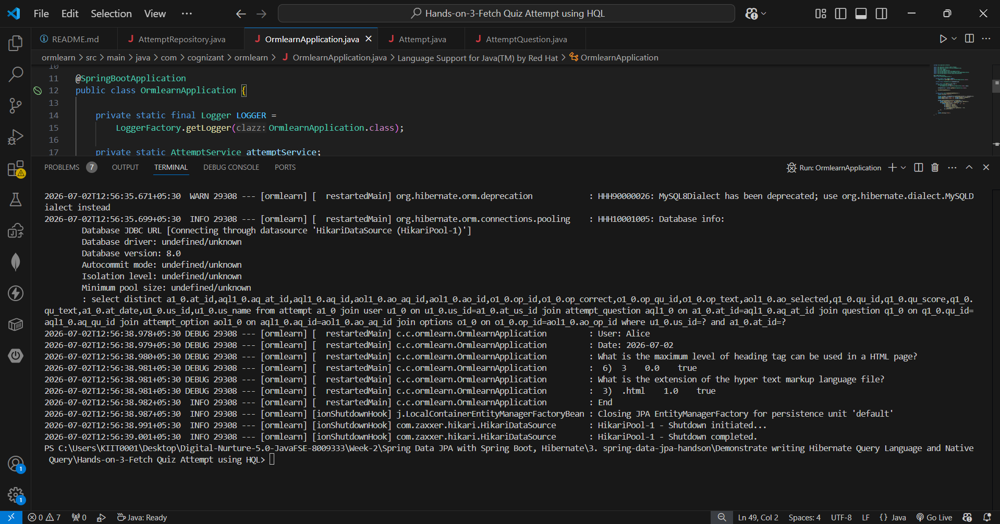

# Hands-on 3 – Fetch Quiz Attempt Details using HQL

## 📘 Objective
Fetch quiz attempt details for a specific user using **HQL with fetch joins** across 6 related tables.

---

## 📁 Project Structure

```text
ormlearn/
├── pom.xml
├── src/main/java/com/cognizant/ormlearn/
│   ├── OrmlearnApplication.java
│   ├── model/
│   │   ├── User.java
│   │   ├── Question.java
│   │   ├── Options.java
│   │   ├── Attempt.java
│   │   ├── AttemptQuestion.java
│   │   └── AttemptOption.java
│   ├── repository/
│   │   └── AttemptRepository.java
│   └── service/
│       └── AttemptService.java
└── src/main/resources/
    └── application.properties
```

---

## 🧱 Database Schema
| Table | Purpose |
|---|---|
| user | Stores user info |
| question | Quiz questions |
| options | Options for each question |
| attempt | Each user's quiz attempt |
| attempt_question | Questions in an attempt |
| attempt_option | Options selected in attempt |

---

## 🔹 HQL Query Used

```java
@Query("SELECT DISTINCT a FROM Attempt a " +
       "JOIN FETCH a.user u " +
       "JOIN FETCH a.attemptQuestionList aq " +
       "JOIN FETCH aq.question q " +
       "JOIN FETCH aq.attemptOptionList ao " +
       "JOIN FETCH ao.option " +
       "WHERE u.id = :userId AND a.id = :attemptId")
Attempt getAttempt(@Param("userId") int userId,
                   @Param("attemptId") int attemptId);
```

### Key Points
- `JOIN FETCH` used wherever one-to-many relationship exists
- `DISTINCT` used to avoid duplicate results
- `Set` used instead of `List` for collections to avoid `MultipleBagFetchException`

---

## 🔹 O/R Mapping Summary

| Relationship | Mapping |
|---|---|
| Attempt → User | `@ManyToOne` |
| Attempt → AttemptQuestion | `@OneToMany` (Set) |
| AttemptQuestion → Question | `@ManyToOne` |
| AttemptQuestion → AttemptOption | `@OneToMany` (Set) |
| AttemptOption → Options | `@ManyToOne` |

---

## 🔹 Service Method

```java
@Transactional
public Attempt getAttempt(int userId, int attemptId) {
    LOGGER.info("Start");
    return attemptRepository.getAttempt(userId, attemptId);
}
```

---

## 🔹 Test Method

```java
private static void testGetAttemptDetails() {
    LOGGER.info("Start");

    Attempt attempt = attemptService.getAttempt(1, 1);
    LOGGER.debug("User: {}", attempt.getUser().getName());
    LOGGER.debug("Date: {}", attempt.getDate());

    attempt.getAttemptQuestionList().forEach(aq -> {
        LOGGER.debug("{}", aq.getQuestion().getText());
        aq.getAttemptOptionList().forEach(ao -> {
            LOGGER.debug(" {})  {}    {}    {}",
                ao.getOption().getId(),
                ao.getOption().getText(),
                ao.getOption().isCorrect()
                    ? aq.getQuestion().getScore() : 0.0,
                ao.isSelected());
        });
    });

    LOGGER.info("End");
}
```

---

## ▶️ How to Run

```bash
.\mvnw.cmd clean spring-boot:run
```

---

## ✅ Output

```text
User: Alice
Date: 2026-07-02

What is the maximum level of heading tag can be used in a HTML page?
 6)  3    0.0    true

What is the extension of the hyper text markup language file?
 3)  .html    1.0    true
```

---

## 🎯 Key Concepts

| Concept | Description |
|---|---|
| HQL fetch join | Loads related data in single query |
| DISTINCT | Avoids duplicate results in join |
| Set vs List | Set used to avoid MultipleBagFetchException |
| @Transactional | Keeps session open during fetch |

---

## 🖼️ Screenshots


##  Codes


##  Output
