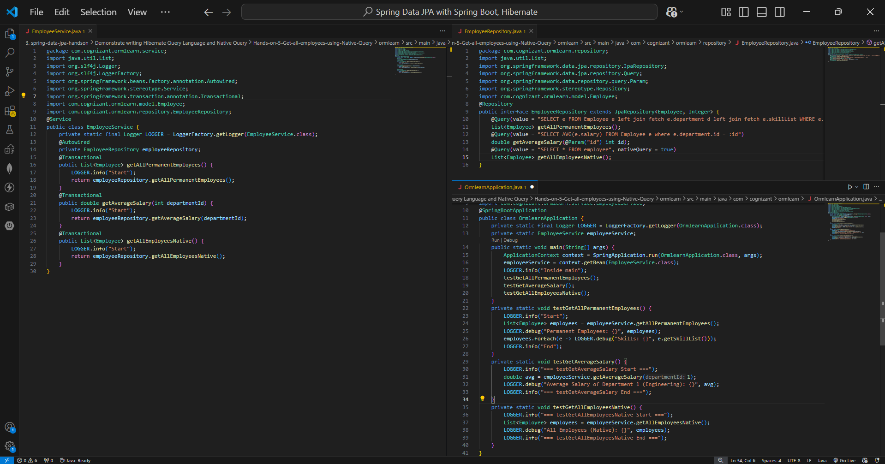
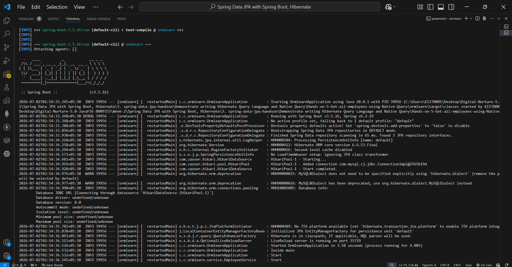
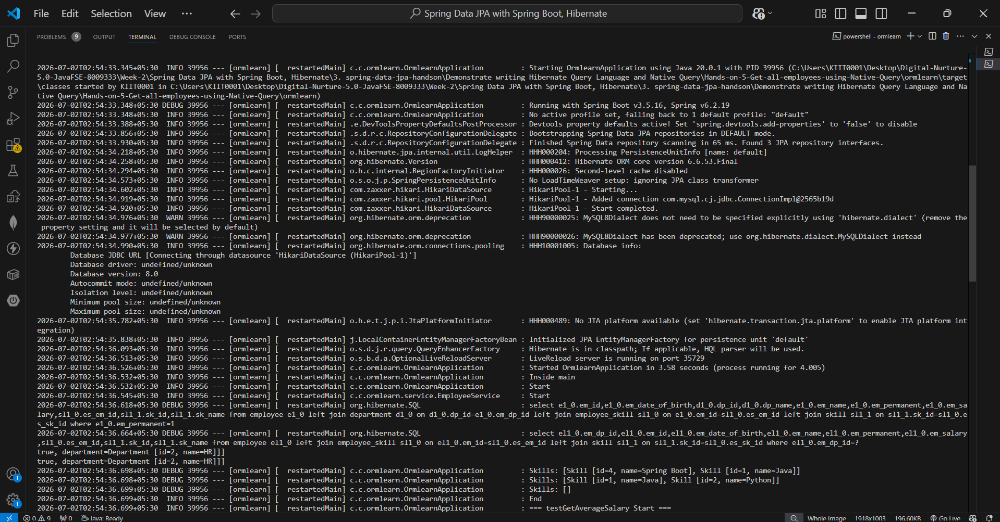
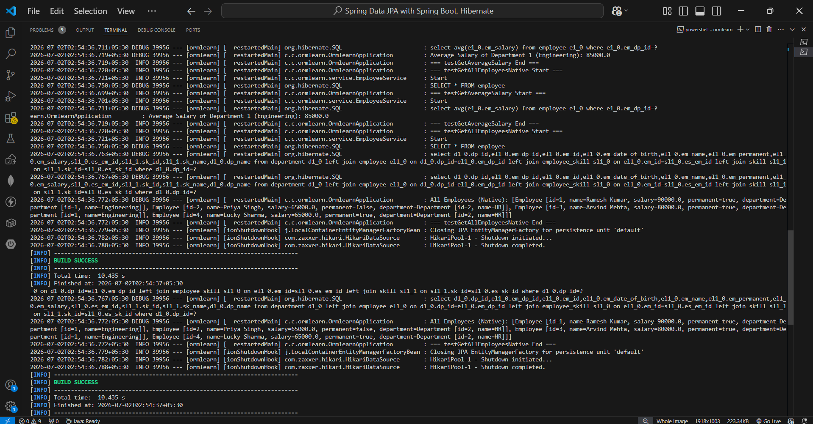

# Hands-on 5 – Get All Employees using HQL and Native Query

## 📘 Objective
Demonstrate writing **Hibernate Query Language (HQL)** and **Native SQL Queries** using Spring Data JPA.

This hands-on extends the O/R Mapping project and performs:
- Fetching permanent employees
- Calculating average salary using HQL
- Fetching all employees using Native SQL

---

## 📁 Project Structure

```text
ormlearn/
├── pom.xml
├── src/main/java/com/cognizant/ormlearn/
│   ├── OrmlearnApplication.java
│   ├── model/
│   │   ├── Employee.java
│   │   ├── Department.java
│   │   └── Skill.java
│   ├── repository/
│   │   ├── EmployeeRepository.java
│   │   ├── DepartmentRepository.java
│   │   └── SkillRepository.java
│   └── service/
│       └── EmployeeService.java
└── src/main/resources/
    └── application.properties
```

---

## 🧱 Database Tables Used

### Employee Table
```sql
CREATE TABLE employee (
    em_id INT PRIMARY KEY AUTO_INCREMENT,
    em_name VARCHAR(50),
    em_salary DOUBLE,
    em_permanent BOOLEAN,
    em_date_of_birth DATE,
    em_dp_id INT
);
```

---

### Department Table
```sql
CREATE TABLE department (
    dp_id INT PRIMARY KEY AUTO_INCREMENT,
    dp_name VARCHAR(50)
);
```

---

### Skill Table
```sql
CREATE TABLE skill (
    sk_id INT PRIMARY KEY AUTO_INCREMENT,
    sk_name VARCHAR(50)
);
```

---

### Employee-Skill Mapping Table
```sql
CREATE TABLE employee_skill (
    es_em_id INT,
    es_sk_id INT
);
```

---

## 🔹 HQL Query

Used to calculate average salary of employees in a department.

```java
@Query("select avg(e.salary) from Employee e where e.department.id = ?1")
double getAverageSalary(int departmentId);
```

---

## 🔹 Native Query

Used to fetch all employees.

```java
@Query(value = "SELECT * FROM employee", nativeQuery = true)
List<Employee> getAllEmployeesNative();
```

---

## 🔹 Service Methods

### EmployeeService.java

```java
@Transactional
public double getAverageSalary(int departmentId) {
    LOGGER.info("Start");
    return employeeRepository.getAverageSalary(departmentId);
}

@Transactional
public List<Employee> getAllEmployeesNative() {
    LOGGER.info("Start");
    return employeeRepository.getAllEmployeesNative();
}
```

---

## 🔹 Main Testing Methods

### OrmlearnApplication.java

```java
private static void testGetAverageSalary() {
    LOGGER.info("=== testGetAverageSalary Start ===");
    double avg = employeeService.getAverageSalary(1);
    LOGGER.debug("Average Salary of Department 1 (Engineering): {}", avg);
    LOGGER.info("=== testGetAverageSalary End ===");
}

private static void testGetAllEmployeesNative() {
    LOGGER.info("=== testGetAllEmployeesNative Start ===");
    List<Employee> employees = employeeService.getAllEmployeesNative();
    LOGGER.debug("All Employees (Native): {}", employees);
    LOGGER.info("=== testGetAllEmployeesNative End ===");
}
```

---

## ▶️ How to Run

```bash
mvn clean spring-boot:run
```

or

```bash
mvn.cmd clean spring-boot:run
```

---

## 🖼️ Code Screenshots

### EmployeeRepository.java , EmployeeService.java & OrmlearnApplication.java


---
## 🖼️ Output Screenshot





---

## ✅ Output Verified

### Permanent Employees Retrieved

```text
Permanent Employees:
Employee [id=1, name=Ramesh Kumar]
Employee [id=3, name=Arvind Mehta]
Employee [id=4, name=Lucky Sharma]
```

---

### HQL Query Output

```text
Average Salary of Department 1 (Engineering): 85000.0
```

---

### Native Query Output

```text
All Employees (Native):
Employee [id=1, name=Ramesh Kumar]
Employee [id=2, name=Priya Singh]
Employee [id=3, name=Arvind Mehta]
Employee [id=4, name=Lucky Sharma]
```

---

## ✅ Hands-on Requirements Met

| Requirement | Status |
|---|---|
| Demonstrate HQL query | ✅ |
| Demonstrate Native SQL query | ✅ |
| Average salary calculation | ✅ |
| Fetch all employees | ✅ |
| O/R mapping maintained | ✅ |
| Application executed successfully | ✅ |

---

## 🎯 Concepts Covered

- Spring Data JPA
- Hibernate Query Language (HQL)
- Native SQL Queries
- Many-to-One Mapping
- Many-to-Many Mapping
- Transaction Management
- Repository Queries