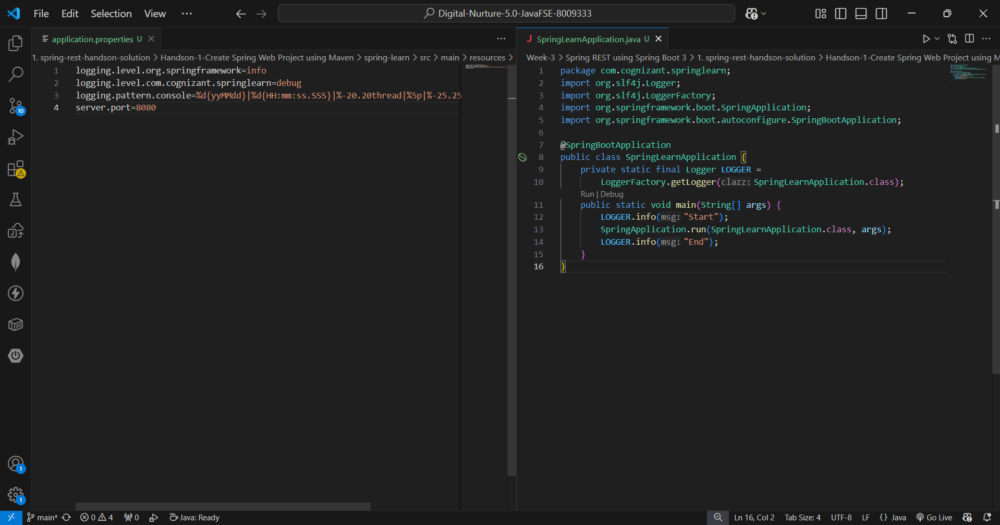
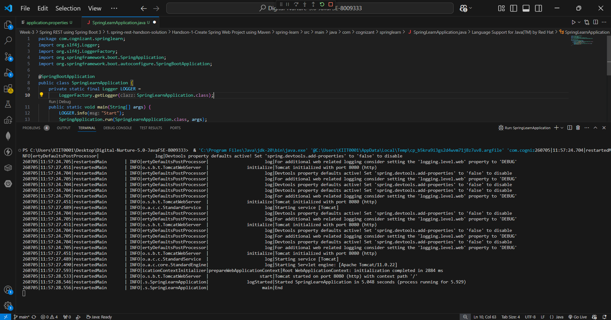

# Handson 1 – Create a Spring Web Project using Maven

## 📘 Objective
Demonstrate creation of a **Spring Boot Application** using Spring Initializr and Maven.

---

## 📁 Project Structure

```text
spring-learn/
├── pom.xml
├── src/main/java/com/cognizant/springlearn/
│   └── SpringLearnApplication.java
├── src/main/resources/
│   └── application.properties
└── src/test/java/com/cognizant/springlearn/
    └── SpringLearnApplicationTests.java
```

---

## ⚙️ Project Setup

### Generated from Spring Initializr
- URL: https://start.spring.io
- Project: **Maven**
- Language: **Java**
- Spring Boot: **4.1.0**
- Group: `com.cognizant`
- Artifact: `spring-learn`
- Package: `com.cognizant.springlearn`
- Packaging: **Jar**
- Java: **17**

### Dependencies Added
| Dependency | Purpose |
|---|---|
| Spring Web | Build RESTful web applications |
| Spring Boot DevTools | Auto restart on code changes |

---

## 🔹 application.properties

```properties
logging.level.org.springframework=info
logging.level.com.cognizant.springlearn=debug
logging.pattern.console=%d{yyMMdd}|%d{HH:mm:ss.SSS}|%-20.20thread|%5p|%-25.25logger{25}|%25M|%m%n
server.port=8080
```

---

## 🔹 SpringLearnApplication.java

```java
package com.cognizant.springlearn;

import org.slf4j.Logger;
import org.slf4j.LoggerFactory;
import org.springframework.boot.SpringApplication;
import org.springframework.boot.autoconfigure.SpringBootApplication;

@SpringBootApplication
public class SpringLearnApplication {

    private static final Logger LOGGER =
        LoggerFactory.getLogger(SpringLearnApplication.class);

    public static void main(String[] args) {
        LOGGER.info("Start");
        SpringApplication.run(SpringLearnApplication.class, args);
        LOGGER.info("End");
    }
}
```

---

## 🎯 Key Concepts

| Concept | Description |
|---|---|
| `@SpringBootApplication` | Combines `@Configuration`, `@EnableAutoConfiguration`, `@ComponentScan` |
| `SpringApplication.run()` | Bootstraps the Spring application |
| Embedded Tomcat | No separate server needed, runs on port 8080 |
| `src/main/java` | Application source code |
| `src/main/resources` | Configuration files |
| `src/test/java` | Test code |
| Logger | SLF4J logging with debug/info levels |

---

## ▶️ How to Run

Using VS Code Run button on `SpringLearnApplication.java`

Or terminal:
```bash
.\mvnw.cmd clean spring-boot:run
```

---

## ✅ Output

```text
INFO  - Start
INFO  - Tomcat started on port 8080
INFO  - Started SpringLearnApplication in 5.048 seconds
INFO  - End
```

---

## 🖼️ Screenshots

## Code


## Output
