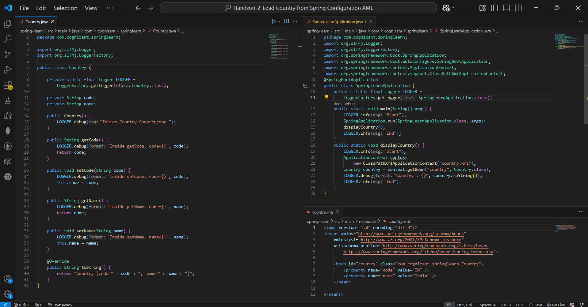
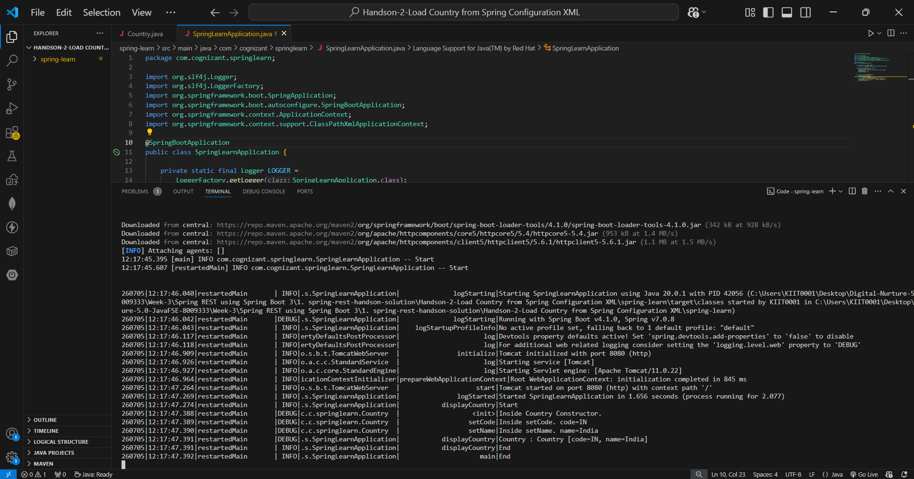

# Hands-on 2 – Load Country from Spring Configuration XML

## 📘 Objective

The objective of this hands-on is to load a **Country** bean from a Spring XML configuration file using the Spring IoC container and display its details using `ClassPathXmlApplicationContext`.

---

## 📁 Project Structure

```text
spring-learn/
├── pom.xml
├── src/
│   └── main/
│       ├── java/
│       │   └── com/cognizant/springlearn/
│       │       ├── Country.java
│       │       └── SpringLearnApplication.java
│       └── resources/
│           ├── application.properties
│           └── country.xml
├── README.md
├── code.png
└── output.png
```

---

# Implementation

## Step 1 – Create Country Bean Class

Created a `Country` POJO with the following properties:

- code
- name

Also implemented:

- Default constructor
- Getter methods
- Setter methods
- `toString()` method

Logging statements were added inside the constructor and setter methods to observe Spring bean creation.

---

## Step 2 – Configure Spring XML

Created **country.xml** under **src/main/resources**.

Configured the Country bean:

```xml
<bean id="country" class="com.cognizant.springlearn.Country">
    <property name="code" value="IN"/>
    <property name="name" value="India"/>
</bean>
```

---

## Step 3 – Load Bean from Spring Container

Used `ClassPathXmlApplicationContext` to load the XML configuration file.

```java
ApplicationContext context =
        new ClassPathXmlApplicationContext("country.xml");

Country country = context.getBean("country", Country.class);
```

Displayed the bean details using SLF4J logging.

---

# Code Screenshot



---

# Console Output

```text
INFO  - Start
DEBUG - Inside Country Constructor.
DEBUG - Inside setCode. code=IN
DEBUG - Inside setName. name=India
DEBUG - Country : Country [code=IN, name=India]
INFO  - End
```



---

# Key Concepts Used

| Concept | Description |
|----------|-------------|
| Spring IoC | Manages object creation and dependency injection |
| XML Bean Configuration | Defines beans in `country.xml` |
| `<bean>` | Declares a Spring managed object |
| `<property>` | Injects values using setter injection |
| ClassPathXmlApplicationContext | Loads XML configuration from the classpath |
| getBean() | Retrieves a bean from the Spring container |
| SLF4J Logger | Used for application logging |

---

# How to Run

```bash
cd spring-learn
.\mvnw.cmd spring-boot:run
```

---

# Verification

| Requirement | Status |
|--------------|--------|
| Country class created | ✅ |
| country.xml created | ✅ |
| Bean configured using Spring XML | ✅ |
| Bean loaded using ClassPathXmlApplicationContext | ✅ |
| Country details displayed | ✅ |
| Application executed successfully | ✅ |

---

# Result

Successfully loaded a **Country** bean from **Spring XML Configuration** using the Spring IoC container and displayed its details through the application.