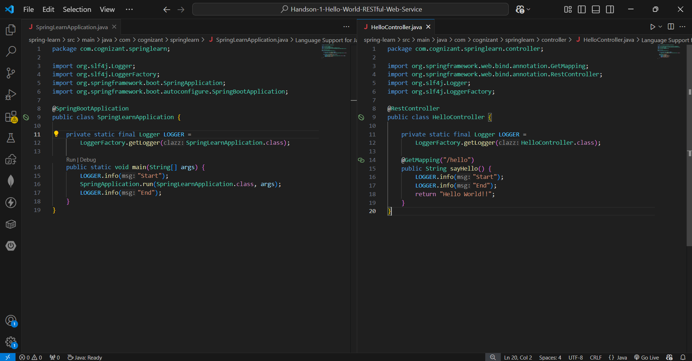
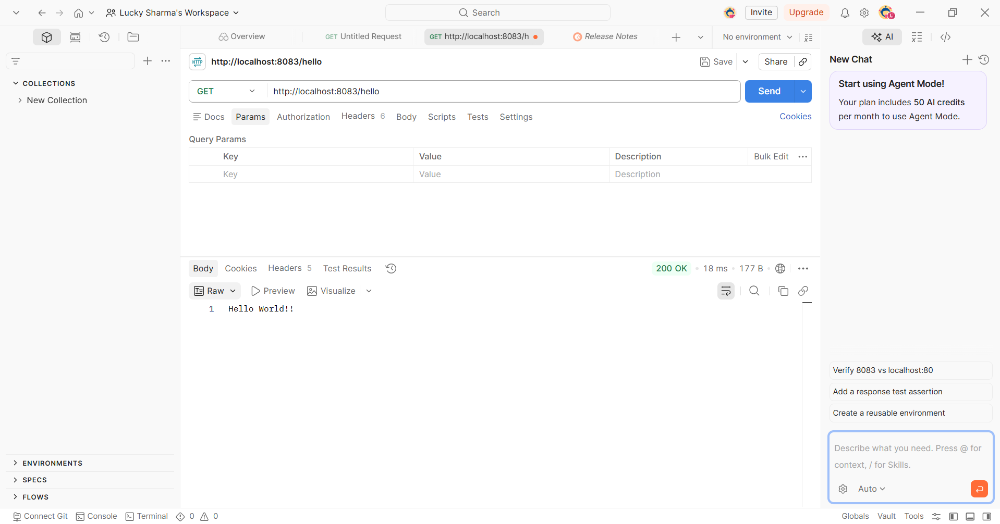
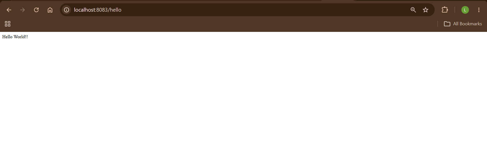
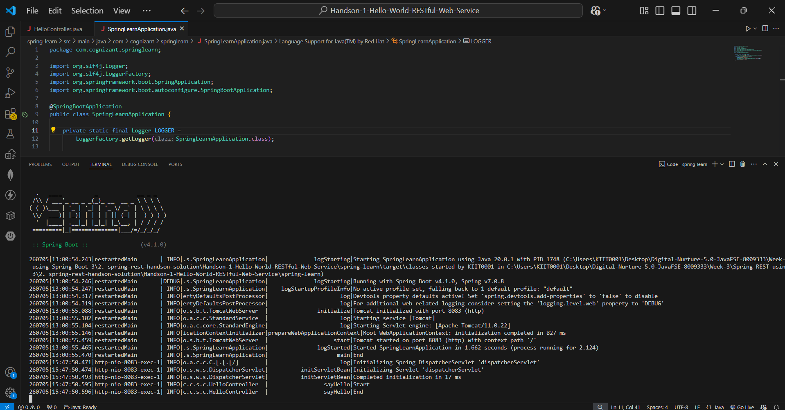

# Hands-on 1 – Hello World RESTful Web Service

## 📘 Objective

The objective of this hands-on is to create a simple **Spring Boot RESTful Web Service** that returns **"Hello World!!"** when a client sends a GET request.

---

## 📁 Project Structure

```text
spring-learn/
├── pom.xml
├── src/
│   └── main/
│       ├── java/
│       │   └── com/cognizant/springlearn/
│       │       ├── SpringLearnApplication.java
│       │       └── controller/
│       │           └── HelloController.java
│       └── resources/
│           └── application.properties
├── README.md
├── codes.png
├── browser-output.png
└── console-output.png
```

---

# Implementation

## Step 1 – Create Spring Boot Project

Created a Spring Boot project using Maven with the following dependency:

- Spring Web

---

## Step 2 – Create REST Controller

Created a controller class named **HelloController**.

Implemented a GET endpoint using:

```java
@GetMapping("/hello")
```

The method returns:

```text
Hello World!!
```

---

## Step 3 – Add Logging

Added SLF4J logging to the controller method.

```java
LOGGER.info("Start");
LOGGER.info("End");
```

This helps verify that the request reaches the controller successfully.

---

# API Details

| Method | Endpoint | Response |
|----------|----------|----------|
| GET | `/hello` | Hello World!! |

---

# Code Screenshot


---
---

# Postman Output

The REST endpoint was also tested successfully using **Postman**.

**Request Method:** `GET`

**URL:**

```text
http://localhost:8083/hello
```

**Response:**

```text
Hello World!!
```

**HTTP Status Code:** `200 OK`

The successful `200 OK` response confirms that the REST endpoint is accessible and functioning correctly through Postman.



# Browser Output

URL:

```text
http://localhost:8083/hello
```

Response:

```text
Hello World!!
```



---

# Console Output

```text
Tomcat started on port 8083
HelloController : Start
HelloController : End
```



---

# Key Concepts Used

| Concept | Description |
|----------|-------------|
| Spring Boot | Framework used to build the application |
| REST Controller | Handles HTTP requests |
| @RestController | Declares the class as a REST controller |
| @GetMapping | Maps HTTP GET requests |
| SLF4J Logger | Used for application logging |
| Embedded Tomcat | Runs the application on port 8083 |

---

# How to Run

```bash
cd spring-learn
.\mvnw.cmd spring-boot:run
```

---

# Testing

Open any browser and visit:

```text
http://localhost:8083/hello
```

Expected Output:

```text
Hello World!!
```

---

# Verification

| Requirement | Status |
|--------------|--------|
| Spring Boot project created | ✅ |
| REST Controller created | ✅ |
| GET endpoint implemented | ✅ |
| Logging added | ✅ |
| Browser displays "Hello World!!" | ✅ |
| Application runs successfully | ✅ |

---

# Result

Successfully developed and executed a **Spring Boot RESTful Web Service** that handles a GET request and returns the message **"Hello World!!"** with appropriate logging.