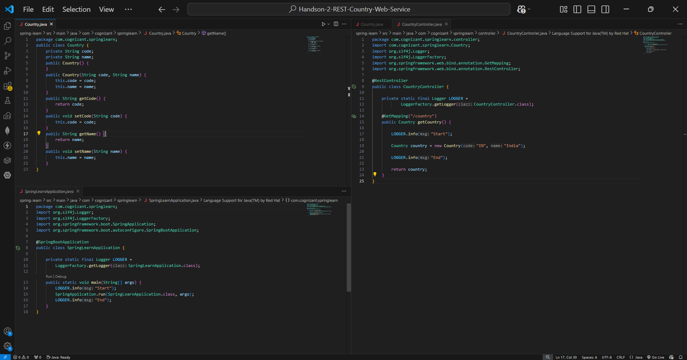
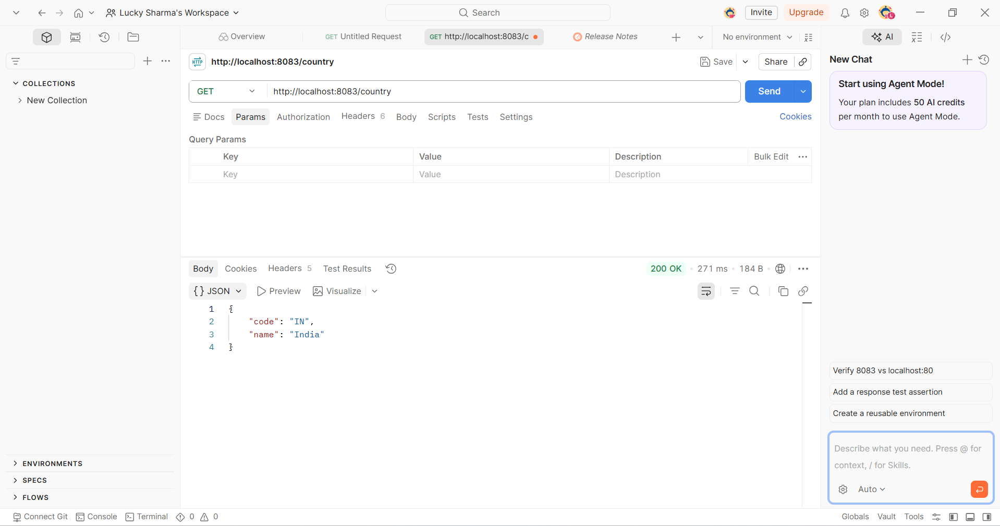
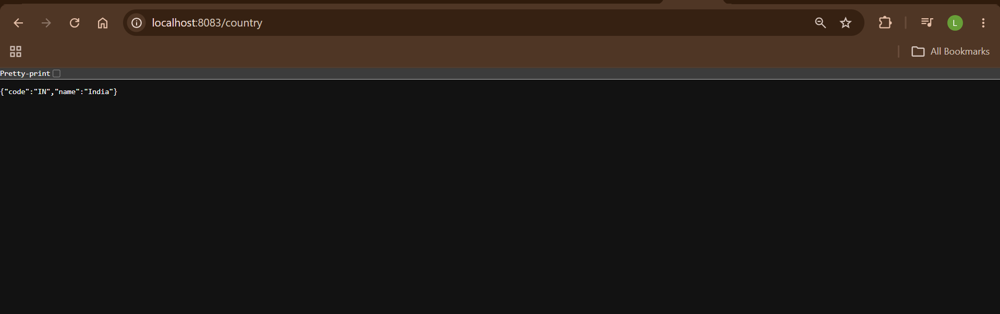
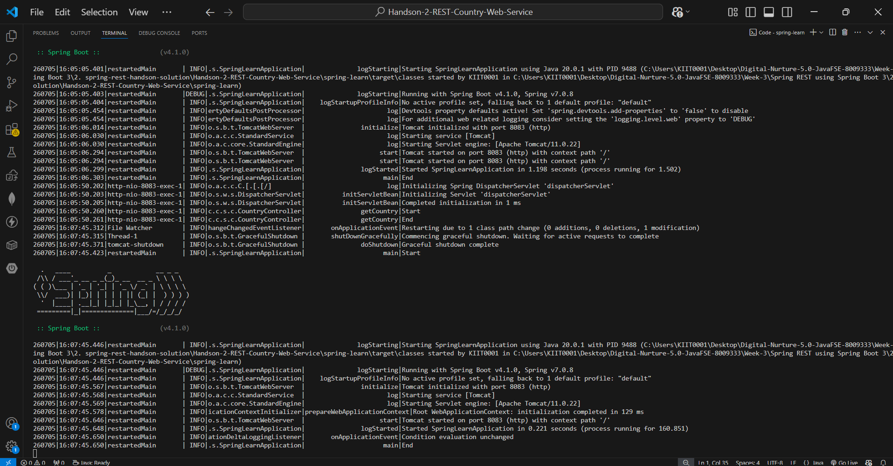

# Hands-on 2 – REST Country Web Service

## 📘 Objective

The objective of this hands-on is to create a RESTful Web Service that returns the details of a Country object in JSON format.

---

## 📁 Project Structure

```text
spring-learn/
├── pom.xml
├── src/
│   └── main/
│       ├── java/
│       │   └── com/cognizant/springlearn/
│       │       ├── SpringLearnApplication.java
│       │       ├── Country.java
│       │       └── controller/
│       │           └── CountryController.java
│       └── resources/
│           └── application.properties
├── README.md
├── code1.png
├── code2.png
├── code3.png
├── browser-output.png
└── console-output.png
```

---

# Implementation

## Step 1 – Create Country Model

Created a `Country` class with:

- code
- name

Included:

- Constructors
- Getters
- Setters

---

## Step 2 – Create REST Controller

Created `CountryController`.

Implemented:

```java
@GetMapping("/country")
```

Returns:

```java
new Country("IN", "India");
```

---

## Step 3 – Add Logging

Added SLF4J logging inside the controller method.

```java
LOGGER.info("Start");
LOGGER.info("End");
```

---

# API Details

| Method | Endpoint | Response |
|---------|----------|----------|
| GET | `/country` | Country JSON |

---

# Codes Screenshot



---
---

# Postman Output

The REST API was successfully tested using **Postman**.

**Request Method**

```text
GET
```

**Request URL**

```text
http://localhost:8083/country
```

**Response**

```json
{
    "code": "IN",
    "name": "India"
}
```

**HTTP Status**

```text
200 OK
```

The successful response confirms that the REST endpoint is working correctly and that the `Country` Java object is automatically serialized into JSON by Spring Boot.



---
# Browser Output

URL

```text
http://localhost:8083/country
```

Response

```json
{
  "code":"IN",
  "name":"India"
}
```



---

# Console Output

```text
Tomcat started on port 8083

CountryController : Start

CountryController : End
```



---

# Key Concepts Used

| Concept | Description |
|----------|-------------|
| Spring Boot | Framework used to create REST services |
| @RestController | Defines REST Controller |
| @GetMapping | Maps HTTP GET request |
| JSON Response | Automatically converts Java object to JSON |
| Embedded Tomcat | Runs application on port 8083 |
| SLF4J Logger | Used for logging |

---

# How to Run

```bash
cd spring-learn
.\mvnw.cmd spring-boot:run
```

---

# Testing

Open

```text
http://localhost:8083/country
```

Expected Response

```json
{
  "code":"IN",
  "name":"India"
}
```

---

# Verification

| Requirement | Status |
|--------------|--------|
| Country model created | ✅ |
| REST Controller created | ✅ |
| GET endpoint implemented | ✅ |
| JSON response returned | ✅ |
| Logging added | ✅ |
| Application executed successfully | ✅ |

---

# Result

Successfully created a Spring Boot RESTful Web Service that returns Country details in JSON format.