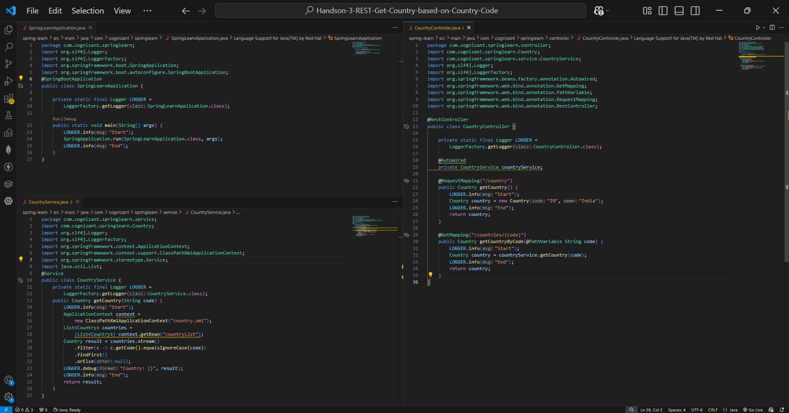
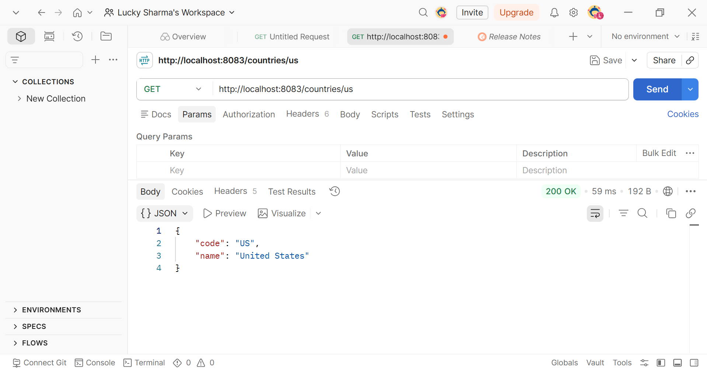
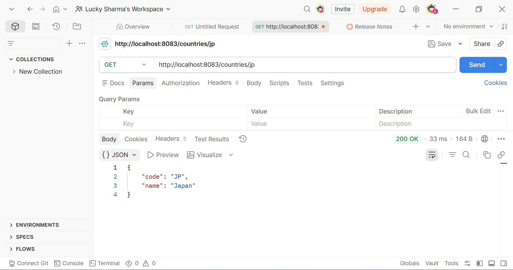
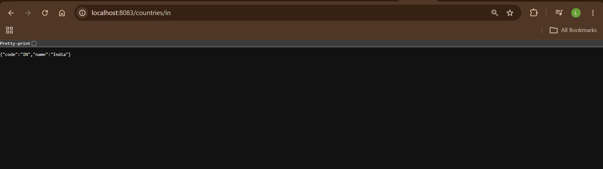
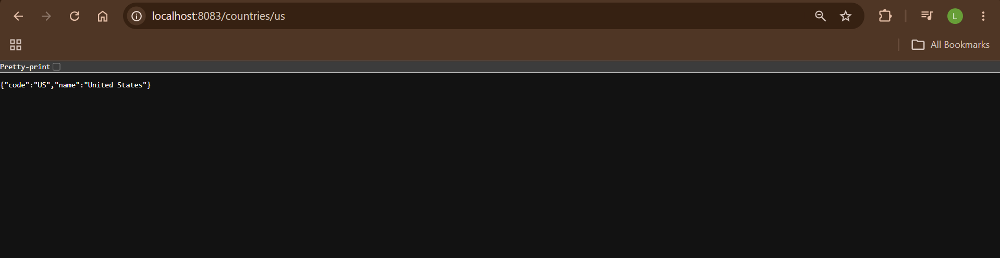
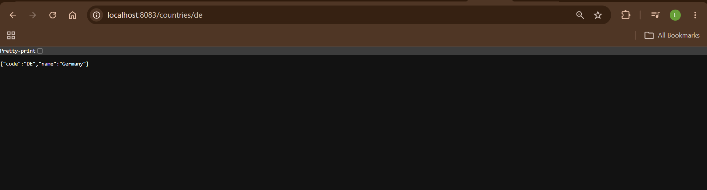
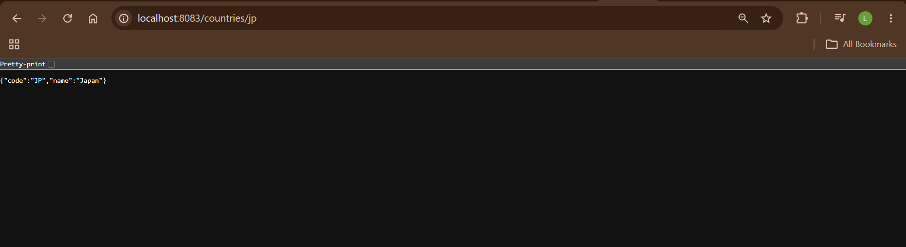
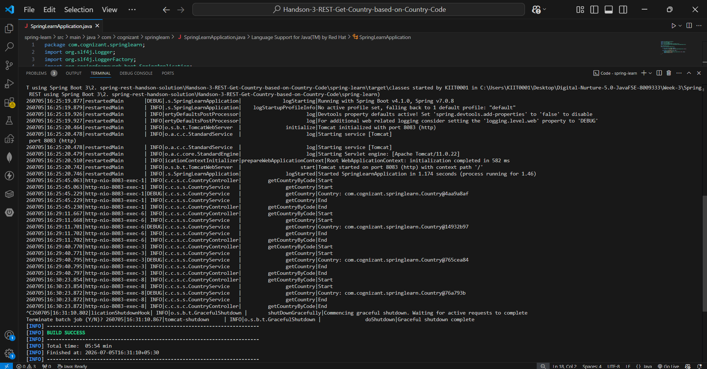

# Handson 3 – REST - Get Country based on Country Code

## 📘 Objective
Write a REST service that returns a specific country based on **country code** using `@PathVariable`. The country code should be **case insensitive**.

---

## 📁 Project Structure

```text
spring-learn/
├── pom.xml
├── src/main/java/com/cognizant/springlearn/
│   ├── SpringLearnApplication.java
│   ├── Country.java
│   ├── controller/
│   │   └── CountryController.java
│   └── service/
│       └── CountryService.java
└── src/main/resources/
    ├── application.properties
    └── country.xml
```

---

## 🔹 country.xml

```xml
<?xml version="1.0" encoding="UTF-8"?>
<beans xmlns="http://www.springframework.org/schema/beans"
    xmlns:xsi="http://www.w3.org/2001/XMLSchema-instance"
    xsi:schemaLocation="http://www.springframework.org/schema/beans
        https://www.springframework.org/schema/beans/spring-beans.xsd">

    <bean id="in" class="com.cognizant.springlearn.Country">
        <property name="code" value="IN" />
        <property name="name" value="India" />
    </bean>
    <bean id="us" class="com.cognizant.springlearn.Country">
        <property name="code" value="US" />
        <property name="name" value="United States" />
    </bean>
    <bean id="de" class="com.cognizant.springlearn.Country">
        <property name="code" value="DE" />
        <property name="name" value="Germany" />
    </bean>
    <bean id="jp" class="com.cognizant.springlearn.Country">
        <property name="code" value="JP" />
        <property name="name" value="Japan" />
    </bean>

    <bean id="countryList" class="java.util.ArrayList">
        <constructor-arg>
            <list>
                <ref bean="in"></ref>
                <ref bean="us"></ref>
                <ref bean="de"></ref>
                <ref bean="jp"></ref>
            </list>
        </constructor-arg>
    </bean>
</beans>
```

---

## 🔹 CountryService.java

```java
package com.cognizant.springlearn.service;

import com.cognizant.springlearn.Country;
import org.slf4j.Logger;
import org.slf4j.LoggerFactory;
import org.springframework.context.ApplicationContext;
import org.springframework.context.support.ClassPathXmlApplicationContext;
import org.springframework.stereotype.Service;
import java.util.List;

@Service
public class CountryService {

    private static final Logger LOGGER =
        LoggerFactory.getLogger(CountryService.class);

    public Country getCountry(String code) {
        LOGGER.info("Start");
        ApplicationContext context =
            new ClassPathXmlApplicationContext("country.xml");
        List<Country> countries =
            (List<Country>) context.getBean("countryList");
        Country result = countries.stream()
            .filter(c -> c.getCode().equalsIgnoreCase(code))
            .findFirst()
            .orElse(null);
        LOGGER.debug("Country: {}", result);
        LOGGER.info("End");
        return result;
    }
}
```

---

## 🔹 CountryController.java

```java
package com.cognizant.springlearn.controller;

import com.cognizant.springlearn.Country;
import com.cognizant.springlearn.service.CountryService;
import org.slf4j.Logger;
import org.slf4j.LoggerFactory;
import org.springframework.beans.factory.annotation.Autowired;
import org.springframework.web.bind.annotation.GetMapping;
import org.springframework.web.bind.annotation.PathVariable;
import org.springframework.web.bind.annotation.RequestMapping;
import org.springframework.web.bind.annotation.RestController;

@RestController
public class CountryController {

    private static final Logger LOGGER =
        LoggerFactory.getLogger(CountryController.class);

    @Autowired
    private CountryService countryService;

    @RequestMapping("/country")
    public Country getCountry() {
        LOGGER.info("Start");
        Country country = new Country("IN", "India");
        LOGGER.info("End");
        return country;
    }

    @GetMapping("/countries/{code}")
    public Country getCountryByCode(@PathVariable String code) {
        LOGGER.info("Start");
        Country country = countryService.getCountry(code);
        LOGGER.info("End");
        return country;
    }
}
```

---

## 🎯 Key Concepts

| Concept | Description |
|---|---|
| `@PathVariable` | Extracts value from URL path |
| `equalsIgnoreCase()` | Case insensitive matching |
| `@Service` | Marks class as service layer |
| `@Autowired` | Injects CountryService into controller |
| Stream + filter | Searches country list by code |

---

## ▶️ How to Run

```bash
cd spring-learn
.\mvnw.cmd spring-boot:run
```

---

## 🌐 API Endpoints

| URL | Response |
|---|---|
| `http://localhost:8083/countries/in` | `{"code":"IN","name":"India"}` |
| `http://localhost:8083/countries/us` | `{"code":"US","name":"United States"}` |
| `http://localhost:8083/countries/de` | `{"code":"DE","name":"Germany"}` |
| `http://localhost:8083/countries/jp` | `{"code":"JP","name":"Japan"}` |

---

## ✅ Output

```json
{"code":"JP","name":"Japan"}
```

---

## 🖼️ Screenshots

## Codes

---

# Postman Testing

The REST service was successfully tested using **Postman** for different country codes.

## India

**Request**

```text
GET http://localhost:8083/countries/in
```

**Response**

```json
{
    "code": "IN",
    "name": "India"
}
```

**Status**

```text
200 OK
```


---

## United States

**Request**

```text
GET http://localhost:8083/countries/us
```

**Response**

```json
{
    "code": "US",
    "name": "United States"
}
```

**Status**

```text
200 OK
```



---

## Germany

**Request**

```text
GET http://localhost:8083/countries/de
```

**Response**

```json
{
    "code": "DE",
    "name": "Germany"
}
```

**Status**

```text
200 OK
```


---

## Japan

**Request**

```text
GET http://localhost:8083/countries/jp
```

**Response**

```json
{
    "code": "JP",
    "name": "Japan"
}
```

**Status**

```text
200 OK
```



---

## Console Output India


## Console Output USA


## Console Output Germany


## Console Output Japan


## Terminal Output
