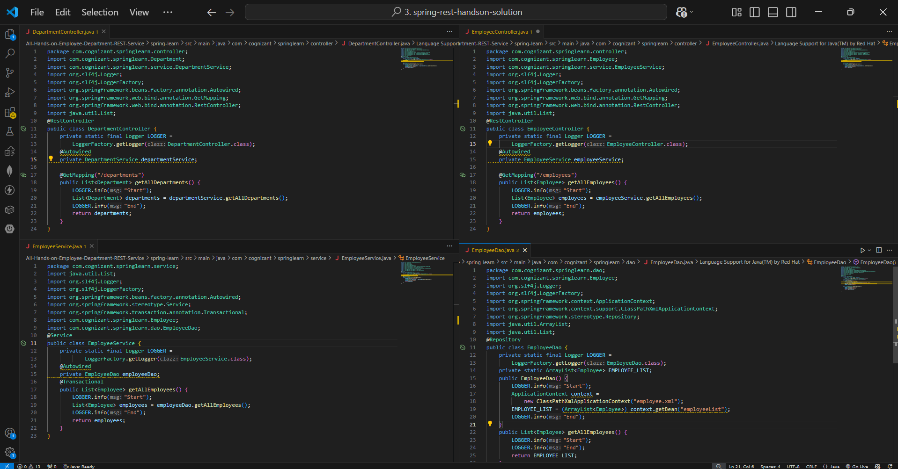
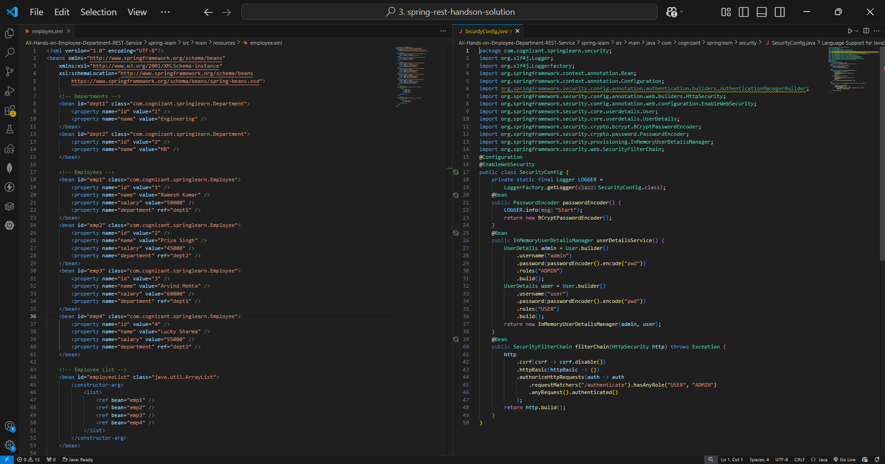
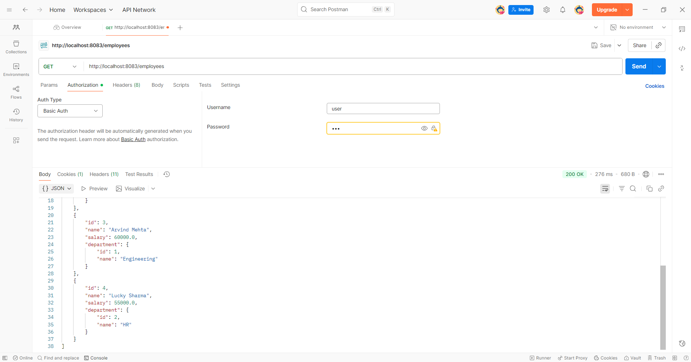
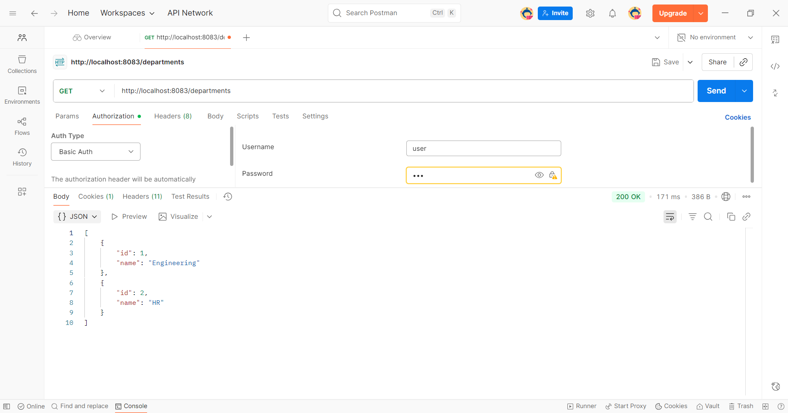
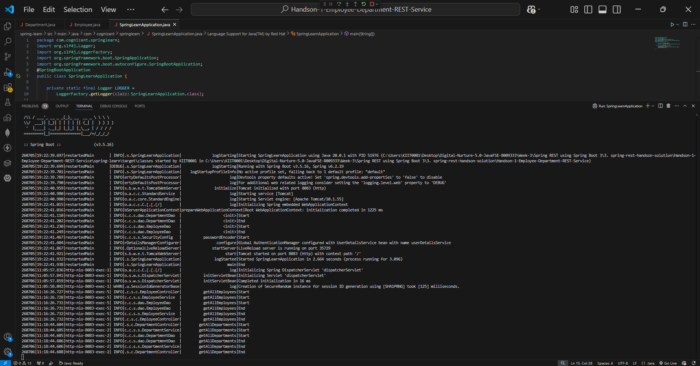

# Spring REST Handson 3 – All Hands-on (Employee & Department REST Service)

## 📘 Overview

This project contains the implementation of **all required hands-on exercises** for **Module 3 – Spring REST Handson** of the Cognizant Digital Nurture Java FSE Deep Skilling Program.

Unlike the previous modules where each exercise was implemented in a separate project, the official solution for this module combines all required REST APIs into **one single Spring Boot application**.

The project demonstrates the development of RESTful Web Services using Spring Boot with a layered architecture consisting of **Controller → Service → DAO**, Spring XML configuration, Spring Security (Basic Authentication), and REST API testing using Postman.

---

# 📌 Important Note

> According to the official Cognizant Deep Skilling schedule, Module 3 is marked as **"All Hands-on"**.

Instead of creating multiple independent projects, all required activities are implemented together in the single project:

```
All-Hands-on-Employee-Department-REST-Service
```

Therefore, this repository contains the complete implementation for the entire **3. spring-rest-handson** module.

---

# ✅ Hands-on Completed

| Exercise | Description | Status |
|----------|-------------|--------|
| Employee REST Service | Create REST API to retrieve all employees | ✅ Completed |
| Department REST Service | Create REST API to retrieve all departments | ✅ Completed |
| Spring XML Configuration | Load static employee & department data | ✅ Completed |
| DAO Layer | Retrieve data from XML configuration | ✅ Completed |
| Service Layer | Business layer implementation | ✅ Completed |
| REST Controller Layer | Expose REST endpoints | ✅ Completed |
| Spring Security | Basic Authentication | ✅ Completed |
| Postman Testing | Successfully tested secured APIs | ✅ Completed |

---

# 📋 Problem Statement

Develop RESTful Web Services for displaying Employee and Department information.

The application should:

- Create employee and department data using Spring XML configuration.
- Implement DAO layer to retrieve data.
- Implement Service layer for business logic.
- Implement REST Controllers exposing GET APIs.
- Secure APIs using Spring Security Basic Authentication.
- Test APIs using Postman.

---

# 🏗 Application Architecture

```
                    Client
                      │
                      ▼
               REST Controller
                      │
                      ▼
                 Service Layer
                      │
                      ▼
                   DAO Layer
                      │
                      ▼
            employee.xml (Spring Beans)
```

---

# 📁 Project Structure

```text
Handson-1-Employee-Department-REST-Service/
│
├── spring-learn/
│
├── src/
│   ├── main/
│   │
│   ├── java/
│   │   └── com/cognizant/springlearn/
│   │       │
│   │       ├── Employee.java
│   │       ├── Department.java
│   │       ├── Country.java
│   │       ├── SpringLearnApplication.java
│   │       │
│   │       ├── controller/
│   │       │     ├── EmployeeController.java
│   │       │     ├── DepartmentController.java
│   │       │     └── CountryController.java
│   │       │
│   │       ├── service/
│   │       │     ├── EmployeeService.java
│   │       │     ├── DepartmentService.java
│   │       │     └── CountryService.java
│   │       │
│   │       ├── dao/
│   │       │     ├── EmployeeDao.java
│   │       │     └── DepartmentDao.java
│   │       │
│   │       └── security/
│   │             └── SecurityConfig.java
│   │
│   └── resources/
│         ├── application.properties
│         ├── employee.xml
│         └── country.xml
├── codes1.png
├── codes2.png
├── employees-postman.png
├── departments-postman.png
└── README.md
└── terminal-output
```

---

# ⚙️ Technologies Used

| Technology | Version |
|------------|---------|
| Java | 17 |
| Spring Boot | 3.x |
| Spring MVC | ✔ |
| Spring Security | ✔ |
| Spring XML Configuration | ✔ |
| Maven | ✔ |
| REST API | ✔ |
| Postman | ✔ |

---

# 📂 Spring XML Configuration

The application uses **employee.xml** to configure Spring beans.

The XML file contains:

- Department beans
- Employee beans
- Employee List
- Department List

This XML acts as the application's in-memory data source.

---

# 🔹 DAO Layer

The DAO layer loads the XML configuration using

```java
ClassPathXmlApplicationContext
```

and retrieves

- Employee List
- Department List

from Spring Beans.

---

# 🔹 Service Layer

The Service layer performs business operations and acts as the bridge between Controller and DAO.

Services implemented:

- EmployeeService
- DepartmentService
- CountryService

---

# 🔹 Controller Layer

REST Controllers expose APIs.

Controllers implemented:

- EmployeeController
- DepartmentController
- CountryController

---

# 🔐 Spring Security

The application is secured using

- Spring Security
- HTTP Basic Authentication

Every REST endpoint requires authentication before access.

---

# 🌐 REST API Endpoints

| Endpoint | Method | Authentication | Description |
|-----------|--------|----------------|-------------|
| `/employees` | GET | Basic Auth | Returns all employees |
| `/departments` | GET | Basic Auth | Returns all departments |

Base URL

```
http://localhost:8083
```

---

# ▶️ Running the Project

```bash
cd spring-learn

.\mvnw.cmd spring-boot:run
```

Server starts at

```
http://localhost:8083
```

---

# 🧪 API Testing

The APIs were tested using Postman.

Authentication:

- Username: user
- Password: ******

Verified Endpoints:

- GET /employees
- GET /departments

Both endpoints returned **HTTP 200 OK**.

---

# ✅ Sample Output

## Employees API

```json
[
  {
    "id":1,
    "name":"Ramesh Kumar",
    "salary":50000.0,
    "department":{
      "id":1,
      "name":"Engineering"
    }
  }
]
```

---

## Departments API

```json
[
    {
        "id":1,
        "name":"Engineering"
    },
    {
        "id":2,
        "name":"HR"
    }
]
```

---

# 🎯 Key Concepts

| Concept | Description |
|----------|-------------|
| REST Controller | Exposes REST APIs |
| GET Mapping | Maps GET requests |
| DAO Layer | Retrieves XML data |
| Service Layer | Business logic |
| Spring Security | Basic Authentication |
| XML Bean Configuration | Static Data Source |
| Maven | Dependency Management |
| Postman | REST API Testing |

---

# 📸 Screenshots

## Codes


>


---

## Employees API – Postman



---

## Departments API – Postman




## Terminal Output




---

# 📝 Conclusion

This project successfully implements **all required hands-on exercises** specified under **Module 3 – Spring REST Handson**.

Although the Deep Skilling schedule lists multiple activities, the official solution combines all required implementations into **one Spring Boot application**.

The project demonstrates:

- Layered Architecture
- Spring XML Configuration
- RESTful Web Services
- Spring Security
- Basic Authentication
- REST API Testing using Postman

thus completing the requirements for **3. spring-rest-handson (All Hands-on)**.