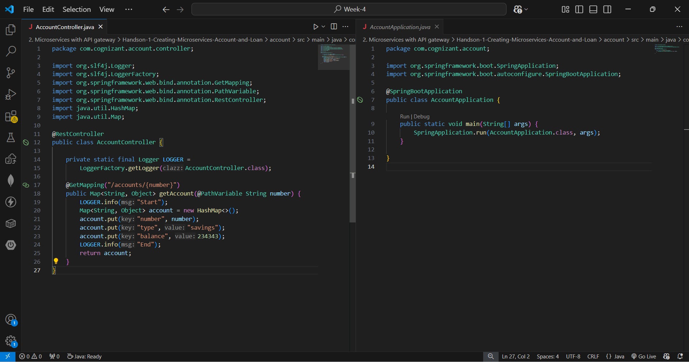
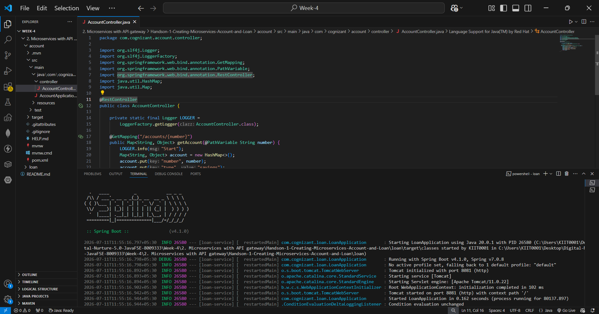
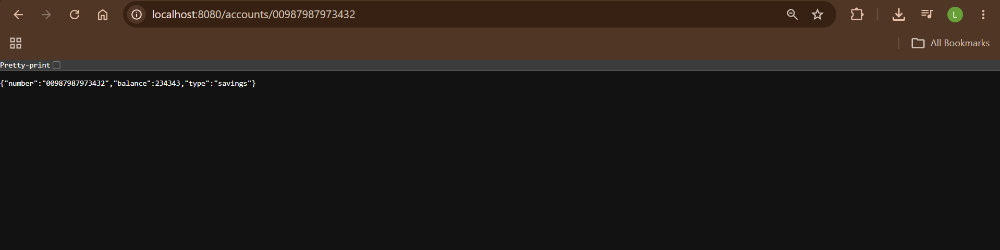
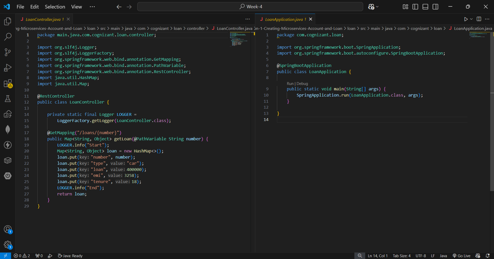
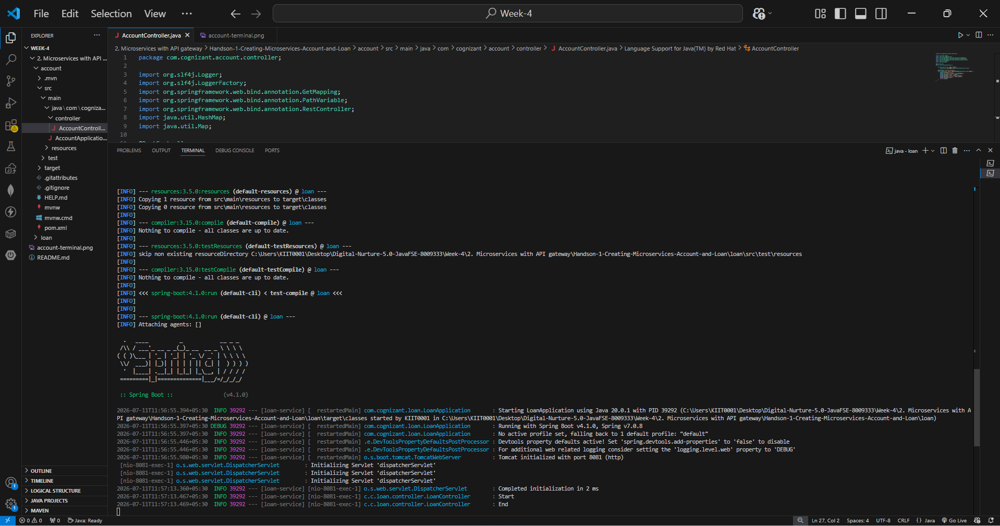
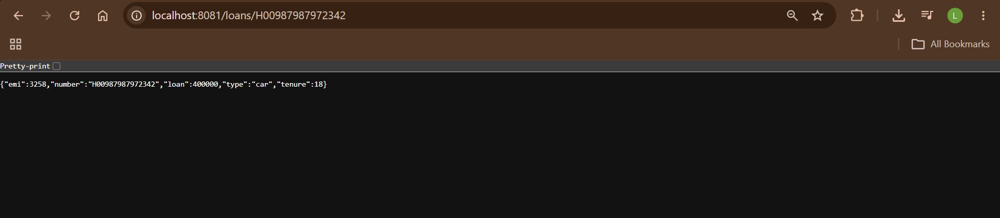

# Handson-1: Creating Microservices for Account and Loan

## Objective
Create two independent Spring Boot microservices for a bank — one for handling account details and one for handling loan details — each running as a separate, independently deployable service.

## Tech Stack
- Java 17
- Spring Boot 4.1.0
- Spring Web
- Spring Boot DevTools
- Maven (via `mvnw.cmd`)

## Microservices

### 1. Account Service
| Property | Value |
|---|---|
| Port | 8080 |
| Application name | account-service |
| Endpoint | `GET /accounts/{number}` |

**Sample Request:**
```
GET http://localhost:8080/accounts/00987987973432
```

**Sample Response:**
```json
{"number":"00987987973432","type":"savings","balance":234343}
```
 

**Account Codes:**


**Account Terminal (service running):**


**Account Browser output:**


### 2. Loan Service
| Property | Value |
|---|---|
| Port | 8081 |
| Application name | loan-service |
| Endpoint | `GET /loans/{number}` |

**Sample Request:**
```
GET http://localhost:8081/loans/H00987987972342
```

**Sample Response:**
```json
{"number":"H00987987972342","type":"car","loan":400000,"emi":3258,"tenure":18}
```

**Loan Codes:**


**Loan Terminal (service running):**


**Loan Browser output:**


## Folder Structure
```
Handson-1-Creating-Microservices-Account-and-Loan/
├── account/
│   ├── src/main/java/com/cognizant/account/
│   │   ├── AccountApplication.java
│   │   └── controller/AccountController.java
│   ├── src/main/resources/application.properties
│   └── pom.xml
├── loan/
│   ├── src/main/java/com/cognizant/loan/
│   │   ├── LoanApplication.java
│   │   └── controller/LoanController.java
│   ├── src/main/resources/application.properties
│   └── pom.xml
├── account-codes.png
├── account-terminal.png
├── accounts-browser.png
├── loan-codes.png
├── loan-terminal.png
├── loan-browser.png
└── README.md
```

## application.properties

**account/src/main/resources/application.properties**
```properties
server.port=8080
spring.application.name=account-service
logging.level.com.cognizant=debug
```

**loan/src/main/resources/application.properties**
```properties
server.port=8081
spring.application.name=loan-service
logging.level.com.cognizant=debug
```

## How to Run

**Account service:**
```bash
cd account
.\mvnw.cmd spring-boot:run
```

**Loan service (in a separate terminal):**
```bash
cd loan
.\mvnw.cmd spring-boot:run
```

Both services run independently on different ports, demonstrating the core microservices principle: each service is decoupled, independently deployable, and a failure in one does not affect the other — unlike a monolithic architecture.

## Key Learning
- Each microservice is a separate Spring Boot Maven project with its own `pom.xml`.
- Services must run on different ports since each embeds its own server (Tomcat) by default on 8080.
- `spring.application.name` identifies the service (used later for Eureka registration in Handson-2).

## Status
✅Creating Microservices for account and loan — Completed