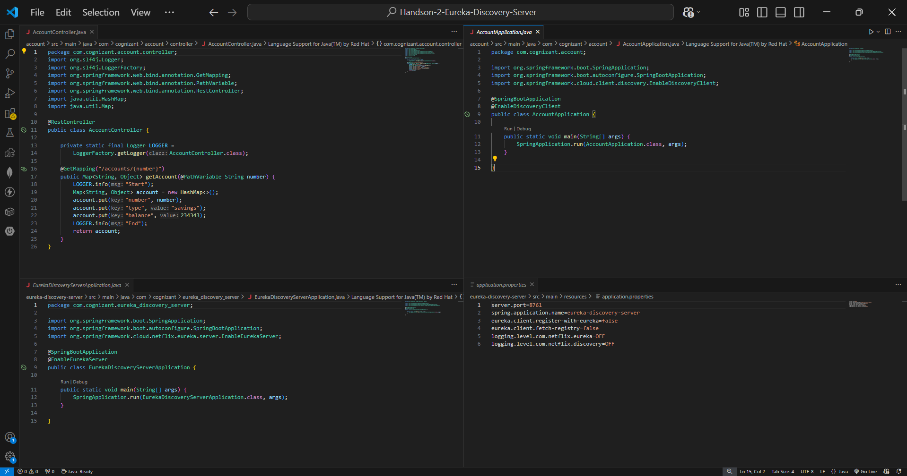
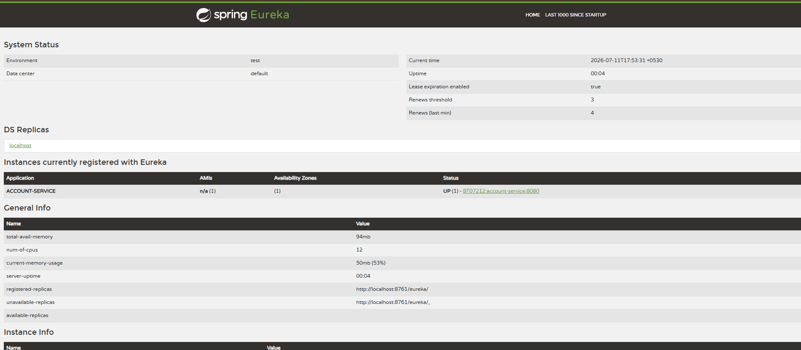
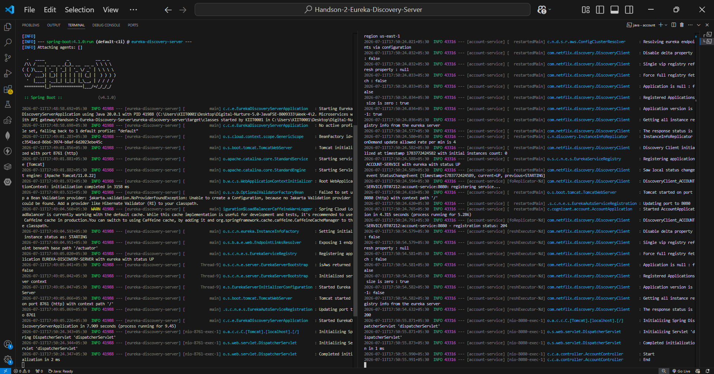
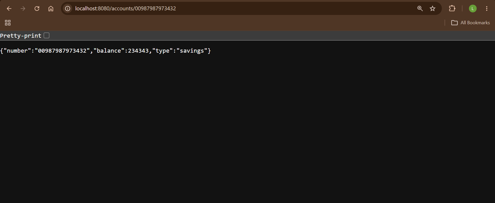
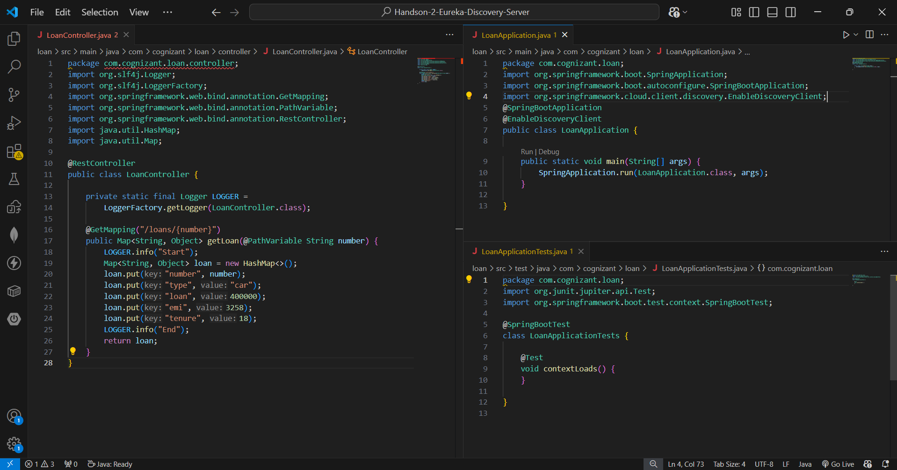
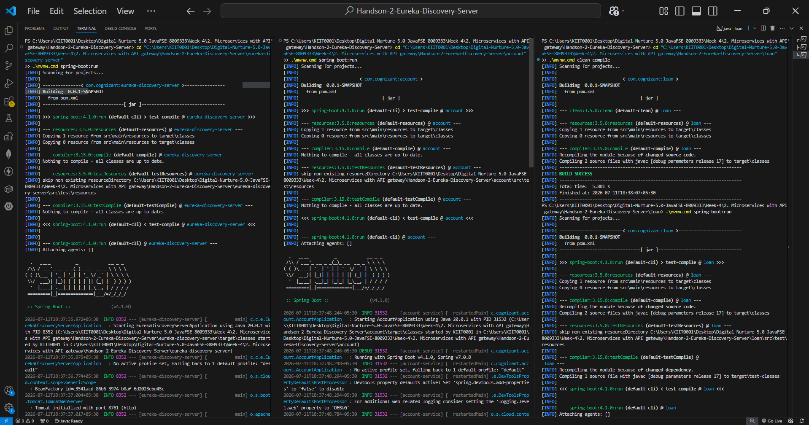
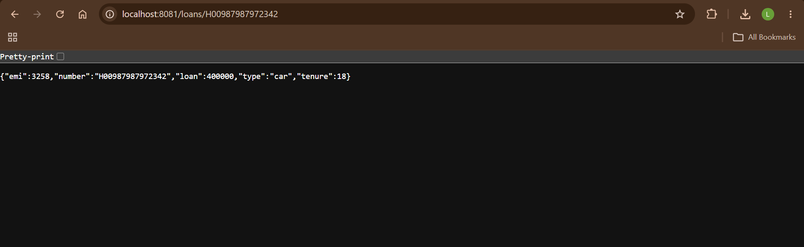
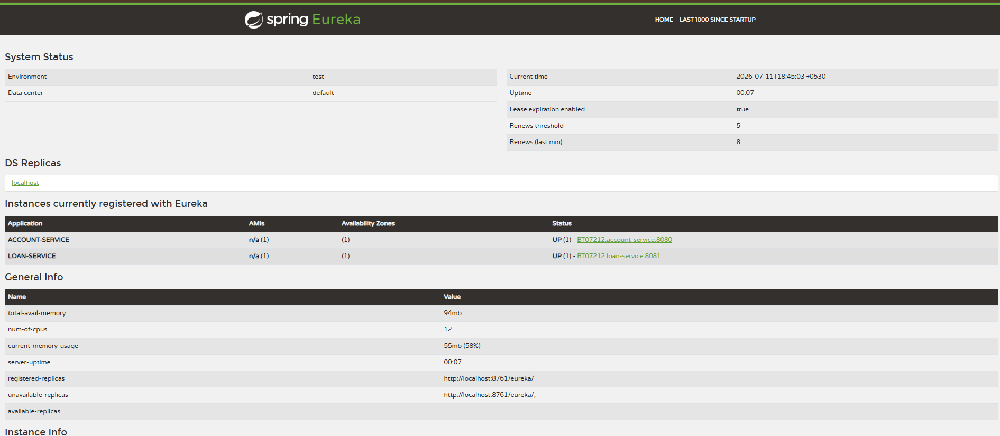

# Handson 2 – Create Eureka Discovery Server and Register Microservices

## 📘 Objective

Create a **Eureka Discovery Server** and register the **Account** and **Loan** microservices with it so that services can discover each other dynamically instead of relying on hardcoded URLs.

---

## 🏗️ Architecture

```text
                    +----------------------+
                    | Eureka Discovery     |
                    | Server (Port 8761)   |
                    +----------+-----------+
                               |
              -----------------------------------
              |                                 |
              | Registers                       | Registers
              |                                 |
      +-------+--------+               +--------+-------+
      | Account Service|               | Loan Service   |
      | Port : 8080    |               | Port : 8081    |
      +----------------+               +----------------+
```

---

## 🌐 API Endpoints

| Service | Method | Endpoint | Response |
|---------|--------|----------|----------|
| Account Service | GET | `/accounts/{number}` | Account Details |
| Loan Service | GET | `/loans/{number}` | Loan Details |
| Eureka Server | GET | `http://localhost:8761` | Eureka Dashboard |

---

## 🛠️ Tech Stack

- Java 17
- Spring Boot 4.1.0
- Spring Cloud Netflix Eureka (Server + Client)
- Spring Web
- Spring Boot DevTools
- Maven (using `mvnw.cmd`)

---

# ⚙️ Microservices Configuration

## 1️⃣ Eureka Discovery Server

| Property | Value |
|----------|-------|
| Port | 8761 |
| Application Name | `eureka-discovery-server` |
| Dashboard | `http://localhost:8761` |

### application.properties

```properties
server.port=8761
spring.application.name=eureka-discovery-server

eureka.client.register-with-eureka=false
eureka.client.fetch-registry=false

logging.level.com.netflix.eureka=OFF
logging.level.com.netflix.discovery=OFF
```

### Main Class

Annotated with:

```java
@EnableEurekaServer
```

---

## 2️⃣ Account Service (Eureka Client)

| Property | Value |
|----------|-------|
| Port | 8080 |
| Application Name | `account-service` |
| Endpoint | `GET /accounts/{number}` |

### application.properties

```properties
server.port=8080

spring.application.name=account-service

logging.level.com.cognizant=debug

eureka.client.service-url.defaultZone=http://localhost:8761/eureka/
```

### Sample Response

```json
{
  "number":"00987987973432",
  "type":"savings",
  "balance":234343
}
```

---

## 🖼️ Screenshots

### Eureka Discovery Server & Account Service Code



---

### Eureka Dashboard (Account Service Registered)



---

### Account Service Terminal Output



---

### Account Service Browser Output



---

## 3️⃣ Loan Service (Eureka Client)

| Property | Value |
|----------|-------|
| Port | 8081 |
| Application Name | `loan-service` |
| Endpoint | `GET /loans/{number}` |

### application.properties

```properties
server.port=8081

spring.application.name=loan-service

logging.level.com.cognizant=debug

eureka.client.service-url.defaultZone=http://localhost:8761/eureka/
```

### Sample Response

```json
{
  "number":"H00987987972342",
  "type":"car",
  "loan":400000,
  "emi":3258,
  "tenure":18
}
```

---

### Loan Service Code



---

### Loan Service Terminal Output



---

### Loan Service Browser Output



---

## 🌐 Eureka Dashboard – Both Services Registered

Both **ACCOUNT-SERVICE** and **LOAN-SERVICE** were successfully registered with Eureka and are displayed with status **UP**.



| Application | Status |
|-------------|--------|
| ACCOUNT-SERVICE | ✅ UP - BT07212:account-service:8080 |
| LOAN-SERVICE | ✅ UP - BT07212:loan-service:8081 |

---

## 📁 Folder Structure

```text
Handson-2-Eureka-Discovery-Server/
│
├── eureka-discovery-server/
│   └── src/main/java/com/cognizant/eureka_discovery_server/
│       └── EurekaDiscoveryServerApplication.java
│
├── account/
│   ├── src/main/java/com/cognizant/account/
│   │   ├── AccountApplication.java
│   │   └── controller/
│   │       └── AccountController.java
│   └── src/main/resources/
│       └── application.properties
│
├── loan/
│   ├── src/main/java/com/cognizant/loan/
│   │   ├── LoanApplication.java
│   │   └── controller/
│   │       └── LoanController.java
│   └── src/main/resources/
│       └── application.properties
│
├── account&eureka-discovery-server-code.png
├── account-service-browser.png
├── account-service-terminal.png
├── account-service-registry.png
├── loan-codes.png
├── loan-service-browser.png
├── loan-service-terminal.png
├── loan-service-registry.png
└── README.md
```

---

# ▶️ How to Run

## Step 1 – Start Eureka Discovery Server

```bash
cd eureka-discovery-server
.\mvnw.cmd spring-boot:run
```

Wait until the console displays:

```text
Started EurekaDiscoveryServerApplication
```

---

## Step 2 – Start Account Service

```bash
cd account
.\mvnw.cmd spring-boot:run
```

---

## Step 3 – Start Loan Service

```bash
cd loan
.\mvnw.cmd spring-boot:run
```

---

## Step 4 – Verify Eureka Dashboard

Open:

```text
http://localhost:8761
```

Both services should appear under:

```
Instances currently registered with Eureka
```

with status **UP**.

---

## 📖 Key Learning

- Eureka Discovery Server acts as a centralized registry for all microservices.
- Client applications automatically register themselves with Eureka.
- Service discovery removes the need for hardcoded service URLs.
- `@EnableEurekaServer` enables the Eureka server.
- `@EnableDiscoveryClient` registers microservices as Eureka clients.
- `spring.application.name` determines how services appear in the Eureka Dashboard.
- The Eureka Server must always be started **before** the client services.
- The property `eureka.client.service-url.defaultZone` specifies the Eureka server URL for client registration.

---

## ✅ Verification

| Requirement | Status |
|-------------|--------|
| Eureka Discovery Server Created | ✅ |
| Account Service Created | ✅ |
| Loan Service Created | ✅ |
| Eureka Server Running | ✅ |
| Account Service Registered | ✅ |
| Loan Service Registered | ✅ |
| Account API Tested | ✅ |
| Loan API Tested | ✅ |
| Eureka Dashboard Verified | ✅ |

---

## 🎯 Result

Successfully created a **Eureka Discovery Server** and registered both **Account Service** and **Loan Service** as Eureka Clients. The services were successfully discovered through the Eureka Dashboard and displayed with **UP** status, confirming successful dynamic service registration and discovery using **Spring Cloud Netflix Eureka**.