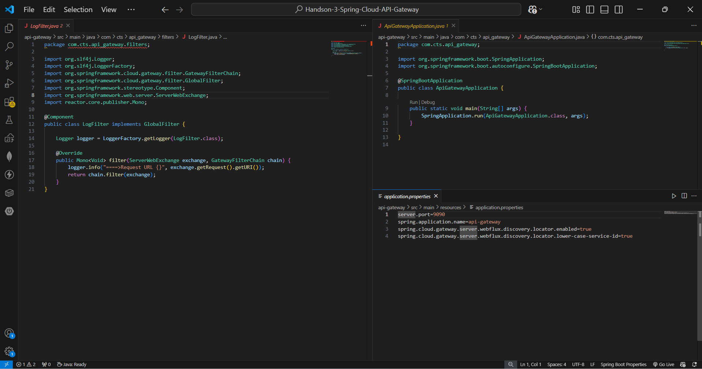
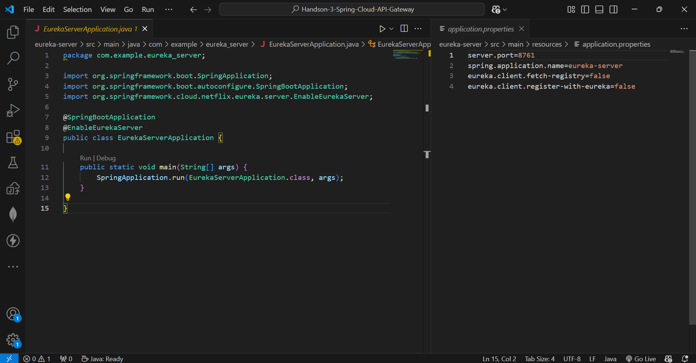
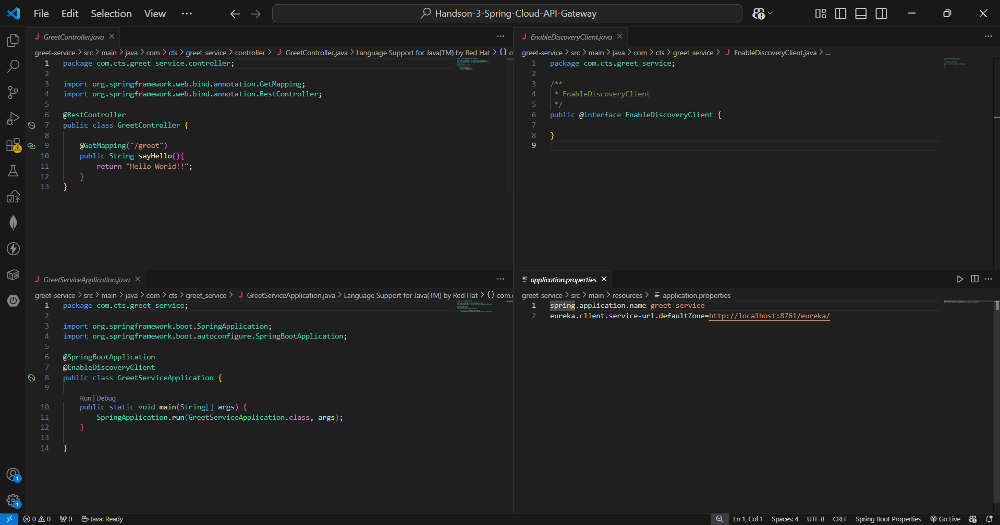
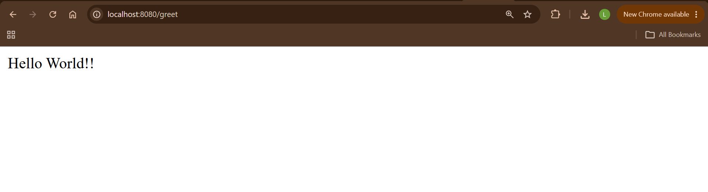
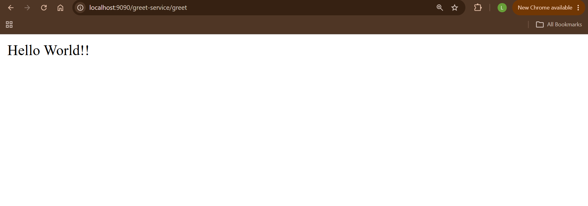
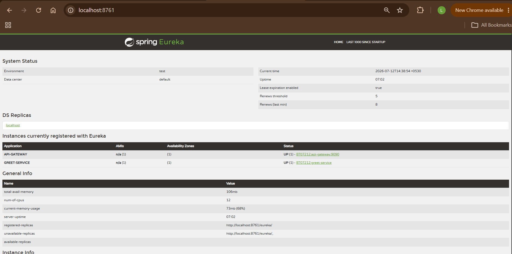
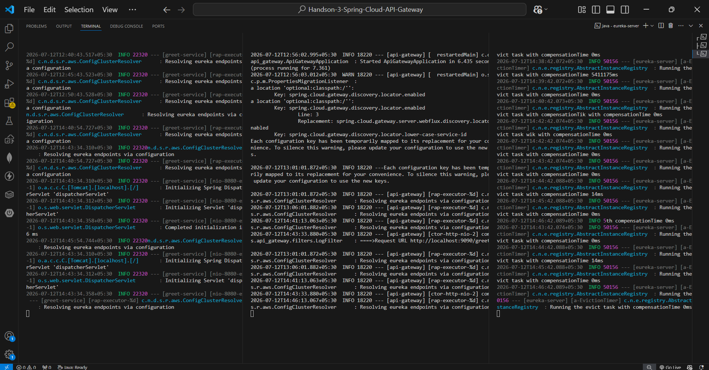

# Handson 3 – Spring Cloud API Gateway

## 📘 Objective

Create a Spring Cloud API Gateway that routes client requests to microservices registered with the Eureka Discovery Server. The gateway acts as a single entry point for all client requests and performs service discovery dynamically.

---

# 🏗️ Architecture

```text
                   Client / Browser
                          │
                          ▼
                API Gateway (Port 9090)
                          │
                          ▼
              Eureka Discovery Server
                     (Port 8761)
                          │
                          ▼
                Greet Service (Port 8080)
                          │
                          ▼
                     Hello World!!
```

---

## 📚 Tech Stack

- Java 17
- Spring Boot 3.5.16
- Spring Cloud Gateway
- Spring Cloud Netflix Eureka
- Spring Web
- Maven
- Embedded Tomcat

---

## 📂 Project Structure

```text
Handson-3-Spring-Cloud-API-Gateway/
│
├── api-gateway/
│   ├── src/main/java/com/cts/api_gateway/
│   │   ├── ApiGatewayApplication.java
│   │   └── filters/
│   │       └── LogFilter.java
│   └── src/main/resources/
│       └── application.properties
│
├── eureka-server/
│   ├── src/main/java/com/example/eureka_server/
│   │   └── EurekaServerApplication.java
│   └── src/main/resources/
│       └── application.properties
│
├── greet-service/
│   ├── src/main/java/com/cts/greet_service/
│   │   ├── GreetServiceApplication.java
│   │   └── controller/
│   │       └── GreetController.java
│   └── src/main/resources/
│       └── application.properties
│
├── api-gateway-codes.png
├── eureka-server-codes.png
├── greet-service-codes.png
├── API-Gateway-browser.png
├── greet-service-browser.png
├── Eureka-Dashboard.png
├── terminal.png
└── README.md
```

---

# 📖 Implementation

## Step 1 – Create Eureka Discovery Server

Created a Spring Boot application and enabled Eureka Server.

Main Annotation

```java
@EnableEurekaServer
```

Runs on

```
http://localhost:8761
```

---

## Step 2 – Create Greet Service

Created a REST microservice.

Endpoint

```java
@GetMapping("/greet")
```

Response

```text
Hello World!!
```

Registered the service with Eureka using

```properties
spring.application.name=greet-service
```

---

## Step 3 – Create API Gateway

Created another Spring Boot application using Spring Cloud Gateway.

Registered the gateway with Eureka.

Configured Discovery Locator.

```properties
spring.cloud.gateway.server.webflux.discovery.locator.enabled=true
spring.cloud.gateway.server.webflux.discovery.locator.lower-case-service-id=true
```

Gateway Port

```text
9090
```

---

## Step 4 – Add Global Logging Filter

Implemented a Global Filter.

```java
@Component
public class LogFilter implements GlobalFilter
```

Logs every incoming request.

Example

```text
====> Request URL http://localhost:9090/greet
```

---

# 🌐 API Endpoints

| Service | URL | Method | Response |
|---------|-----|--------|----------|
| Greet Service | http://localhost:8080/greet | GET | Hello World!! |
| API Gateway | http://localhost:9090/greet | GET | Hello World!! |
| Eureka Dashboard | http://localhost:8761 | GET | Registered Services |

---

# ▶️ How to Run

### Terminal 1 – Start Eureka Server

```bash
cd eureka-server
.\mvnw.cmd spring-boot:run
```

Wait until

```text
Started EurekaServerApplication
```

---

### Terminal 2 – Start Greet Service

```bash
cd greet-service
.\mvnw.cmd spring-boot:run
```

Wait until

```text
Started GreetServiceApplication
```

---

### Terminal 3 – Start API Gateway

```bash
cd api-gateway
.\mvnw.cmd spring-boot:run
```

Wait until

```text
Started ApiGatewayApplication
```

---

# 🧪 Testing

## Test Greet Service

Open

```text
http://localhost:8080/greet
```

Expected Output

```text
Hello World!!
```

---

## Test API Gateway

Open

```text
http://localhost:9090/greet
```

Expected Output

```text
Hello World!!
```

---

## Eureka Dashboard

Open

```text
http://localhost:8761
```

Expected Registered Services

```
API-GATEWAY
GREET-SERVICE
```

Both should show

```
UP
```

---

# 🖼️ Screenshots

## API Gateway Code



---

## Eureka Server Code



---

## Greet Service Code



---

## Greet Service Output



---

## API Gateway Output



---

## Eureka Dashboard



---

## Terminal Output



---

# 🎯 Key Concepts Used

| Concept | Description |
|----------|-------------|
| Spring Cloud Gateway | API Gateway implementation |
| Eureka Discovery Server | Service Registry |
| Eureka Client | Registers services with Eureka |
| @EnableEurekaServer | Enables Eureka Server |
| @EnableDiscoveryClient | Registers client with Eureka |
| GlobalFilter | Intercepts every request |
| Logging | Logs incoming API requests |
| Service Discovery | Dynamic routing without hardcoded URLs |
| REST Controller | Exposes REST endpoints |

---

# ✅ Verification

| Requirement | Status |
|--------------|--------|
| Eureka Server created | ✅ |
| Greet Service created | ✅ |
| API Gateway created | ✅ |
| Greet Service registered with Eureka | ✅ |
| API Gateway registered with Eureka | ✅ |
| Gateway routing verified | ✅ |
| Browser testing completed | ✅ |
| Logging filter executed | ✅ |

---

# 🎯 Result

Successfully implemented a **Spring Cloud API Gateway** integrated with a **Eureka Discovery Server**. The API Gateway dynamically discovered the registered Greet Service and successfully routed client requests through a single entry point. The custom Global Filter logged every incoming request, demonstrating centralized request handling in a microservices architecture.